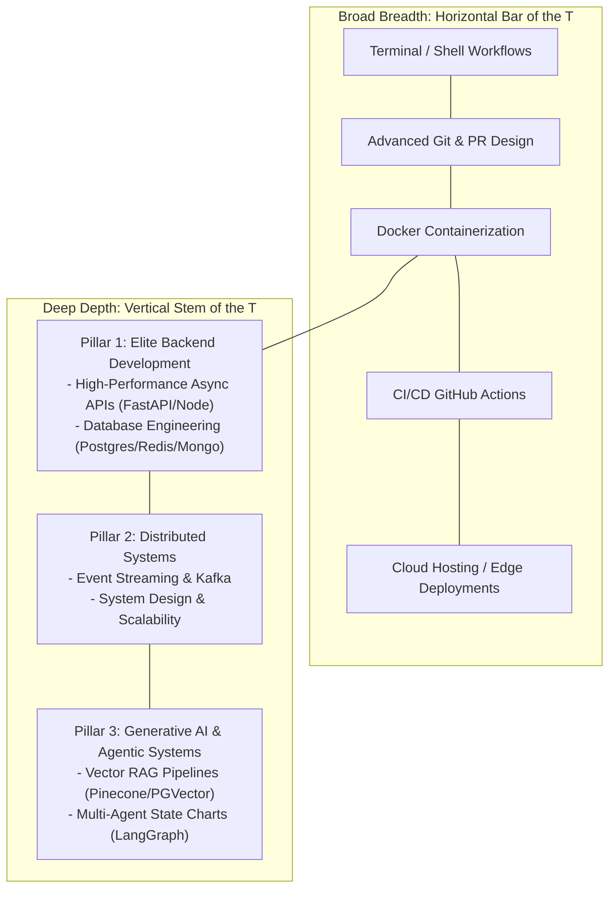
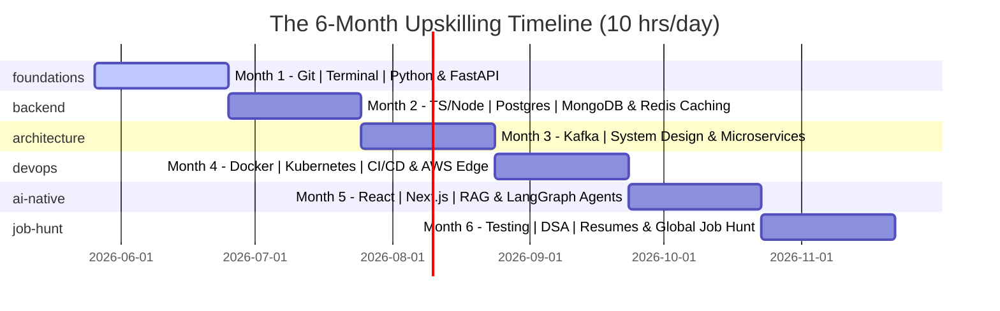
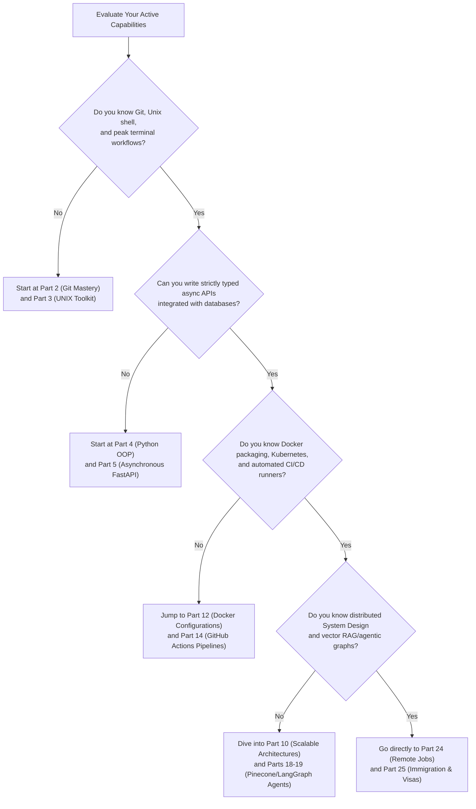

# The 2026 IT Career Blueprint: From Service-Based Support to Elite Backend & GenAI Engineer

*[← Back to Master Index](/blog/it-career-guide)*

---

## 1. The Service Company Trap and the High-Paid Escape Hatch

> [!IMPORTANT]
> **This is not a generic coding guide.** This is a highly rigorous, exhaustively detailed, 25-part upskilling blueprint designed specifically for **Chirag Singhal** and any software engineer currently locked in a service-based IT multinational (TCS, Infosys, Cognizant, Wipro, HCL) on a support account. 
>
> If you joined today as an Assistant Systems Engineer, were assigned to a specialized package like **SAP CPQ (Configure, Price, Quote)**, Salesforce Admin, or manual production support, and find your coding skills eroding while your CTC remains anchored at **₹3.36 LPA**, this handbook is your escape route. We assume **zero prior experience** with systems architecture, container orchestration, event streams, or AI model integration, and build you from first principles into a highly compensated, internationally competitive **AI-Native Systems Developer**.

---

### The Anatomy of Career Stagnation inside Services Giants
Every year, hundreds of thousands of engineering graduates in India are recruited by service giants through mass placement drives. While these companies provide a stable entry point into the corporate world, they harbor a silent career bottleneck: **The Project Allocation Lottery**. 

Once inside, you have virtually zero control over your technological destiny. You are randomly allocated to a project based on active billable resource requirements. A vast majority of these projects do not involve writing custom software. Instead, you are assigned to:
- **Proprietary Enterprise Software Configuration:** Administering proprietary cloud modules like SAP CPQ, Salesforce, or ServiceNow. Your daily tasks involve setting up pricing tables, configuring workflow rules inside graphical user interfaces, or writing minor, platform-specific scripting snippets (like SAP IronPython or Salesforce Apex) that are completely non-transferable to the broader tech industry.
- **Legacy Production Support:** Monitoring system logs, dragging tickets across Jira boards, performing manual file transfers, or executing database scripts written ten years ago.
- **Manual Quality Assurance:** Executing repetitive click-through testing runs on staging environments.

As the months roll by, a dangerous erosion occurs. The programming fundamentals you learned in college fade. You become highly specialized in a tool owned by a single vendor, making you completely dependent on that vendor's ecosystem. When you look at the job market, you realize that product-based companies, high-growth startups, and international remote employers do not hire "SAP CPQ configurators with 3 years of TCS experience." They hire developers who can build high-performance distributed systems, optimize database schemas under massive load, package containerized services, and integrate stateful AI agents.

Meanwhile, your compensation is structurally capped. Service companies operate on low-margin, high-volume billing models. Annual increments are marginal, and moving from a ₹3.36 LPA entry bracket to even ₹6 LPA inside the same firm can take half a decade of bureaucratic navigation.

---

### The Escape Hatch: The 2026 AI-Native Systems Developer
The global technology landscape of **2026** is going through a massive transformation. The traditional boundary between a "backend developer" and an "AI researcher" has collapsed. The rise of Large Language Models (LLMs), semantic search vectors, and multi-agent workflows (Agentic AI) has created a highly paid, extremely in-demand engineering class: **The AI-Native Systems Developer**.

These engineers are not mathematicians training raw deep-learning weights from scratch. Instead, they are master software architects who know how to:
1. Build highly scalable, resilient backend APIs (using Python/FastAPI or TypeScript/Node.js).
2. Optimize relational and document databases (PostgreSQL, MongoDB, Redis) to handle millions of operations.
3. Design event-driven, decoupled systems (using Apache Kafka) that process massive event streams in real-time.
4. Integrate advanced Generative AI capabilities (semantic retrieval, vector databases, vector embeddings, stateful agent graphs) directly into production-grade systems.

Because this skillset is extremely rare, the compensation packages are unprecedented:
- **Product Startups & Mid-Sized Firms (India):** Starting CTCs range from **₹8–15+ LPA** for entry-level developers who can demonstrate these skills through a public portfolio, scaling to **₹25–50+ LPA** for experienced systems architects.
- **Global Remote Contracts:** International startups in the US, Europe, and the UAE actively hire location-agnostic Indian developers, paying **$50,000–$120,000+ USD (₹40 Lakhs to ₹1 Crore)** annually for full-time remote contributors.
- **Visa-Sponsored Relocation:** Tech hubs in Europe (specifically Germany and the Netherlands) face massive shortages of systems and platform developers. They offer direct relocation packages and fast-track work visas (like the EU Blue Card) to developers who can write production-grade backend code and manage Kubernetes orchestration meshes.

This handbook is designed to guide you step-by-step from the very bottom of the service company support trap to the absolute peak of these global tech opportunities.

---

## 2. The Core Philosophy: The T-Shaped Developer Model

To successfully transition into this elite engineering class, you cannot just complete a few basic coding tutorials or copy-paste mock templates. You must develop a **T-Shaped Skill Profile**:

1. **Broad Breadth (The Horizontal Bar of the T):** You must master the standard operational developer lifecycle. This includes navigating UNIX terminals like a professional, managing complex Git rebase workflows, wrapping services in highly optimized Docker containers, orchestrating automatic test pipelines (CI/CD), and deploying serverless scripts to the edge. This breadth ensures you can immediately integrate into any world-class development team without requiring operational hand-holding.
2. **Deep Depth (The Vertical Stem of the T):** You must establish deep, uncompromising technical capabilities across three critical pillars:
   - **Elite Backend Development:** Writing strictly typed, highly concurrent, asynchronous services, designing high-efficiency relational schemas, profiling database indexes (`EXPLAIN ANALYZE`), and managing in-memory caching topologies.
   - **Distributed Systems:** Building scalable event streams utilizing Apache Kafka, decomposing monoliths into fault-tolerant gRPC microservices, and design-pattern scaling strategies that mitigate single points of failure.
   - **Generative AI & Agentic Systems:** Navigating semantic vector spaces, building robust Retrieval-Augmented Generation (RAG) knowledge bases, and orchestrating stateful, multi-agent autonomous graphs using frameworks like LangGraph.

---

## 3. Rebuilding Your Skill Tree: The 6-Month Chronological Timeline

upskilling while holding down a full-time corporate job requires absolute, uncompromising structure. If you are sitting on the bench or assigned to a light support project at TCS, you have a golden opportunity. By leveraging **10 hours a day** (leveraging bench hours, early mornings, late evenings, and weekends), you can comfortably cover this entire, comprehensive blueprint in **6 months**.

Here is your exact chronological, week-by-week upskilling timeline:

### Detailed Monthly Operational Goals:
*   **Month 1 - Foundational Toolkit & Modern Python (Weeks 1–4):** Escape the legacy OS mindset. Set up WSL2, learn Shell command lines, master Git internals (DAGs, reflog rescue), and build modern, asynchronous, strictly typed Python backends using FastAPI and Pydantic v2.
*   **Month 2 - Server JS, Database Engineering & Caching (Weeks 5–8):** Master server-side TypeScript and Node.js event execution. Dive deep into database internals, learning index tuning (B-Tree vs GIN), transaction isolations, MongoDB document modeling, and Redis high-performance caching (Cache-Aside, TTL jitter policies).
*   **Month 3 - Scale, Distributed Systems & Microservices (Weeks 9–12):** Build decoupled architectures. Study Apache Kafka partitions and consumer groups, practice high-level system design patterns (consistent hashing, rate limiters, database sharding), and decompose monolithic code into gRPC-driven microservices wrapped in fault-tolerant circuit breakers.
*   **Month 4 - Cloud Infrastructure & DevOps Pipelines (Weeks 13–16):** Package and automate your systems. Write highly optimized, secure multi-stage Dockerfiles, orchestrate deployments with Kubernetes manifests, configure parallel, cached CI/CD workflows using GitHub Actions, and deploy serverless functions to global edge datacenters via Cloudflare Workers.
*   **Month 5 - Frontend Integration & GenAI Engineering (Weeks 17–20):** Build full-stack capability and AI integration. Master React and Next.js server components, learn LLM integration APIs, build semantic search Retrieval-Augmented Generation (RAG) systems using vector databases (Pinecone/PGVector), and orchestrate autonomous multi-agent state charts using LangGraph.
*   **Month 6 - Quality, DSA Mastery & Global Remote Applications (Weeks 21–24):** Bulletproof your software and prepare for interviews. Write comprehensive unit, integration, and E2E tests, practice high-frequency coding patterns (NeetCode 150), optimize your GitHub portfolio, restructure your resume using the STAR method, and launch applications to remote platforms and Europe visa-sponsoring employers.

---

## 4. The 25-Part Series Syllabus Map

Below is your complete, interactive progress directory. Each part is a massive, **5,000+ words long master guide** containing a core technical refresher, multiple dedicated resource sections with detailed selection rationales, target modules, time budgets, value analysis, a hands-on portfolio project description, and a targeted interview questionnaire.

### Phase 1: Foundations & Pythonic Core (Parts 1–5)
- **[Part 1: The Blueprint & Escape Plan](/blog/it-career-guide/part-01-the-blueprint):** Navigating corporate economics, salary design, and scheduling upskilling routines. Focuses on setting up your master roadmap repository.
- **[Part 2: Advanced Version Control & Git Mastery](/blog/it-career-guide/part-02-git-github):** Git DAG topology, hashing engines, branching rebases, reflog recoveries, and pre-commit hook suites.
- **[Part 3: The Elite Developer Toolkit & Workflows](/blog/it-career-guide/part-03-developer-toolkit):** WSL2 configurations, profile script setups, modern CLI search programs (`rg`, `fzf`, `zoxide`, `jq`), and SSH forwarding security.
- **[Part 4: Python Mastery from Scratch](/blog/it-career-guide/part-04-python-mastery):** CPython pointers, generational Garbage Collection cycles, closures, generators, and static type configurations with Mypy.
- **[Part 5: Async Programming & FastAPI Backend Services](/blog/it-career-guide/part-05-async-python-fastapi):** Event loop concurrency models, Pydantic data schemas, and dependency injection architectures.

### Phase 2: Server JS, Databases & Distributed Caching (Parts 6–10)
- **[Part 6: TypeScript & Node.js Backend Ecosystems](/blog/it-career-guide/part-06-typescript-nodejs):** Node.js V8 execution, compiler options, and TypeScript runtime schema validations using Zod.
- **[Part 7: Relational Databases & Advanced PostgreSQL](/blog/it-career-guide/part-07-postgresql):** Storage engines, indexing profiles (`EXPLAIN ANALYZE`), transaction isolations, and replication lags.
- **[Part 8: NoSQL Databases (MongoDB & Redis Caching)](/blog/it-career-guide/part-08-nosql-redis):** MongoDB Aggregation pipelines, document schema designs, and Redis Cache-Aside configurations.
- **[Part 9: Distributed Systems & Message Queues with Kafka](/blog/it-career-guide/part-09-kafka):** Topic partitioning, consumer groups, offset tracking, and transaction idempotency guarantees.
- **[Part 10: System Design Principles & Scalable Architecture](/blog/it-career-guide/part-10-system-design):** Consistent hashing rings, CDN pull topologies, database sharding keys, and CAP theorem trade-offs.

### Phase 3: Microservices, Containerization & DevOps (Parts 11–15)
- **[Part 11: Microservices Architecture Patterns](/blog/it-career-guide/part-11-microservices):** DDD Bounded Contexts, gRPC protobuf contracts, Saga patterns, and Circuit Breaker resiliencies.
- **[Part 12: Docker & Containerization for Backend Developers](/blog/it-career-guide/part-12-docker):** Namespaces, multi-stage optimized Dockerfiles, layer caching, and non-root system users.
- **[Part 13: Kubernetes & Container Orchestration](/blog/it-career-guide/part-13-kubernetes):** Pod life cycles, load-balancing Ingress, resource limits, and health probes (readiness/liveness).
- **[Part 14: Continuous Integration & Deployment with GitHub Actions](/blog/it-career-guide/part-14-cicd):** Workflow parallelism, caching directories, environment secrets, and GHCR registry packaging.
- **[Part 15: AWS Cloud & Serverless Architectures](/blog/it-career-guide/part-15-serverless):** AWS IAM structures, EC2/S3/RDS engines, V8 isolates vs VM runtimes, and Cloudflare Workers with Wrangler CLI.

### Phase 4: Full-Stack Integration & AI Engineering (Parts 16–20)
- **[Part 16: Front-End Mastery: React, Next.js & Client-Side Architectures](/blog/it-career-guide/part-16-frontend):** React state hooks, Server Components, hydration states, and responsive styling.
- **[Part 17: Generative AI & Large Language Models (LLM) Integration](/blog/it-career-guide/part-17-genai):** Tokenization limits, temperature metrics, prompt engineering context, and LangChain/Anthropic APIs.
- **[Part 18: Retrieval-Augmented Generation (RAG) & Vector Databases](/blog/it-career-guide/part-18-rag):** Vector spaces, semantic similarity, PGVector, and document chunking pipelines.
- **[Part 19: AI Agents & Advanced Workflows with LangGraph](/blog/it-career-guide/part-19-agents):** State graphs, conditional routing, tool invocations, and agent memory persistence.
- **[Part 20: Enterprise Security, Authentication & OWASP Top 10](/blog/it-career-guide/part-20-security):** OAuth2/PKCE, JWT signing validations, CORS policies, and injection sanitization.

### Phase 5: Testing, DSA & Job Placement Pipelines (Parts 21–25)
- **[Part 21: Comprehensive Testing: Unit, Integration, & E2E Testing](/blog/it-career-guide/part-21-testing):** Pytest structures, Jest mocks, Playwright client assertions, and test coverage metrics.
- **[Part 22: Data Structures & Algorithms (DSA) and LeetCode Blueprint](/blog/it-career-guide/part-22-dsa):** Array, List, Map, Tree, and Graph traversals matching the NeetCode 150 syllabus.
- **[Part 23: Tech Interview Success: System Design & STAR Method](/blog/it-career-guide/part-23-interviews):** Back-of-the-envelope calculations, architectural diagrams, and behavioral STAR stories.
- **[Part 24: Global Remote Jobs and Freelancing Platforms](/blog/it-career-guide/part-24-remote-jobs):** Building portfolio profiles, pricing models on Toptal/Turing, and handling client invoices.
- **[Part 25: Immigration, Visas & Tech Relocation](/blog/it-career-guide/part-25-visas):** Navigating German Blue Cards, Dutch HSM visas, and relocating to global tech hubs.

---

## 5. Universal Decision Tree: Where Do You Start?

If you are confused about how to navigate this massive blueprint based on your active experience, use this interactive systems decision tree:

---

## 6. AdSense Ready Placement Slots

To prepare your blog for eventual monetization via Google AdSense, the codebase must conform to clean viewability layouts. We integrate dedicated, non-shifting CSS glassmorphic card containers where AdSense script tags can be injected seamlessly, preventing Cumulative Layout Shifts (CLS) which penalize SEO rankings:

  Advertisement Slot (AdSense Ready)
  
This space represents an optimized, non-shifting AdSense box conforming to Google's strict layout guidelines.

  {/* AdSense script placeholder
  <ins class="adsbygoogle"
       style="display:block; text-align:center;"
       data-ad-layout="in-article"
       data-ad-format="fluid"
       data-ad-client="ca-pub-XXXXXXXXXXXXXXXX"
       data-ad-slot="XXXXXXXXXX"></ins>
  
  */}
  CLS Insulated

