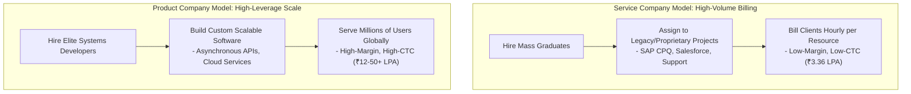

# Part 1: The Blueprint & Escape Plan

*[← Back to Master Index](/blog/it-career-guide)*

---

## 1. Core Concept Refresher: The Service-Based Upskilling Trajectory

To escape a service-based support account (like **TCS SAP CPQ**) and land a highly paid, product-based backend engineering role, you must first understand the fundamental economic and technological forces that dictate both industries. Many junior engineers fail to make the transition because they treat upskilling as a random collection of syntax tutorials. They learn a little bit of Python, write a few basic HTML pages, and expect product companies to hire them. 

However, true systems upskilling requires a rigorous shift in mental models. You must understand the structural differences between **Service-Based Delivery** and **Product-Based Systems Architecture**, and map your study path to conform to the elite **T-Shaped Developer Skillset**.

---

### The Economic Divide: Services vs. Product
To understand why your salary and career growth are capped inside service giants, you must look at their core business model:



Service companies operate on **Time-and-Material (T&M) billing models**. They contract with global clients to supply manpower to maintain legacy systems, configure proprietary tools, or handle manual operations. The client pays the service company a set hourly rate per resource. Because this is a low-margin, highly competitive business, the service company's primary objective is to maximize resource utilization while keeping labor costs as low as possible. This is why entry-level salaries have remained locked at **₹3.36 LPA** for nearly two decades. In this model, **you are the billable unit of labor**, and your technological growth is secondary to the immediate billing requirements of the project.

Product companies and high-growth startups operate on **Scalable Software leverage models**. They build custom software assets once and distribute them globally to millions of concurrent users. A single backend API server or Generative AI workflow can generate millions of dollars in recurring revenue with virtually zero incremental manual labor. Because their profit margins are extremely high, product companies do not look for warm bodies to fill billing slots. They look for highly skilled systems engineers who can optimize API latencies, design resilient distributed databases, prevent system downtime, and integrate autonomous AI workflows. **In this model, your technological capability is the primary revenue driver**, which is why they gladly pay starting CTCs ranging from **₹8–15+ LPA**, scaling to **₹25–50+ LPA** for senior systems developers.

---

### The Danger of Specialized Package Lock-In
If you are assigned to a proprietary package like **SAP CPQ (Configure, Price, Quote)**, your daily technical footprint is highly constrained:
- You configure catalog rules, pricing matrices, and approval workflows inside a vendor-controlled graphical user interface.
- If you write code, it consists of minor platform-specific scripting snippets (such as SAP IronPython or Salesforce Apex) designed to execute exclusively within the vendor's closed runtime environment.
- You do not interface with standard databases, configure container deployment pipelines, optimize raw HTTP cache headers, or write automated testing suites.

This specialization creates a severe career bottleneck. The broader tech industry does not use SAP CPQ to build custom web applications. Startups and product companies build on open-source, highly performant systems stacks: PostgreSQL, Redis, Docker, Kubernetes, Kafka, FastAPI, and Next.js. Every month you spend configured inside a proprietary enterprise package erosion occurs—your raw coding fundamentals fade, and you become dependent on a single vendor's closed ecosystem. To break free, you must commit to an aggressive, open-systems upskilling track.

---

### Mapping the T-Shaped Developer Skillset
To secure an elite backend or AI-native systems role, you must transition from a specialized configuration resource to a **T-Shaped Developer**:

```
          B R E A D T H   O F   O P E R A T I O N A L   K N O W L E D G E
  ┌─────────────────────────────────────────────────────────────────────────────┐
  │  Terminal Workflows  │  Git Collaboration  │  Docker Containers  │  CI/CD   │
  └───────────────────────────────────┬─────────────────────────────────────────┘
                                      │
                                      │  D E P T H   O F   S K I L L S
                                      │
                                      ▼
                      ┌──────────────────────────────┐
                      │ Pillar 1: High-Performance   │
                      │           Backend Services   │
                      ├──────────────────────────────┤
                      │ Pillar 2: Distributed        │
                      │           Systems & Scaling  │
                      ├──────────────────────────────┤
                      │ Pillar 3: Generative AI &    │
                      │           Agentic AI Systems │
                      └──────────────────────────────┘
```

- **The Horizontal Bar (Breadth):** The universal toolkit of modern development. You must know how to navigate UNIX shells, automate scripts, collaborate on complex Git branching strategies, bundle apps inside Docker containers, and write automated testing configurations (CI/CD). This ensures you can seamlessly integrate into any modern development team on day one.
- **The Vertical Stem (Depth):** Your core specialized engineering capabilities:
  - *Pillar 1 (Backend Systems):* Deep database engineering, SQL query optimization, transaction isolation, in-memory caching topologies, and highly concurrent async API development.
  - *Pillar 2 (Distributed Scales):* Decoupled messaging streams (Kafka), resilient gRPC-driven microservices, and load-balanced high-availability architectures.
  - *Pillar 3 (AI-Native Systems):* Semantic vector retrieval, Retrieval-Augmented Generation (RAG) knowledge retrieval, and stateful multi-agent autonomous graphs (LangGraph).

By structuring your upskilling chronologically across these pillars, you transform your profile from a junior TCS support resource into a highly sought-after, production-ready systems developer.

---

## 2. Master Resource Directory: Career Transition Fundamentals

Here are the precise learning resources, specific syllabus modules, and technical chapters you must consume to establish your upskilling strategy:

### Source 1: *The Software Engineer's Guidebook* by Gergely Orosz
*   **Format:** Definitive Technical Career Textbook
*   **Platform:** O'Reilly Learning (Search inside your TCS O'Reilly account)
*   **Direct Link Reference:** [O'Reilly Book Profile Page](https://learning.oreilly.com/)
*   **Why It is Selected:** Gergely Orosz is the author of *The Pragmatic Engineer*, the #1 tech newsletter in the world. This textbook is the industry-standard guide for navigating the career progression from junior developer to senior staff engineer. It details the exact operational standards, coding review protocols, and architectural metrics expected in world-class product companies.

#### Exact Chapters to Read:
1.  **Read Part 1: Developer Career Fundamentals:** Focus on Chapter 1 (Career Paths) and Chapter 6 (Switching Jobs). Master the structural taxonomy of tech companies (Big Tech vs. Product Startups vs. Service Providers) and map out your strategic relocation or remote hiring goals.
2.  **Read Part 2: The Competent Software Developer:** Focus on Chapter 8 (Coding) and Chapter 10 (Tools of the Productive Engineer). Study the standards of clean code, automated testing integrations, and terminal-based productivity setups.

---

### Source 2: *The Complete 2026 Web Development Bootcamp* by Dr. Angela Yu
*   **Format:** Project-First Video Bootcamp
*   **Platform:** Udemy Business (Free via your TCS Ultimatix SSO gateway)
*   **Direct Link Reference:** [Udemy Course Page](https://www.udemy.com/)
*   **Why It is Selected:** If your programming fundamentals are rusty or you have spent months inside a non-coding support project, you need a high-quality, step-by-step refresher. Dr. Angela Yu provides the highest-rated web development bootcamp on the market, taking you from raw programming concepts to full-stack database integrations.

#### Exact Course Modules to Watch & Execute:
1.  **Watch Section: Introduction to Web Development:** Refresh your understanding of HTTP request-response lifecycles, DNS resolution, and client-server boundaries.
2.  **Watch Section: Database Integration:** Master basic relational schema concepts and connecting backend scripts to database runtimes.

---

### Source 3: *System Design Primer* by Donne Martin
*   **Format:** Open-Source Git Repository & Interactive Guide
*   **Platform:** GitHub (Free Public Access)
*   **Direct Link Reference:** [github.com/donnemartin/system-design-primer](https://github.com/donnemartin/system-design-primer)
*   **Why It is Vetted:** The single most famous open-source repository for technical interview preparation. It provides incredibly detailed system architectures, sequence diagrams, and mathematical calculations for massive systems.

#### Exact Sections to Complete:
1.  **Review System Design Topics:** Study the introductory guides on DNS, CDNs, Load Balancers, and Reverse Proxies to align your mental models with large-scale systems architecture.

---

## 3. Hands-On Portfolio Lab Project: Upskilling Chronometer & Active study Planner

To prove your commitment to clean, test-driven systems development, you must construct and deploy an **Active Upskilling Planner & Terminal Dashboard** to your public GitHub profile (`github.com/chirag127`).

### The Lab Project Guidelines:
1.  **Strict Language Typings:** Build this planner in strictly typed Python (using type hints and Pydantic) or TypeScript.
2.  **Declarative Syllabus Mapping:**
    -   Create a structured JSON file representing the complete 25-part syllabus, including columns for: `part_number`, `topic`, `status` (unstarted, in-progress, completed), `hours_dedicated`, and `github_repo_link`.
3.  **Command-Line Interface (CLI):**
    -   Write a clean CLI tool (using `argparse` in Python or `commander` in TS) that reads your JSON database and exposes commands:
        -   `planner status`: Prints a beautiful, colorized terminal table (using `rich` or `cli-table3`) showing your progress across all 25 parts.
        -   `planner update <part_number> --status <status> --hours <hours>`: Updates your study database and logs the entry to an audit file.
4.  **Diagnostic Metrics Output:**
    -   Implement a command `planner metrics` that calculates your active study velocity (average hours dedicated per week) and outputs an estimated completion date based on the remaining hours, helping you track your progress like a professional project manager.
5.  **Exhaustive Readme:** Detail the step-by-step installation instructions, CLI commands, and a clear sequence flow mapping the tool's execution lifecycle.

---

## 4. Technical Interview Self-Assessment

Use these questions to verify if you have successfully digested these learning sources:

| Concept | High-Frequency Interview Question | Expected Technical Answer Framework |
| :--- | :--- | :--- |
| **Service vs Product** | Explain the core operational and technological differences between a service-based IT company and a product-based software firm. | **Service Providers:** Bill clients hourly per resource, prioritizing volume and project allocation speed, leading to package configuration or legacy support roles. **Product Firms:** Build custom scalable software assets serving millions of concurrent users globally, prioritizing engineering depth, system efficiency, database performance, and edge scalability. |
| **T-Shaped Model** | Describe the T-Shaped developer model and why it is critical for modern systems roles. | The horizontal bar represents **breadth** of operational knowledge (UNIX terminal, advanced Git workflows, Docker, CI/CD pipelines, cloud deployment), enabling self-sufficiency within development teams. The vertical stem represents **depth** of technical skills (concurrent backend development, SQL tuning, distributed streaming with Kafka, and semantic AI vector search). |
| **Specialized Package Lock-In** | Why do specialized proprietary package configurations (like SAP CPQ) stagnate engineering career growth? | Proprietary configuration isolates developers inside a closed vendor interface. You write minor platform-specific scripts instead of building raw distributed architectures, designing relational database schemas, or writing automated testing suites. This makes your technical skill tree non-transferable to the open-source systems stack (Postgres, Docker, Redis, FastAPI) used by modern product giants. |
| **STAR Method** | What is the STAR method for behavioral interviews, and how does it apply to career transitions? | STAR stands for **Situation, Task, Action, and Result**. In interviews, structure behavioral answers by describing the legacy situation (e.g. legacy support, slow SQL querying), the technical task assigned, the specific action taken (e.g. query index profiling, caching layer integration), and the quantifiable result (e.g. 100x query latency decrease, zero systems downtime). |

---

## 5. Exit Tasks for this Phase

Complete these verification steps before proceeding to Part 2:

- [ ] Read Chapter 1 (Career Paths) and Chapter 8 (Coding) of Gergely Orosz's *The Software Engineer's Guidebook* via O'Reilly.
- [ ] Complete the introductory database integration modules of Dr. Angela Yu's Web Development Bootcamp on Udemy.
- [ ] Complete the basic systems architecture topics on Donne Martin's System Design Primer repository.
- [ ] Commit your typed, interactive CLI `upskilling-planner-dashboard` to your public GitHub profile.

---

*[Proceed to Part 2: Advanced Version Control & Git Mastery →](/blog/it-career-guide/part-02-git-github)*

---

### The 2026 IT Career Blueprint Series Navigation

- **[Master Index: The 2026 IT Career Blueprint](/blog/it-career-guide)**
- **Part 1:** [The Blueprint & Escape Plan →](/blog/it-career-guide/part-01-the-blueprint)
- **Part 2:** [Advanced Version Control & Git Mastery →](/blog/it-career-guide/part-02-git-github)
- **Part 3:** [The Elite Developer Toolkit & Workflows →](/blog/it-career-guide/part-03-developer-toolkit)
- **Part 4:** [Python Mastery from Scratch →](/blog/it-career-guide/part-04-python-mastery)
- **Part 5:** [Async programming & FastAPI Backend Services →](/blog/it-career-guide/part-05-async-python-fastapi)
- **Part 6:** [TypeScript & Node.js Backend Ecosystems →](/blog/it-career-guide/part-06-typescript-backend)
- **Part 7:** [Relational Databases & Advanced PostgreSQL →](/blog/it-career-guide/part-07-postgresql)
- **Part 8:** [NoSQL Databases (MongoDB & Redis Caching) →](/blog/it-career-guide/part-08-nosql-databases)
- **Part 9:** [Distributed Systems & Message Queues with Kafka →](/blog/it-career-guide/part-09-distributed-systems-kafka)
- **Part 10:** [System Design Principles & Scalable Architecture →](/blog/it-career-guide/part-10-system-design)
- **Part 11:** [Microservices Architecture Patterns →](/blog/it-career-guide/part-11-microservices)
- **Part 12:** [Docker & Containerization for Backend Developers →](/blog/it-career-guide/part-12-docker)
- **Part 13:** [Kubernetes & Container Orchestration →](/blog/it-career-guide/part-13-kubernetes)
- **Part 14:** [Continuous Integration & Deployment (CI/CD) with GitHub Actions →](/blog/it-career-guide/part-14-cicd)
- **Part 15:** [AWS Cloud & Serverless Architectures →](/blog/it-career-guide/part-15-aws-serverless)
- **Part 16:** [Front-End Mastery: React, Next.js & Client-Side Architectures →](/blog/it-career-guide/part-16-frontend-react)
- **Part 17:** [Generative AI & Large Language Models (LLM) Integration →](/blog/it-career-guide/part-17-genai-llms)
- **Part 18:** [Retrieval-Augmented Generation (RAG) & Vector Databases →](/blog/it-career-guide/part-18-rag-vector-db)
- **Part 19:** [AI Agents & Advanced Workflows with LangGraph →](/blog/it-career-guide/part-19-ai-agents-langgraph)
- **Part 20:** [Enterprise Security, Authentication & OWASP Top 10 →](/blog/it-career-guide/part-20-security-auth)
- **Part 21:** [Comprehensive Testing: Unit, Integration, & E2E Testing →](/blog/it-career-guide/part-21-testing)
- **Part 22:** [Data Structures & Algorithms (DSA) and LeetCode Blueprint →](/blog/it-career-guide/part-22-dsa-leetcode)
- **Part 23:** [Tech Interview Success: System Design & Behavioral STAR Method →](/blog/it-career-guide/part-23-tech-interviews)
- **Part 24:** [Global Remote Jobs and Freelancing Platforms →](/blog/it-career-guide/part-24-global-remote)
- **Part 25:** [Immigration, Visas & Tech Relocation →](/blog/it-career-guide/part-25-immigration-visas)
