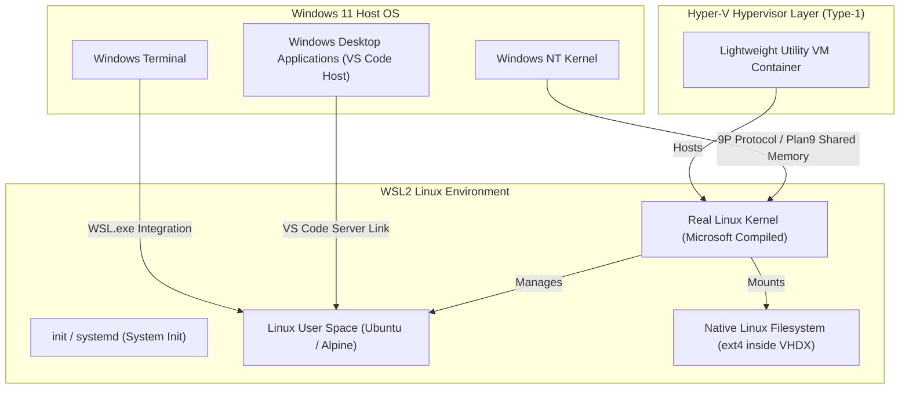
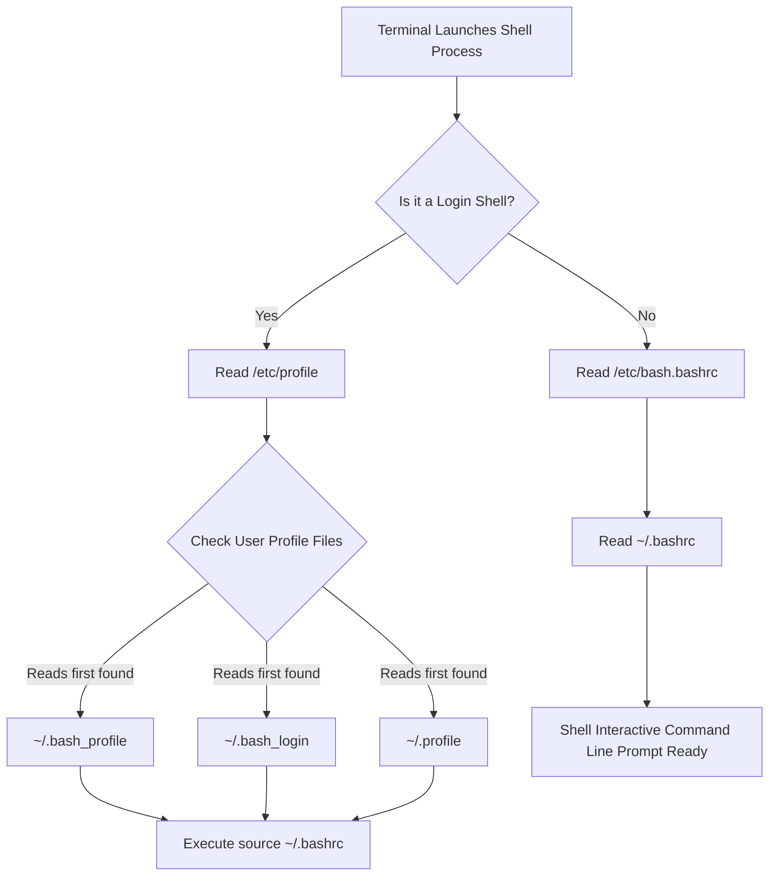
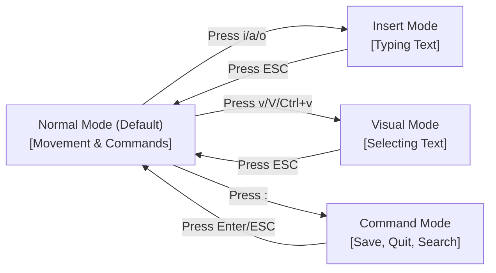
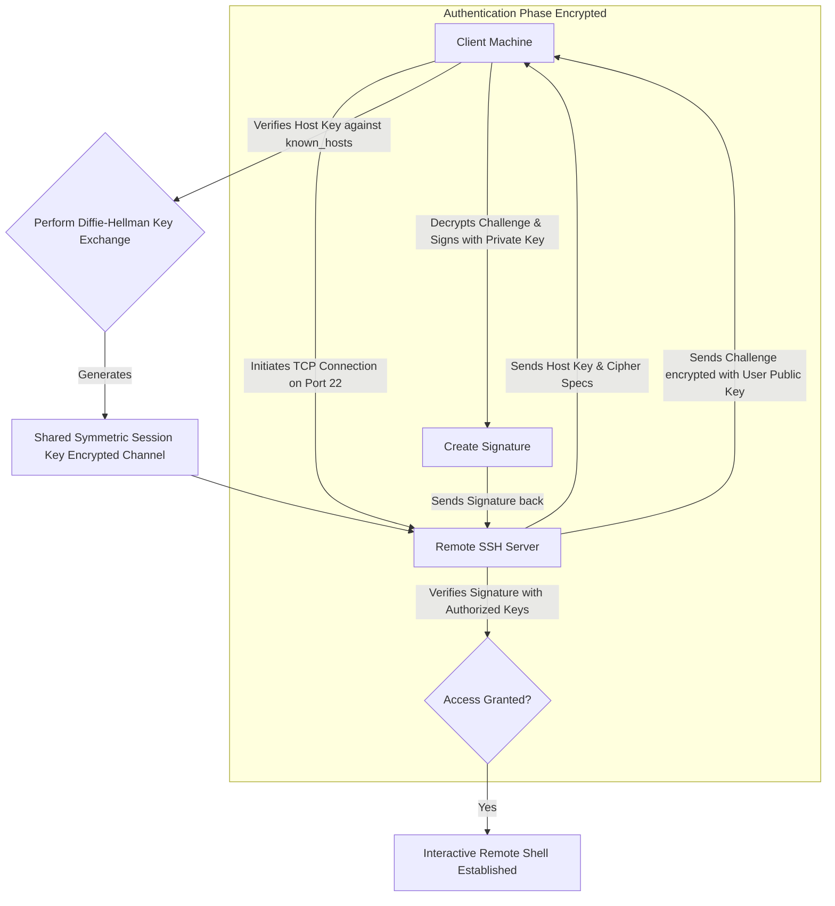
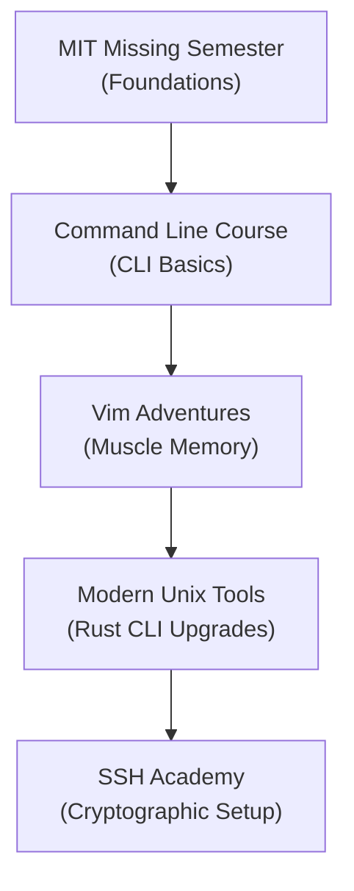

# Part 3: The Elite Developer Toolkit & Workflows

*[← Back to Master Index](/blog/it-career-guide)*

---

## 1. Deep-Dive Core Concepts: The Mechanics of Developer Environments

As an Assistant Systems Engineer transitioning from legacy corporate workflows (such as manual SAP CPQ maintenance or GUI-dependent administration) to a high-paying Platform or GenAI Engineer role, your terminal and workflow speed is your primary execution engine. Every time you lift your hands from the home row of your keyboard to grab a mouse, navigate nested folders in a graphical file explorer, or wait for legacy, slow UI tools to search a codebase, you waste cognitive focus. 

In modern, high-scale software engineering, elite backend and platform engineers operate almost entirely via keyboard-driven commands. They treat the terminal as a direct pipeline for code execution, system monitoring, and file editing. Understanding the physical and virtual boundaries of your operating environment is critical to configuring a workstation that scales to high-intensity development.

---

### The OS Boundary: WSL2 Virtualization and Hypervisor Architecture

For engineers working on Windows 11 systems, running web applications natively inside Windows creates compatibility and performance gaps. Most production cloud environments, Docker containers, database engines, and serverless runtimes run on Linux. Windows Subsystem for Linux 2 (WSL2) addresses this discrepancy by hosting a real Linux kernel on Windows machines, but it behaves very differently from native Linux or virtual machines.



#### Hypervisor Mechanics and Dynamic Memory Reclaim
Unlike WSL1, which sat directly on top of the Windows NT kernel and translated Linux system calls to Windows system calls on the fly (often experiencing performance drops for disk I/O and lacking support for direct kernel modules), WSL2 runs inside a Type-1 Hyper-V hypervisor.
- **Lightweight Utility VM:** Microsoft compiles a customized Linux kernel tailored specifically for WSL2. This kernel is instantiated inside a lightweight utility virtual machine container during boot. It boots in less than one second because it omits hardware device emulation, relying instead on direct virtual device drivers mapped to the Windows host.
- **Dynamic Resource Allocator:** Standard hypervisors (like VirtualBox or VMware) pre-allocate a fixed slice of RAM and CPU to the guest OS, locking those resources away from the host. WSL2 dynamically requests memory from the Windows host memory pool as Linux processes demand it. Conversely, when Linux processes terminate, a kernel daemon releases unused page frames back to the Windows NT memory manager. 
- **Memory Reclaim Configurations:** Under heavy Docker compilation or massive Python package installations, WSL2 can consume up to 80% of host RAM. To prevent system-wide memory exhaustion, developers must configure resource caps. You can create a file named `.wslconfig` in your Windows User profile directory (`C:\Users\<Username>\.wslconfig`) to constrain resource usage:
  ```ini
  [wsl2]
  memory=8GB    # Limit WSL2 memory allocation to 8 gigabytes
  processors=4  # Limit CPU core utilization to 4 logical cores
  guiApplications=false # Disable GUI translation if unnecessary
  ```

#### The Plan9 (9P) File Protocol and Directory Performance Rules
WSL2 shares files across the host-guest boundary using a custom implementation of the Plan9 (9P) network file protocol. Windows displays the Linux filesystem under the network share `\\wsl.localhost\`, while Linux mounts the Windows host drives under `/mnt/`. 
- **The Performance Boundary:** Because disk operations crossing the Plan9 boundary must undergo network protocol translation, running database engines, file watchers, or dependency installations across this barrier results in significant slowdowns.
- **Native vs. Mounted Disk Speeds:** Storing code inside the Windows filesystem and compiling it from within WSL2 (e.g., executing `npm install` or running a FastAPI hot-reload server inside `/mnt/c/Users/...`) causes high latency. Reading/writing files locally inside the native Linux filesystem (e.g., `/home/username/projects/`) bypasses the 9P translation layer entirely, operating on a native virtual disk format (`ext4` inside a `.vhdx` file). This approach increases filesystem compilation and package installation speeds up to tenfold.

---

### Shell Execution and Compilation Pipelines

When you open a terminal emulator (such as Windows Terminal or Alacritty), the host executes a shell binary (e.g., `/bin/bash` or `/bin/zsh`). The shell is an interactive command language interpreter that reads inputs from standard input (stdin) or files, parses them, and executes them by invoking system kernel calls.



#### Shell Execution Modes: Interactive vs. Non-Interactive, Login vs. Non-Login
The shell behaves differently depending on how it is invoked:
1. **Interactive Login Shell:** Triggered when you log into a remote server via SSH, or run `bash --login`. It initializes the entire environment from scratch.
   - **Load Path:** It reads `/etc/profile` first to set global system variables. Then it searches for `~/.bash_profile`, `~/.bash_login`, and `~/.profile` in order, executing the first one it finds.
2. **Interactive Non-Login Shell:** Triggered when you open a new terminal window or tab in WSL2 without logging in.
   - **Load Path:** It bypasses `/etc/profile` and login files, loading `/etc/bash.bashrc` followed by the user-specific `~/.bashrc` (or `~/.zshrc` for Zsh).
3. **Non-Interactive Non-Login Shell:** Triggered when running an automated shell script (e.g., `./deploy.sh`).
   - **Load Path:** It does not read any of the standard startup profile files. Instead, it checks for an environment variable named `$BASH_ENV`, pointing to a configuration script to run before executing.

#### Environment Variables and PATH Resolution Mechanics
Variables defined in the shell can be either local variables (accessible only within the current shell process) or environment variables (exported to child processes).
- **The PATH Array:** The most important system environment variable is `$PATH`. It contains a colon-separated list of directories:
  ```bash
  /usr/local/sbin:/usr/local/bin:/usr/sbin:/usr/bin:/sbin:/bin
  ```
- **Command Resolution:** When you type a command like `python3`, the shell searches these directories sequentially from left to right. It executes the first executable file with that name it encounters. If you install a custom binary (e.g., Rust utilities under `~/.cargo/bin`) and fail to append this directory to the `$PATH` array, the shell will throw a `command not found` error.
- **Modifying the Environment:** To modify path configurations permanently, add an export command to your `~/.bashrc`:
  ```bash
  export PATH="$HOME/.local/bin:$PATH"
  ```
  After editing, you must either restart the terminal or execute `source ~/.bashrc` to re-execute the script and compile these modifications into your active shell process memory space.

---

### The Dotfiles Philosophy: Configuration Portability

In professional platform engineering, setting up a new developer machine should take minutes. Manually installing applications, copying configurations, or re-adding custom shell aliases introduces configuration drift and wastes time. 

#### Configuration Portability and Dotfiles Structure
To maintain a portable environment, developer configuration files (which typically start with a period, making them hidden in standard directory lists) are centralized in a single Git repository, commonly called a **Dotfiles** repository.
- **The Directory Layout:** A modular dotfiles folder structure separates concerns clearly:
  ```
  ~/dotfiles/
  ├── shell/
  │   ├── env.sh      # System environment variables and PATH edits
  │   └── aliases.sh  # Common terminal shortcuts and functions
  ├── git/
  │   └── .gitconfig  # Global Git configuration
  ├── vim/
  │   └── .vimrc      # Editor settings and mappings
  └── install.sh      # Automation installation script
  ```
- **Symlink Compilation:** To apply these configurations, you create symbolic links (symlinks) from the home directory (`~`) pointing to the files inside the tracked `dotfiles` directory. If you run:
  ```bash
  ln -sf ~/dotfiles/git/.gitconfig ~/.gitconfig
  ```
  any changes made to `~/.gitconfig` are saved inside the tracked Git repository, ready to be committed and pushed to GitHub.

---

### The Modern CLI Toolchain Architecture

Modern CLI tools designed in Rust or C focus on performance, leveraging multi-threading and modern terminal graphics protocols. Replacing legacy, single-threaded POSIX utilities with these modern alternatives can speed up command line tasks significantly.

| Legacy Tool | Modern Alternative | Language | Key Architectural Advantage |
| :--- | :--- | :--- | :--- |
| `cd` | **zoxide** | Rust | Tracks directory access frequencies using a "frecency" algorithm to enable fast teleportation. |
| `grep` | **ripgrep (`rg`)** | Rust | Utilizes Rust's Regex engine and finite automata to search directories in parallel, ignoring `.gitignore` files. |
| `find` | **fd** | Rust | Employs parallel directory traversal to perform regex-based file searches with colored output by default. |
| `cat` | **bat** | Rust | Integrates syntax highlighting, line numbers, and Git modification markers directly into terminal views. |
| `ls` | **eza** | Rust | Uses visual icons and color coding to display metadata, showing detailed Git statuses per file. |
| `curl` | **httpie** | Python | Simplifies API testing with formatted JSON outputs and syntax highlighting. |

#### Zoxide Frecency Mechanics
The standard `cd` command requires typing absolute or relative paths. **Zoxide** replaces this by recording directory navigation history. 
- **Frecency Formula:** Zoxide calculates a score for each directory by combining access frequency (f) and the time elapsed since the last access (t):
  `Frecency Score = f * e^(-lambda * t)`
- **Teleportation:** Typing `z api` prompts Zoxide to search its local database for the path containing "api" with the highest frecency score, immediately changing the active directory to that path.

#### Ripgrep Text Search Optimization
Ripgrep (`rg`) searches directories faster than GNU `grep` or `ag` (The Silver Searcher) through several optimizations:
1. **Deterministic Finite Automata (DFA):** Ripgrep compiles search queries into deterministic finite automata, avoiding back-tracking states during evaluation.
2. **Parallel Traversal:** Directories are walked in parallel using multi-threaded routines that scale across available CPU cores.
3. **Smart Ignoring:** Ripgrep reads and respects `.gitignore`, `.ignore`, and `.rgignore` configurations, skipping compiler outputs, `node_modules`, and binary data by default to avoid scanning unnecessary files.

---

### Vim Modal Editing Internals

Remote servers, cloud staging instances, and Kubernetes pods often lack graphical interfaces. Modifying configurations in these environments requires using command-line editors like Vim or Neovim.

#### Vim Modes
Vim relies on modal state separation to let developers control the editor without a mouse:
1. **Normal Mode:** Every key press is mapped to a command rather than typing characters on the screen.
2. **Insert Mode:** Active when typing code. Enter this mode by pressing `i`, `a`, or `o`.
3. **Visual Mode:** Used for selecting blocks of text. Enter this mode by pressing `v` (character-wise), `V` (line-wise), or `Ctrl+v` (block-wise).
4. **Command Mode:** Used for saving files, quitting, and setting configurations. Enter this mode by pressing `:` in Normal Mode.



#### Vim Registers and Buffers
Vim manages documents in memory using specific structures:
- **Buffers:** An in-memory representation of a file. When you open a file, Vim loads its content into a buffer. You can have multiple buffers open at once and switch between them using `:bnext` or `:bprev`.
- **Registers:** Clipboard slots used to store text. Vim has several registers:
  - `"`: The unnamed register (stores the last deleted or yanked text).
  - `0`: The yank register (stores the last copied text, preventing it from being overwritten by deletions).
  - `+` or `*`: The system clipboard registers (used to copy and paste text between Vim and other desktop applications).
  - `a` to `z`: Named registers (used to store text chunks in specific keys, like `"ayiw` to copy a word into register `a`).

#### Operator-Motion Grammar
Vim commands are structured like sentences, combining an **Operator** (the action) with a **Motion** (the target):

```
Action = Operator + Motion
```

- **Operators:** `d` (delete), `c` (change), `y` (yank/copy).
- **Motions:** `w` (next word), `e` (end of word), `$` (end of line), `t}` (until the next closing curly bracket).
- **Combination:** Typing `ciw` (change inner word) tells Vim to delete the word under the cursor and switch to Insert Mode, allowing you to edit the word immediately. Typing `y$` copies everything from the cursor to the end of the line.

---

### SSH Infrastructure and Cryptographic Signatures

Secure Shell (SSH) is the standard protocol for logging into remote servers and executing commands securely. It relies on asymmetric cryptography to authenticate connections.



#### Cryptographic Signatures and Key Types
An SSH key pair consists of a public key and a private key:
- **Algorithms:** Legacy setups used **RSA** keys, which require longer key lengths (typically 4096 bits) to remain secure. Modern setups prefer **Ed25519** keys, which use elliptic curve cryptography to offer equivalent security with shorter key lengths (256 bits), faster signature generation, and better performance.
- **Authentication Flow:** Your private key stays on your local machine, protected by a passphrase. Your public key is added to the remote server's `~/.ssh/authorized_keys` file. During login, the server encrypts a random challenge with your public key. Your client decrypts it using your private key and sends back a signature, proving identity without exposing the private key.

#### SSH Agent Mechanics
To avoid typing your private key passphrase for every connection, you can use the `ssh-agent` helper tool. It runs in the background, loads your decrypted private keys into memory using `ssh-add`, and handles authentication challenges automatically.

#### Agent Forwarding and Security Risks
When connecting to a remote bastion or staging server, you may need to run commands that authenticate with another system (like cloning a private repository from GitHub).
- **The Wrong Way:** Copying your private key directly to the remote server is a security risk. If that server is compromised, attackers can access your private key.
- **The Safe Way (Agent Forwarding):** By enabling agent forwarding with `ssh -A user@server`, you tell the SSH client to forward connection requests to your local `ssh-agent`. The remote server creates a local socket file that proxies authentication challenges back to your local machine, allowing you to authenticate remote actions without exposing your private key.
- **Security Caution:** Staging or production servers with root users can access your forwarded agent socket files. Only use agent forwarding on trusted servers to prevent unauthorized authentication attempts.

---

## 2. Master Resource Directory: Terminal & Workflows

To build a fast, productive workspace, you need to study how these tools work under the hood. The table below lists curated resources to help you master terminal workflows, terminal environments, and modal editing.



---

### Resource 1: The Missing Semester of Your CS Education (MIT)

- **Why It Was Selected:** This course bridges the gap between academic CS theory and practical developer workflows. It covers terminal usage, shell scripting, command line tools, and SSH configurations.
- **Target Syllabus Modules/Chapters:**
  - *Lecture 1: The Shell* (Understanding pipes, streams, and file descriptors).
  - *Lecture 2: Shell Tools and Scripting* (Loops, conditions, globbing, and shebang lines).
  - *Lecture 5: Command-line Environment* (Job control, terminal multiplexers, aliases, and configuration files).
  - *Lecture 7: Debugging and Profiling* (Log analysis, query timings, and core dumps).
- **Time Investment Required:** 15 Hours (includes watching lectures and completing the exercises).
- **Value Assessment:** Free. This resource provides a foundational understanding of shell environments, teaching you how to use pipes, redirects, and scripting instead of relying on manual UI steps.
- **Actionable Study Strategy:** Watch the videos at 1.25x speed. Have a WSL2 terminal open alongside the video to run the commands and complete the assignments on their course website.

---

### Resource 2: Command Line Crash Course (freeCodeCamp)

- **Why It Was Selected:** A practical, video-based introduction to POSIX commands, file operations, permissions, and directory structures.
- **Target Syllabus Modules/Chapters:**
  - *Module 1: Navigation and Pathing* (Absolute vs. relative paths, `pwd`, `ls`, and `cd`).
  - *Module 2: File Manipulations* (Creating, copying, moving, and deleting files with `mkdir`, `touch`, `cp`, `mv`, and `rm`).
  - *Module 3: Permissions and Access* (`chmod`, `chown`, and octal permissions representation).
  - *Module 4: I/O Redirection* (Understanding stdin, stdout, stderr, `>`, `>>`, and `|`).
- **Time Investment Required:** 4 Hours (video playback and hands-on practice).
- **Value Assessment:** Free. Essential for building the basic terminal navigation skills needed to manage projects without a mouse.
- **Actionable Study Strategy:** Watch the course at 1.0x speed. Pause the video at each exercise to type the commands manually in your terminal.

---

### Resource 3: Vim Adventures

- **Why It Was Selected:** An interactive browser game that teaches Vim keyboard shortcuts by turning modal editing into a puzzle game.
- **Target Syllabus Modules/Chapters:**
  - *Levels 1-3:* Basic navigation keys (`h`, `j`, `k`, `l`).
  - *Levels 4-5:* Word-based jumps (`w`, `e`, `b`) and line navigation (`0`, `$`).
  - *Levels 6-10:* Text editing actions (`d`, `c`, `y`, `p`, `x`) and target motions (`iw`, `it`, `a"`).
- **Time Investment Required:** 3 Hours.
- **Value Assessment:** Free for the introductory levels. It helps build the muscle memory needed to use Vim commands without constantly looking at a keyboard cheat sheet.
- **Actionable Study Strategy:** Play for 30 minutes a day before starting your main coding work. Focus on avoiding the arrow keys entirely.

---

### Resource 4: Modern Unix Tools Documentation

- **Why It Was Selected:** A curated list and collection of documentation for modern command line tools like `ripgrep`, `fd`, `bat`, `eza`, and `zoxide`.
- **Target Syllabus Modules/Chapters:**
  - *zoxide Setup:* Configuring automatic directory tracking.
  - *ripgrep Usage:* Regular expressions, filtering file types, and search configurations.
  - *jq Playground:* Filtering and transforming JSON payloads.
- **Time Investment Required:** 5 Hours (reading documentation and configuring tools).
- **Value Assessment:** Free. Using these tools can speed up file search, system navigation, and JSON parsing tasks compared to legacy utilities.
- **Actionable Study Strategy:** Read the installation guides for each tool. Write a custom configuration file for `ripgrep` (`~/.ripgreprc`) to define your default search rules.

---

### Resource 5: Visual Studio Code Essential Training (LinkedIn Learning)

- **Why It Was Selected:** A course focused on using VS Code efficiently, covering keyboard shortcuts, workspaces, extensions, and integration with WSL2.
- **Target Syllabus Modules/Chapters:**
  - *Chapter 3: Customizing settings and keybindings.*
  - *Chapter 5: Extensions and remote development workspaces.*
  - *Chapter 7: Git integration and conflict resolution inside VS Code.*
- **Time Investment Required:** 6 Hours (video content and workspace setup).
- **Value Assessment:** Included with TCS-provided LinkedIn Learning access. It helps you set up VS Code to work directly with files inside your WSL2 Linux container.
- **Actionable Study Strategy:** Watch at 1.5x speed. Install the "Remote - WSL" extension pack and configure your workspace to use WSL2 as the default terminal shell.

---

### Resource 6: SSH Academy & Cryptographic Tutorials

- **Why It Was Selected:** A series of tutorials on managing SSH keys, configuring SSH agents, and setting up agent forwarding safely.
- **Target Syllabus Modules/Chapters:**
  - *Section 1: Key generation with Ed25519.*
  - *Section 2: Configuring SSH config files (`~/.ssh/config`).*
  - *Section 3: Security implications of agent forwarding.*
- **Time Investment Required:** 3 Hours.
- **Value Assessment:** Free. Essential for understanding how to authenticate securely with remote servers, GitHub, and production databases.
- **Actionable Study Strategy:** Read the guides, generate new Ed25519 key pairs, and configure a structured `~/.ssh/config` file to manage connections to multiple servers.

---

## 3. Hands-On Portfolio Lab Project: Dotfiles Automation Engine

In this lab, you will build and deploy a modular **Dotfiles Automation Engine**. This project will automate the setup of a developer workspace on a clean Linux or WSL2 installation, installing tools like `zoxide`, `ripgrep`, `bat`, `eza`, and configuring shell profiles, Git settings, and Vim environments.

```
~/dotfiles/
├── install.sh                  # Main entry bootstrap script
├── install_dependencies.sh     # System package detection and install engine
├── shell/
│   ├── aliases.sh              # Alias mappings and custom shell wrappers
│   ├── env.sh                  # PATH adjustments and runtime exports
│   └── prompt.sh               # Terminal prompt optimization configurations
├── git/
│   └── .gitconfig              # Global Git settings (merging, diffing)
└── vim/
    └── .vimrc                  # Modal editing configurations
```

---

### Step 1: Create the Dotfiles Directory Structure

Open your terminal inside your native WSL2 directory (do not use a Windows directory mount `/mnt/c/`) and run:
```bash
mkdir -p ~/dotfiles/shell ~/dotfiles/git ~/dotfiles/vim
cd ~/dotfiles
```

---

### Step 2: Define Shell Configurations

#### File: `~/dotfiles/shell/env.sh`
This file configures system environment variables and appends paths to the `$PATH` array safely.
```bash
#!/usr/bin/env bash

# Set default editor to Vim
export EDITOR="vim"
export VISUAL="vim"

# Configure Ripgrep to use a custom configurations file
if [ -f "$HOME/dotfiles/shell/.ripgreprc" ]; then
    export RIPGREP_CONFIG_PATH="$HOME/dotfiles/shell/.ripgreprc"
fi

# Ensure user-level local bin is included in PATH
if [[ ":$PATH:" != *":$HOME/.local/bin:"* ]]; then
    export PATH="$HOME/.local/bin:$PATH"
fi

# Set custom language options for terminal output compilation
export LANG="en_US.UTF-8"
export LC_ALL="en_US.UTF-8"
```

#### File: `~/dotfiles/shell/aliases.sh`
This file contains common commands and replaces legacy POSIX utilities with modern CLI alternatives.
```bash
#!/usr/bin/env bash

# Replace ls with eza (colored lists and icons)
if command -v eza &> /dev/null; then
    alias ls="eza --icons --group-directories-first --header"
    alias ll="eza -la --icons --group-directories-first --git --header"
    alias lt="eza --tree --level=2 --icons"
else
    alias ls="ls --color=auto"
    alias ll="ls -la"
fi

# Replace cat with bat
if command -v bat &> /dev/null; then
    alias cat="bat --style=plain --paging=never"
    alias catp="bat"
fi

# Replace grep with ripgrep
if command -v rg &> /dev/null; then
    alias grep="rg"
fi

# Replace cd with zoxide
if command -v zoxide &> /dev/null; then
    # zoxide initializes as a shell function named 'z'
    alias cd="z"
fi

# Common shortcuts for development
alias g="git"
alias gs="git status"
alias gd="git diff"
alias gp="git push"
alias gc="git commit -m"
alias run-dev="uvicorn main:app --reload --port 8000"
```

#### File: `~/dotfiles/shell/prompt.sh`
A simplified terminal prompt configuration showing git branch status.
```bash
#!/usr/bin/env bash

# Function to parse git branch details
parse_git_branch() {
     git branch 2> /dev/null | sed -e '/^[^*]/d' -e 's/* \(.*\)/ (\1)/'
}

# Configure prompt colors and layout
# Blue directory path, green git branch, and clean prefix character
export PS1="\[\033[36m\]\w\[\033[32m\]\$(parse_git_branch)\[\033[00m\] \$ "
```

---

### Step 3: Define Global Git Configurations

#### File: `~/dotfiles/git/.gitconfig`
Configures user defaults, system behaviors, and colorized diff output.
```ini
[user]
    name = Chirag Singhal
    email = whyiswhen@gmail.com

[core]
    editor = vim
    autocrlf = input
    whitespace = trailing-space,space-before-tab

[color]
    ui = auto

[init]
    defaultBranch = main

[pull]
    rebase = true

[push]
    autoSetupRemote = true
```

---

### Step 4: Configure Vim modal settings

#### File: `~/dotfiles/vim/.vimrc`
Configures text formatting, syntax highlighting, and keyboard shortcuts.
```vim
" Enable syntax highlighting
syntax on

" Set line numbering rules
set number
set relativenumber

" Configure tab indent spacing
set tabstop=4
set shiftwidth=4
set expandtab
set autoindent

" Search settings
set hlsearch
set incsearch
set ignorecase
set smartcase

" Keep cursor 8 lines away from edges during vertical scrolling
set scrolloff=8

" Map Leader key to space
let mapleader = " "

" Map fast exit keys for insert mode
inoremap jk <Esc>

" Clear search highlighting with Leader+h
nnoremap <Leader>h :nohlsearch<CR>

" Fast buffer navigation
nnoremap <Leader>n :bnext<CR>
nnoremap <Leader>p :bprev<CR>
```

---

### Step 5: Build the Dependency Installation Engine

#### File: `~/dotfiles/install_dependencies.sh`
This script checks for a package manager and installs missing utilities (`zoxide`, `ripgrep`, `bat`, `eza`).
```bash
#!/usr/bin/env bash

set -euo pipefail

echo "=== Stage 1: Installing Core Dependencies ==="

# Check for apt (Debian/Ubuntu)
if command -v apt-get &> /dev/null; then
    echo "Detected Debian/Ubuntu system. Updating packages..."
    sudo apt-get update -y
    
    echo "Installing bat, ripgrep, fd-find, and curl..."
    sudo apt-get install -y bat ripgrep fd-find curl git vim

    # Debian installs bat as 'batcat' to avoid namespace conflicts
    # Let's fix that by symlinking it to ~/.local/bin/bat if it exists
    mkdir -p "$HOME/.local/bin"
    if ! command -v bat &> /dev/null; then
        ln -sf /usr/bin/batcat "$HOME/.local/bin/bat"
    fi
    if ! command -v fd &> /dev/null; then
        ln -sf /usr/bin/fdfind "$HOME/.local/bin/fd"
    fi

    # Install zoxide via official binary installer
    if ! command -v zoxide &> /dev/null; then
        echo "Installing zoxide..."
        curl -sS https://raw.githubusercontent.com/ajeetdsouza/zoxide/main/install.sh | sh
    fi

    # Install eza via official repository configuration
    if ! command -v eza &> /dev/null; then
        echo "Configuring eza repository..."
        sudo mkdir -p /etc/apt/keyrings
        wget -qO- https://raw.githubusercontent.com/eza-community/eza/main/deb.asc | sudo gpg --dearmor -o /etc/apt/keyrings/gierens.gpg
        echo "deb [signed-by=/etc/apt/keyrings/gierens.gpg] http://deb.gierens.de/stable main" | sudo tee /etc/apt/sources.list.d/gierens.list
        sudo apt-get update
        sudo apt-get install -y eza
    fi

# Check for brew (macOS / Linuxbrew)
elif command -v brew &> /dev/null; then
    echo "Detected Homebrew. Installing dependencies..."
    brew install bat ripgrep fd zoxide eza git vim

else
    echo "Warning: No supported package manager found (apt or brew)."
    echo "Please install bat, ripgrep, fd, eza, and zoxide manually."
fi
```

---

### Step 6: Build the Symlink Automation Installer

#### File: `~/dotfiles/install.sh`
This script checks dependencies, backs up existing configurations, and links your repository files to the user's home directory.
```bash
#!/usr/bin/env bash

set -euo pipefail

DOTFILES_DIR="$HOME/dotfiles"
BACKUP_DIR="$HOME/dotfiles_backup_$(date +%Y%m%d_%H%M%S)"

echo "Starting dotfiles installation..."

# Run dependency installation
chmod +x "$DOTFILES_DIR/install_dependencies.sh"
"$DOTFILES_DIR/install_dependencies.sh"

# Create backup directory for existing files
mkdir -p "$BACKUP_DIR"

# Function to safely backup and symlink configurations
link_file() {
    local source_file="$1"
    local target_file="$2"

    # If the target exists and is not a symlink, back it up
    if [ -f "$target_file" ] && [ ! -L "$target_file" ]; then
        echo "Backing up existing file: $target_file -> $BACKUP_DIR/"
        mv "$target_file" "$BACKUP_DIR/"
    elif [ -L "$target_file" ]; then
        echo "Removing existing symlink: $target_file"
        rm "$target_file"
    fi

    echo "Linking: $source_file -> $target_file"
    ln -sf "$source_file" "$target_file"
}

# Link Git Configuration
link_file "$DOTFILES_DIR/git/.gitconfig" "$HOME/.gitconfig"

# Link Vim Configuration
link_file "$DOTFILES_DIR/vim/.vimrc" "$HOME/.vimrc"

# Configure Bash to read your modular dotfiles
BASHRC="$HOME/.bashrc"
if [ -f "$BASHRC" ]; then
    # Append load block if it isn't already in ~/.bashrc
    if ! grep -q "dotfiles/shell/env.sh" "$BASHRC"; then
        echo "Appending load hooks to ~/.bashrc..."
        cat << 'EOF' >> "$BASHRC"

# Load Dotfiles Configurations
if [ -f "$HOME/dotfiles/shell/env.sh" ]; then
    source "$HOME/dotfiles/shell/env.sh"
fi
if [ -f "$HOME/dotfiles/shell/aliases.sh" ]; then
    source "$HOME/dotfiles/shell/aliases.sh"
fi
if [ -f "$HOME/dotfiles/shell/prompt.sh" ]; then
    source "$HOME/dotfiles/shell/prompt.sh"
fi

# Initialize Zoxide
if command -v zoxide &> /dev/null; then
    eval "$(zoxide init bash)"
fi
EOF
    fi
fi

echo "Installation complete. Restart your terminal or run: source ~/.bashrc"
```

Make the script executable:
```bash
chmod +x ~/dotfiles/install.sh
```

To run the installation, execute:
```bash
~/dotfiles/install.sh
```

---

## 4. Technical Interview Self-Assessment

Prepare for systems engineering interviews by studying the common questions and answer frameworks below.

| Category | High-Frequency Interview Question | Expected Technical Answer Framework |
| :--- | :--- | :--- |
| **WSL2 System Calls** | What is the performance difference between WSL1 and WSL2 when executing disk-heavy commands? | WSL1 translates Linux system calls into Windows NT system calls on the fly, which introduces virtualization overhead and slows down file-heavy tasks like `npm install`. WSL2 hosts a real Linux kernel running inside a lightweight VM, using native `ext4` virtual disks. This allows WSL2 to execute system calls directly, resulting in significantly faster disk read/write speeds. |
| **Linux Startup Profiles** | Explain the differences between the execution scopes of `/etc/profile`, `~/.profile`, and `~/.bashrc`. | `/etc/profile` sets global system configurations and runs once during system boot or SSH login. `~/.profile` runs next to configure user-specific environment variables for login shells. `~/.bashrc` runs every time a new, interactive non-login shell session is started (like opening a new terminal tab). |
| **I/O Redirection** | Explain the difference between `command > file`, `command 2>&1`, and `command | grep`. | `command > file` redirects standard output (stdout) to a file, overwriting its contents. `command 2>&1` redirects standard error (stderr) to stdout, combining both streams. `command | grep` pipes stdout from the first command as the standard input (stdin) for the grep process. |
| **Vim Command Grammar** | Explain the Vim command `d2w` and how it differs from `2dw`. | In Vim, both commands produce the same result but follow different grammar structures. `d2w` combines the delete operator (`d`) with the motion of jumping two words forward (`2w`). `2dw` executes the "delete word" command (`dw`) twice. |
| **SSH Cryptography** | How does SSH verify identity during public key authentication without sending the private key to the server? | During authentication, the server generates a challenge (a random string), encrypts it with the client's public key, and sends it over the connection. The client decrypts this challenge using its private key and sends the result back as a signature. The server verifies the signature using the corresponding public key, authenticating the connection without exposing the private key. |

---

## 5. Exit Tasks for this Phase

Complete these verification steps before moving to Part 4:
- [ ] Run the `install.sh` script to set up your environment dependencies and symlinks.
- [ ] Verify that commands like `ls` and `cat` alias correctly to `eza` and `bat`.
- [ ] Log out and log back into your WSL2 terminal to ensure environment profiles load without errors.
- [ ] Practice basic Vim movements (`h`, `j`, `k`, `l`) and command combinations (`ciw`, `y$`, `:wq`).
- [ ] Commit your dotfiles repository to GitHub to keep your configurations backed up and portable.

---

*[Proceed to Part 4: Python Mastery from Scratch →](/blog/it-career-guide/part-04-python-mastery)*
