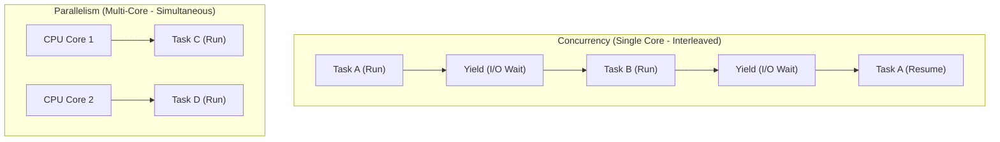
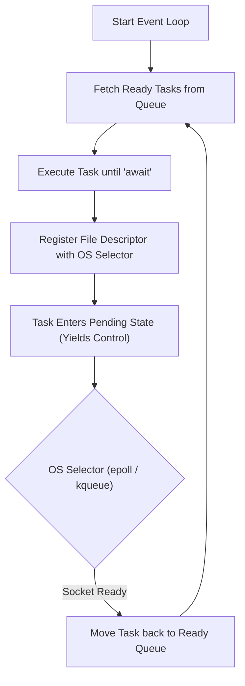
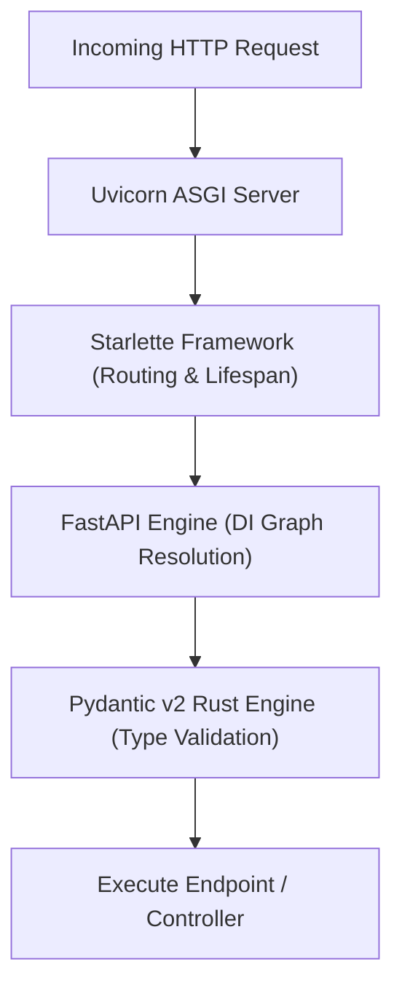
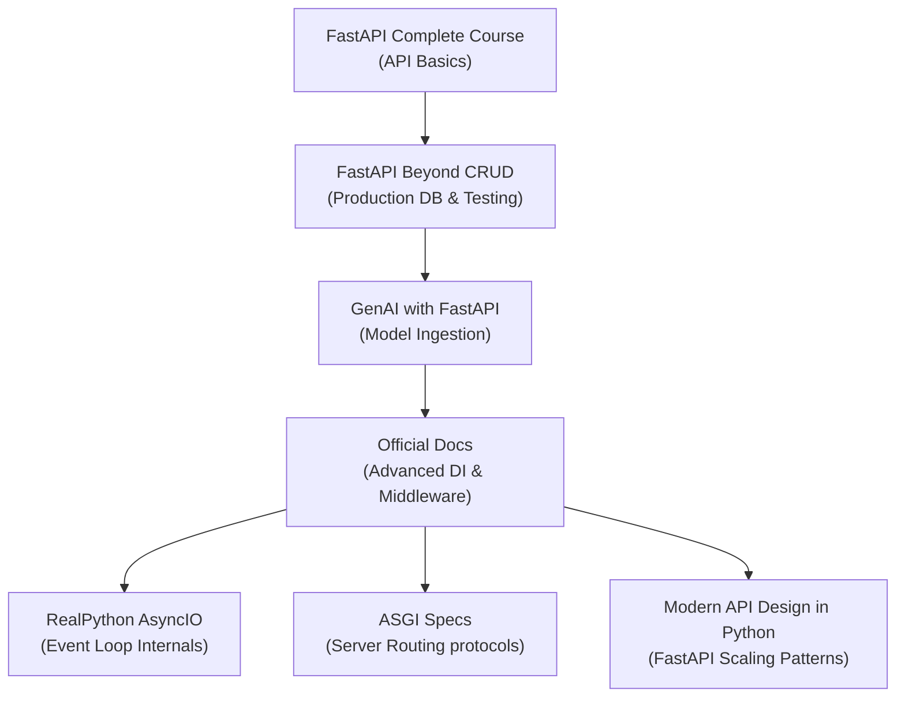

# Part 5: Asynchronous Python & FastAPI Backend Services

*[← Back to Master Index](/blog/it-career-guide)*

---

## 1. Deep-Dive Core Concepts: Asynchronous Runtimes & Web Service Architectures

In traditional synchronous web frameworks (like Django or Flask running under a standard WSGI server), each incoming HTTP request is handled by a single dedicated operating system thread or process. If your application needs to fetch data from a database, call an external payment gateway, or read a file from disk, the thread stops and waits (blocks) for the I/O operation to complete. While waiting, that thread cannot handle other incoming requests, leading to high resource utilization and poor scaling under high concurrency.

Asynchronous frameworks like **FastAPI**, powered by Python's **AsyncIO** engine and executed on an **ASGI** server (like Uvicorn), solve this issue by using cooperative multitasking. Instead of blocking threads during I/O operations, the single execution thread yields control back to an coordinator, allowing it to process other tasks in the meantime.

---

### Concurrency vs. Parallelism: The CPU Boundary

It is important to distinguish between concurrency and parallelism, especially given Python's runtime constraints:



- **Concurrency:** Managing and executing multiple tasks by interleaving their execution on a single core. The system switches between tasks rapidly, creating the appearance of simultaneous execution.
- **Parallelism:** Executing multiple tasks at the exact same physical instant on separate CPU cores.
- **The Global Interpreter Lock (GIL) Limitation:** In CPython, the GIL ensures that only one OS thread executes Python bytecode at any given moment. This prevents multi-threaded Python applications from running CPU-intensive operations (like matrix multiplication or image processing) in parallel across multiple cores. However, for **I/O-bound operations** (like waiting for database queries or network sockets), the GIL is released during the system wait state. This makes asynchronous design highly effective for web servers, which spend most of their time waiting for network I/O.

#### Concurrency Comparison Matrix
The table below compares the performance characteristics of Python's execution models:

| Performance Metric | AsyncIO (Coroutines) | Threading (`threading`) | Multiprocessing (`multiprocessing`) |
| :--- | :--- | :--- | :--- |
| **GIL Bypass** | No (Single thread boundary) | No (Single thread boundary) | Yes (Separate process interpreters) |
| **Memory Footprint** | Low (~2–4 KB per task) | Medium (~1–2 MB per thread) | High (~10–50 MB per process) |
| **Context-Switch Cost** | User-space jump (O(1)) | OS Kernel Scheduler interrupt | OS Kernel process translation page tables |
| **Primary Use-Case** | Network I/O, Web API endpoints | Light non-blocking network I/O | CPU-bound math, image processing |
| **Thread Safety Risks**| Low (Deterministic yield points) | High (Race conditions, lock deadlocks) | Low (Isolated memory environments) |

---

### AsyncIO Event Loop Internals & OS Multiplexing

At the core of asynchronous Python is the **Event Loop**. The event loop is a continuous execution loop that monitors active tasks and coordinates their running states.



#### OS Multiplexing: epoll, kqueue, and Selectors
Instead of constantly polling sockets to check if data has arrived (which consumes CPU cycles), the event loop relies on low-level operating system multiplexing primitives:
- **`epoll`** (Linux)
- **`kqueue`** (macOS/BSD)
- **`IOCP`** (Windows)

Python's `selectors` module abstracts these OS-level features. When an asynchronous task initiates a network read (e.g., waiting for an HTTP database response), the event loop registers the socket's file descriptor (FD) with the OS selector, requesting a notification when the socket has data available. The loop then pauses the current task and executes other ready tasks. When the OS kernel detects that the socket has received data, it triggers a hardware interrupt, prompting the selector to notify the event loop, which moves the waiting task back to the ready queue.

#### Coroutines, Futures, and Tasks
- **Coroutines:** Functions declared with `async def`. Calling a coroutine does not execute it immediately; instead, it returns a coroutine object.
- **Futures:** Low-level objects representing an execution result that may not be available yet. They act as placeholders for pending operations.
- **Tasks:** A wrapper that runs a coroutine inside the event loop as a concurrent execution step. Creating a task schedules the coroutine to run on the loop's next tick.
- **The `await` Keyword:** Tells the runtime to pause the execution of the current coroutine until the awaited task or future completes, yielding control back to the event loop so other tasks can run.

#### Under the Hood: Task Lifecycle and State Transitions
Within the event loop, a Task objects cycles through several states:
1. **Pending:** The task is created and placed in the loop's execution queue. It waits for the loop scheduler to allocate CPU cycles.
2. **Running:** The event loop pulls the task from the queue and executes its bytecode. It runs until it encounters an `await` expression on a blocking operation.
3. **Suspended (Waiting):** The task is paused, waiting for an external event (such as socket I/O or a timer). The event loop registers the target file descriptor with the OS selector and switches to other pending tasks.
4. **Done:** The task completes its execution, storing the return value (or exception) inside its future structure. Any coroutine awaiting this task is then moved back to the ready queue.
5. **Cancelled:** The task is explicitly aborted using `task.cancel()`. This raises a `CancelledError` inside the coroutine, allowing it to run cleanups before exiting.

#### Thread-Safeness and the Event Loop
It is important to remember that the AsyncIO event loop is **not thread-safe**. You cannot schedule tasks on an event loop running in Thread A from Thread B directly using standard `loop.create_task()`. Instead, you must use `loop.call_soon_threadsafe()`, which writes a byte to an internal self-pipe, waking up the event loop in Thread A to schedule the task safely.

#### Custom Micro Event Loop Implementation in Python
To understand how system multiplexing works, here is a simplified implementation of an event loop using Python's `selectors` module:
```python
import selectors
import socket
from typing import Callable, Any

class MicroEventLoop:
    def __init__(self) -> None:
        self.selector = selectors.DefaultSelector()
        self.running = True

    def register_read(self, sock: socket.socket, callback: Callable[[socket.socket], Any]) -> None:
        """Registers a socket file descriptor with the selector for read events."""
        self.selector.register(sock, selectors.EVENT_READ, callback)

    def unregister(self, sock: socket.socket) -> None:
        """Removes a socket from the selector."""
        self.selector.unregister(sock)

    def run_forever(self) -> None:
        """Main loop that polls for registered I/O events and executes callbacks."""
        while self.running:
            # Block until registered sockets are ready for read/write events
            events = self.selector.select(timeout=None)
            for key, mask in events:
                callback = key.data
                sock = key.fileobj
                # Execute callback function associated with the ready socket
                callback(sock) # type: ignore
```

---

### ASGI vs. WSGI Web Server Specifications

To run python web applications, web servers use standard gateway interfaces to communicate with framework code:

```
[WSGI Architecture - Synchronous]
HTTP Client ---> Nginx/Apache ---> Gunicorn (WSGI) ---> Flask/Django Application Code (Blocks thread per request)

[ASGI Architecture - Asynchronous]
HTTP Client ---> Nginx/Cloudflare ---> Uvicorn (ASGI) ---> Starlette/FastAPI Application Code (Shares event loop)
```

- **WSGI (Web Server Gateway Interface):** The legacy standard designed for synchronous applications. It uses a simple call signature: `application(environ, start_response)`. Because it is synchronous, it cannot handle persistent connections like WebSockets or long-polling HTTP requests efficiently, as each connection locks up a server process or thread.
- **ASGI (Asynchronous Server Gateway Interface):** The modern successor to WSGI, designed to support asynchronous call patterns. It supports a three-argument call signature: `application(scope, receive, send)`.
  - `scope`: A dictionary containing metadata about the connection (e.g., HTTP headers, path, protocol type).
  - `receive`: An asynchronous callable used to receive incoming messages from the client.
  - `send`: An asynchronous callable used to send outgoing messages back to the client.
  This allows ASGI servers (such as Uvicorn or Hypercorn) to manage multiple concurrent protocols (like HTTP, HTTP/2, and WebSockets) within a single event loop.

#### Decoding the Connection Scope
Inside the `scope` dictionary of an ASGI HTTP request, headers are represented as a list of two-item tuples containing raw byte keys and values:
```python
scope = {
    "type": "http",
    "http_version": "1.1",
    "method": "POST",
    "path": "/process/csv",
    "headers": [
        (b"host", b"127.0.0.1:8000"),
        (b"content-type", b"multipart/form-data; boundary=...")
    ]
}
```
This low-level representation requires frameworks like FastAPI or Starlette to parse headers into standard Python dictionaries and strings. However, keeping the core ASGI interface simple and performance-focused ensures minimal execution overhead.

#### The ASGI Lifespan Protocol
In addition to handling HTTP requests and WebSockets, ASGI defines a **lifespan** protocol. This protocol allows the server to send startup and shutdown events to the application, enabling frameworks to perform setup and cleanup operations (like opening database connection pools or warming caches) before the server starts accepting HTTP requests.

---

### FastAPI Architecture: Starlette, Pydantic v2, and Dependency Injection

FastAPI is not a low-level framework built from scratch. It coordinates several existing tools to provide a fast, typed API development experience.



#### Starlette Integration
FastAPI uses **Starlette** to handle core web routing, middleware, exception handling, and application lifespan events. Starlette provides the underlying ASGI toolkit, while FastAPI adds features for documentation generation, validation, and dependency management.

#### Pydantic v2 Rust-Based Serialization Engine
For data validation and serialization, FastAPI relies on **Pydantic**.
- **Rust Core:** In version 2, Pydantic's core validation logic was rewritten in Rust (`pydantic-core`), resulting in serialization and validation speeds up to 10 times faster than the purely Python-based version 1.
- **Validation Graphs:** When a Pydantic model is compiled at startup, the engine parses its type annotations into a structured validation graph represented by the `CoreSchema` type.
- **Execution Flow:** When a client sends a JSON payload to a FastAPI endpoint, Pydantic's Rust engine parses the data and validates it against the schema graph. If the validation fails, FastAPI generates structured error messages automatically, returning a `422 Unprocessable Entity` response to the client.

#### Under the Hood: Pydantic v2 Validator Lifecycle & Execution Hooks
Pydantic v2 allows developers to customize validation using decorator hooks:
- **`@field_validator` (Before/After):** Runs validation checks on a single model attribute.
  - `mode='before'`: The validation function receives the raw input value before Pydantic applies any parsing or type casting. This is useful for parsing date strings or sanitizing text inputs.
  - `mode='after'`: The validation function receives the parsed value after standard type validation succeeds. This is ideal for range checks or business logic validation.
- **`@model_validator` (Before/After):** Runs validation checks across multiple fields.
  - `mode='before'`: Receives the raw dictionary representing the incoming request payload.
  - `mode='after'`: Receives the model instance after all individual fields have been validated. This is useful for cross-field validation, such as verifying that a password confirmation matches the password field.

Here is an example showing custom validator registration:
```python
from pydantic import BaseModel, field_validator, model_validator
from typing import Self

class UserProfile(BaseModel):
    username: str
    age: int

    @field_validator("username")
    @classmethod
    def validate_username(cls, value: str) -> str:
        if not value.isalnum():
            raise ValueError("Username must be alphanumeric.")
        return value.lower()

    @model_validator(mode="after")
    def verify_profile_constraints(self) -> Self:
        if self.username == "admin" and self.age < 21:
            raise ValueError("Administrator profiles require age 21 or older.")
        return self
```

#### Dependency Injection (DI) Container Internals
FastAPI features a built-in Dependency Injection system using `Depends()`.
- **The DI Graph:** When you start your application, FastAPI inspects your endpoint functions to build a dependency resolution graph.
- **Recursive Resolution:** If Endpoint A depends on Service B, and Service B depends on Database Session C, FastAPI resolves these dependencies recursively. It creates and caches dependencies during a request, ensuring resource cleanups (like closing database connections) run after the request completes.

#### How FastAPI Resolves the DI Graph
During application startup, FastAPI uses Python's standard `inspect` library (specifically `inspect.signature`) to read the parameter lists of all endpoint functions and dependency functions.
1. **Node Extraction:** Every parameter using `Depends(dependency_callable)` is extracted as a node in a directed acyclic graph (DAG).
2. **Topological Sort (Kahn's Algorithm):** FastAPI performs a topological sort on this dependency graph to establish a correct execution order. If dependencies contain circular references (e.g., Dependency A depends on B, which depends on A), FastAPI raises a `RuntimeError` during startup.
3. **Execution Phase:** When an HTTP request is received, FastAPI executes the sorted dependency tree sequentially. Resolved dependencies are stored in an internal dictionary (`dependency_cache`), ensuring that if multiple components request the same dependency within a single request, the dependency is resolved once, reusing the cached value.

---

### Database Connection Pool Mechanics: Avoiding Starvation in Async Systems

When building asynchronous backend services, your database adapter must also be asynchronous. Using a synchronous driver (like legacy `psycopg2` for PostgreSQL) inside an asynchronous FastAPI endpoint will block the event loop, defeating the purpose of async design.

- **Asynchronous Drivers:** Always use modern asynchronous adapters like `asyncpg` or `aiomysql`.
- **Connection Pools:** Creating a new database connection for every HTTP request is slow because it requires setting up TCP handshakes and allocating database processes. Instead, use a connection pool (managed via SQLAlchemy's `AsyncSession`).
- **Avoiding Pool Starvation:** Under high concurrent traffic, if your pool is capped at 10 connections and you spawn 100 concurrent requests that need database access, 90 requests will queue up waiting for a free connection. If any request blocks the connection longer than necessary (e.g., executing a slow query or waiting for an external network call while holding a transaction lock), your application will experience pool starvation.
- **Rule of Thumb:** Keep database transactions as short as possible. Acquire database sessions immediately before executing queries and release them back to the pool before performing external HTTP requests or heavy CPU computations.

---

## 2. Master Resource Directory: Async Python & FastAPI

Mastering asynchronous web architectures requires studying event loops, concurrency design, API patterns, and database scaling. The table below lists curated resources to help you study these topics.



---

### Resource 1: FastAPI - The Complete Course (Udemy Course by Eric Roby)

- **Why It Was Selected:** A comprehensive video course covering FastAPI development, database integrations using SQLAlchemy, authentication, routers, and testing configurations.
- **Target Syllabus Modules/Chapters:**
  - *Section 3: Path Parameters & Query Parameters.*
  - *Section 5: Database Setup with SQLAlchemy.*
  - *Section 7: Routers, Project Structure, and Modular Design.*
  - *Section 9: Authentication & Authorization using JWT.*
- **Time Investment Required:** 20 Hours (includes watching videos and writing the practice APIs).
- **Value Assessment:** Included with TCS-provided Udemy access. Helps build familiarity with API design, routers, and database configurations.
- **Actionable Study Strategy:** Watch the videos at 1.25x speed. Build the sample application yourself, writing the database models and API endpoints from scratch.

---

### Resource 2: FastAPI Beyond CRUD (YouTube Series)

- **Why It Was Selected:** A practical video series focused on advanced FastAPI design, database migrations with Alembic, background tasks, redis caching, and writing integration tests.
- **Target Syllabus Modules/Chapters:**
  - *Episode 4: Asynchronous Database Sessions with SQLModel/SQLAlchemy.*
  - *Episode 7: Advanced Dependency Injection.*
  - *Episode 10: Writing Integration Tests using Async HTTPX clients.*
- **Time Investment Required:** 10 Hours.
- **Value Assessment:** Free. Excellent for learning how to transition from simple mock APIs to production-ready database applications.
- **Actionable Study Strategy:** Follow the episodes sequentially, refactoring the project code to use asynchronous database sessions and writing tests for each endpoint.

---

### Resource 3: Building Generative AI Services with FastAPI (O'Reilly Book)

- **Why It Was Selected:** A guide showing how to build and scale backend services that integrate machine learning models, handle heavy data payloads, and process asynchronous tasks using FastAPI.
- **Target Syllabus Modules/Chapters:**
  - *Chapter 4: Designing APIs for Machine Learning Models.*
  - *Chapter 6: Processing Heavy Payloads with Background Tasks.*
  - *Chapter 8: Scaling Async APIs using Docker and Workers.*
- **Time Investment Required:** 15 Hours.
- **Value Assessment:** Free via O'Reilly library access. Highly relevant for platform engineers planning to build backend services for AI applications.
- **Actionable Study Strategy:** Read the design chapters. Use the examples to build a service that handles mock data processing tasks asynchronously in the background.

---

### Resource 4: FastAPI Official Documentation

- **Why It Was Selected:** The official documentation is a detailed guide containing recipes for advanced dependency injection, custom middleware, background tasks, security integrations, and deployment.
- **Target Syllabus Modules/Chapters:**
  - *Tutorial - User Guide:* Complete review of path operations, typing, and validation.
  - *Advanced User Guide:* Custom request classes, database pooling, and middleware configurations.
- **Time Investment Required:** 12 Hours.
- **Value Assessment:** Free. Essential reference guide for API design, security patterns, and deployment configurations.
- **Actionable Study Strategy:** Read the Tutorial section completely, then study the Advanced User Guide recipes to learn how to write custom security dependencies and middleware.

---

### Resource 5: RealPython: AsyncIO in Python - A Complete Walkthrough

- **Why It Was Selected:** A tutorial explaining Python's `async/await` syntax, event loop mechanics, coroutines, tasks, and handling network I/O concurrency.
- **Target Syllabus Modules/Chapters:**
  - *Section 2: The Rules of AsyncIO.*
  - *Section 4: Generators and Async Iterators.*
  - *Section 6: Handling Network Sockets with AsyncIO Streams.*
- **Time Investment Required:** 6 Hours.
- **Value Assessment:** Free. Useful for understanding how async execution works under the hood before using higher-level frameworks like FastAPI.
- **Actionable Study Strategy:** Read the tutorial, copy the sample scripts, and use print statements to track the execution order of concurrent tasks.

---

### Resource 6: ASGI Specification Documentation

- **Why It Was Selected:** The official specification defining how ASGI servers (like Uvicorn) interface with asynchronous web frameworks (like FastAPI).
- **Target Syllabus Modules/Chapters:**
  - *The ASGI Spec:* Scope dictionaries, lifecycle events, and message formats.
  - *HTTP Connection Scope:* Request/response structures and streaming protocols.
- **Time Investment Required:** 4 Hours.
- **Value Assessment:** Free. Useful for understanding the low-level communication patterns between the web server and your application code.
- **Actionable Study Strategy:** Read the specifications and write a simple raw ASGI application without using any framework to understand how connection scopes work.

---

### Resource 7: Modern API Design with Python (O'Reilly Video Series)

- **Why It Was Selected:** A practical video series focused on scaling Python API architectures, database connection tuning, load balancing ASGI processes, and optimizing JSON serialization.
- **Target Syllabus Modules/Chapters:**
  - *Module 3: Async database design patterns.*
  - *Module 5: Tuning Gunicorn with Uvicorn workers for high concurrency.*
  - *Module 7: API caching layers with Redis.*
- **Time Investment Required:** 8 Hours.
- **Value Assessment:** Free via O'Reilly. Excellent resource for understanding production-level optimizations for FastAPI backends.
- **Actionable Study Strategy:** Watch the series, compile the configuration templates, and apply the Uvicorn worker settings to your local deployment setups.

---

## 3. Hands-On Portfolio Lab Project: Asynchronous File Processing Service

In this lab, you will build an **Asynchronous File Processing Service** using FastAPI. The service will accept CSV file uploads, parse them using asynchronous stream generators, send rows to a mock external API using `httpx.AsyncClient`, utilize dependency injection to manage resources, and validate payloads with Pydantic v2.

```
~/async_service/
├── app/
│   ├── __init__.py
│   ├── main.py             # App initialization and exception handling
│   ├── config.py           # Configuration schema
│   ├── dependencies.py     # DI database and HTTP clients
│   ├── schemas.py          # Pydantic v2 data validation schemas
│   └── routers/
│       └── processor.py    # Asynchronous processing endpoints
├── tests/
│   ├── __init__.py
│   ├── conftest.py         # Pytest fixtures and mock overrides
│   └── test_processor.py   # Integration tests
├── requirements.txt        # Package dependencies
└── run.sh                  # Validation and run execution script
```

---

### Step 1: Initialize Project Directory and Dependencies

Create the project folder structure inside WSL2:
```bash
mkdir -p ~/async_service/app/routers ~/async_service/tests
cd ~/async_service
```

#### File: `~/async_service/requirements.txt`
Declares the required libraries for our asynchronous service.
```
fastapi>=0.110.0
uvicorn[standard]>=0.28.0
pydantic>=2.6.0
httpx>=0.27.0
pytest>=8.0.0
pytest-asyncio>=0.23.0
python-multipart>=0.0.9
```

---

### Step 2: Implement Configuration Schemas

#### File: `~/async_service/app/config.py`
Defines application configuration settings.
```python
from pydantic import Field
from pydantic_settings import BaseSettings

class Settings(BaseSettings):
    app_name: str = "Async File Processing Service"
    external_api_url: str = Field(default="https://httpbin.org/post", env="EXTERNAL_API_URL")
    max_upload_size_bytes: int = 10 * 1024 * 1024 # 10 Megabytes

    class Config:
        env_file = ".env"

settings = Settings()
```

---

### Step 3: Implement Data Validation Schemas

#### File: `~/async_service/app/schemas.py`
Defines input validation models using Pydantic v2.
```python
from pydantic import BaseModel, Field, EmailStr
from typing import Literal

class TransactionPayload(BaseModel):
    transaction_id: str = Field(..., min_length=3, description="Unique transaction code")
    user_email: EmailStr = Field(..., description="Customer notification email")
    amount: float = Field(..., gt=0.0, description="Transaction amount")
    category: Literal["infrastructure", "saas", "marketing", "hardware"]

class ProcessingSummary(BaseModel):
    processed_count: int
    failed_count: int
    total_amount: float
    status: str = "completed"
```

---

### Step 4: Write Dependency Injection Containers

#### File: `~/async_service/app/dependencies.py`
Configures shared resources like the asynchronous HTTP client.
```python
import httpx
from typing import AsyncGenerator

async def get_http_client() -> AsyncGenerator[httpx.AsyncClient, None]:
    """Provides a shared, asynchronous HTTP client session to endpoints."""
    async with httpx.AsyncClient(timeout=10.0) as client:
        # Yield the client instance and keep the connection pool open
        yield client
        # Connection automatically closes when the request block finishes
```

---

### Step 5: Implement Asynchronous Routers

#### File: `~/async_service/app/routers/processor.py`
This file implements the async processing endpoints.
```python
import codecs
import csv
from fastapi import APIRouter, UploadFile, File, Depends, HTTPException, status
import httpx
from app.schemas import TransactionPayload, ProcessingSummary
from app.dependencies import get_http_client
from app.config import settings

router = APIRouter(
    prefix="/process",
    tags=["Processing Engine"]
)

async def parse_csv_stream(file: UploadFile) -> AsyncGenerator[dict[str, str], None]:
    """Asynchronously parses chunks of an uploaded CSV file, yielding rows as dicts."""
    # Read files in chunks to avoid loading large files into memory at once
    csv_reader = csv.DictReader(codecs.iterdecode(file.file, 'utf-8'))
    for row in csv_reader:
        yield row

@router.post("/csv", response_model=ProcessingSummary, status_code=status.HTTP_202_ACCEPTED)
async def process_csv_payload(
    file: UploadFile = File(...),
    http_client: httpx.AsyncClient = Depends(get_http_client)
) -> ProcessingSummary:
    """Processes uploaded CSV files asynchronously, sending validated rows to an external API."""
    if not file.filename or not file.filename.endswith(".csv"):
        raise HTTPException(
            status_code=status.HTTP_400_BAD_REQUEST,
            detail="Invalid file format. Please upload a standard CSV file."
        )

    processed_count = 0
    failed_count = 0
    total_amount = 0.0

    try:
        # Iterate over the async data stream
        async for row in parse_csv_stream(file):
            try:
                # Validate raw row against Pydantic schema
                payload = TransactionPayload(
                    transaction_id=row.get("transaction_id", ""),
                    user_email=row.get("user_email", ""),
                    amount=float(row.get("amount", 0)),
                    category=row.get("category", "") # type: ignore
                )

                # Send validated payload asynchronously to mock external API
                response = await http_client.post(
                    settings.external_api_url,
                    json=payload.model_dump()
                )

                if response.status_code == 200 or response.status_code == 201:
                    processed_count += 1
                    total_amount += payload.amount
                else:
                    failed_count += 1

            except (ValueError, KeyError, TypeError):
                # Increment failed count if data parsing or validation fails
                failed_count += 1
                continue

    except Exception as e:
        raise HTTPException(
            status_code=status.HTTP_500_INTERNAL_SERVER_ERROR,
            detail=f"An error occurred during file processing: {str(e)}"
        )

    return ProcessingSummary(
        processed_count=processed_count,
        failed_count=failed_count,
        total_amount=total_amount,
        status="completed" if processed_count > 0 else "failed"
    )
```

---

### Step 6: Build the Main Entrypoint

#### File: `~/async_service/app/main.py`
Initializes the FastAPI application and configures routers and routers metadata.
```python
from fastapi import FastAPI, Request
from fastapi.responses import JSONResponse
from app.routers import processor
from app.config import settings

app = FastAPI(
    title=settings.app_name,
    version="1.0.0",
    description="An asynchronous web application for high-performance file parsing and API integration."
)

# Register routers
app.include_router(processor.router)

@app.exception_handler(Exception)
async def global_exception_handler(request: Request, exc: Exception) -> JSONResponse:
    """Catches unhandled errors globally, preventing server failure details from leaking."""
    return JSONResponse(
        status_code=500,
        content={"detail": "An internal system error occurred. Please try again later."}
    )

@app.get("/health", status_code=200)
async def check_health() -> dict[str, str]:
    """Returns application status metrics."""
    return {"status": "healthy", "service": settings.app_name}
```

---

### Step 7: Write Integration Tests

#### File: `~/async_service/tests/conftest.py`
Sets up testing helpers and overrides default dependencies.
```python
import pytest
from typing import AsyncGenerator
from fastapi.testclient import TestClient
from app.main import app
from app.dependencies import get_http_client

# Mock HTTP client to intercept external API requests during testing
class MockAsyncClient:
    async def post(self, url: str, json: dict) -> mock_response:
        class mock_response:
            status_code = 201
            def json(self):
                return json
        return mock_response()

async def override_get_http_client() -> AsyncGenerator[MockAsyncClient, None]:
    yield MockAsyncClient()

# Override application dependencies for tests
app.dependency_overrides[get_http_client] = override_get_http_client

@pytest.fixture
def client() -> TestClient:
    """Fixture providing a test client wrapper for endpoints."""
    return TestClient(app)
```

#### File: `~/async_service/tests/test_processor.py`
Validates CSV parser outputs and error handling scenarios.
```python
from fastapi.testclient import TestClient

def test_health_check(client: TestClient) -> None:
    """Verifies that the system health check resolves correctly."""
    response = client.get("/health")
    assert response.status_code == 200
    assert response.json() == {"status": "healthy", "service": "Async File Processing Service"}

def test_process_csv_success(client: TestClient) -> None:
    """Verifies successful parsing of a valid CSV file upload."""
    # Create mock CSV content
    csv_data = (
        "transaction_id,user_email,amount,category\n"
        "TX101,user1@test.com,250.0,infrastructure\n"
        "TX102,user2@test.com,75.50,saas\n"
    )
    
    files = {"file": ("test.csv", csv_data, "text/csv")}
    response = client.post("/process/csv", files=files)
    
    assert response.status_code == 202
    data = response.json()
    assert data["processed_count"] == 2
    assert data["failed_count"] == 0
    assert data["total_amount"] == 325.50
    assert data["status"] == "completed"

def test_process_csv_invalid_file(client: TestClient) -> None:
    """Verifies that uploading an invalid file format returns a 400 Bad Request error."""
    files = {"file": ("test.txt", "some,raw,text,data", "text/plain")}
    response = client.post("/process/csv", files=files)
    assert response.status_code == 400
    assert "Invalid file format" in response.json()["detail"]

def test_process_csv_validation_failure(client: TestClient) -> None:
    """Verifies that rows with validation errors are skipped and recorded as failures."""
    # Row 2 contains an invalid category, Row 3 contains a negative amount
    csv_data = (
        "transaction_id,user_email,amount,category\n"
        "TX101,user1@test.com,150.0,infrastructure\n"
        "TX102,user2@test.com,100.0,invalid_category\n"
        "TX103,user3@test.com,-50.0,saas\n"
    )
    
    files = {"file": ("test.csv", csv_data, "text/csv")}
    response = client.post("/process/csv", files=files)
    
    assert response.status_code == 202
    data = response.json()
    assert data["processed_count"] == 1
    assert data["failed_count"] == 2
    assert data["total_amount"] == 150.0
```

---

### Step 8: Build the Run Automation Script

#### File: `~/async_service/run.sh`
This script configures a virtual environment, installs dependencies, and runs the test suite.
```bash
#!/usr/bin/env bash

# Exit script on any execution error
set -euo pipefail

echo "=== Stage 1: Creating Virtual Environment ==="
python3 -m venv .venv
source .venv/bin/activate

echo "=== Stage 2: Installing Application Dependencies ==="
pip install --upgrade pip
pip install -r requirements.txt

echo "=== Stage 3: Running Test Suite (Pytest) ==="
pytest tests/

echo "=== Stage 4: Starting API Application Server ==="
echo "Starting Uvicorn server..."
uvicorn app.main:app --reload --port 8000
```

Make the script executable and run it:
```bash
chmod +x ~/async_service/run.sh
./run.sh
```

---

## 4. Technical Interview Self-Assessment

Prepare for systems engineering interviews by studying the common questions and answer frameworks below.

| Category | High-Frequency Interview Question | Expected Technical Answer Framework |
| :--- | :--- | :--- |
| **Concurrency Models** | Explain the difference between thread-based concurrency and async/await cooperative multitasking. | Thread-based concurrency uses the OS scheduler to swap executing threads, which incurs CPU register overhead and memory usage for thread stacks. Async/await uses cooperative multitasking on a single thread. Coroutines yield control to the event loop during I/O operations, letting the loop process other tasks in the meantime. |
| **System Sockets** | What role do `epoll` and `kqueue` play in Python's AsyncIO loop execution? | `epoll` and `kqueue` are low-level OS multiplexing primitives. Instead of constantly checking network sockets, the AsyncIO event loop registers connection file descriptors with the OS selector. The OS notifies the event loop when a socket is ready, letting the loop wake the waiting task and run it. |
| **ASGI Specification** | How does the ASGI interface differ from WSGI, and why is it necessary for modern async services? | WSGI is designed for synchronous, request-response cycles. It blocks execution on a thread until the call finishes. ASGI is designed for asynchronous operations, using a three-argument call structure: `application(scope, receive, send)`. This lets it handle concurrent requests and persistent connections like WebSockets within a single event loop. |
| **Pydantic v2 Performance** | Why is Pydantic v2 significantly faster than v1, and how does it handle validation under the hood? | Pydantic v2's core validation logic is written in Rust (`pydantic-core`), which bypasses Python's interpreter overhead. It validates JSON data directly in Rust, instantiating Python objects only after validation succeeds. This makes data serialization and validation tasks up to 10 times faster. |
| **Dependency Injection** | How does FastAPI's dependency injection system manage database sessions, and how does it handle cleanup? | FastAPI builds a dependency resolution graph at startup. During a request, it resolves dependencies recursively, caching values for the duration of the request. Dependencies using the `yield` keyword yield the resource to the endpoint and then execute cleanup code (like closing database connections) after the response is sent. |
| **Starvation Prevention** | Explain how slow queries can cause database connection pool starvation in an asynchronous system. | An asynchronous system operates on a single execution thread. While the thread yields during I/O wait, the database connection remains allocated to the session. If connections are held during non-database operations (like waiting for slow external API calls or holding long transaction locks), all pool connections become occupied, starving other ready requests of database access. |

---

## 5. Exit Tasks for this Phase

Complete these verification steps before moving to the next batch:
- [ ] Run the `run.sh` script to verify your virtual environment and start the development server.
- [ ] Verify that Pytest executes and passes all test cases successfully.
- [ ] Run the health check endpoint `/health` to confirm the server starts correctly.
- [ ] Test the file processor by uploading a valid CSV file using the `/process/csv` endpoint.
- [ ] Commit your asynchronous service codebase to GitHub to keep your progress backed up.

---

*[Proceed to Part 6: TypeScript & Node.js Backend Ecosystems →](/blog/it-career-guide/part-06-typescript-nodejs)*
