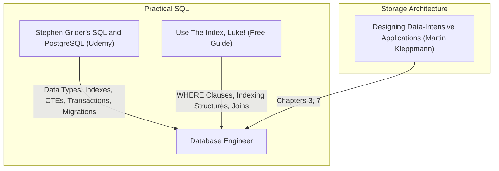

# Part 7: Relational Databases & Advanced PostgreSQL

*[← Back to Master Index](/blog/it-career-guide)*

---

## 1. Introduction: Moving Beyond Basic CRUD

Most junior developers and support engineers treat database systems like simple Excel spreadsheets. They write basic `SELECT * FROM table` queries, ignore how data is laid out on physical hardware, create schemas with zero normalization boundaries, and let ORM libraries generate terrible, un-optimized queries. This lack of database-level engineering is why scaling platforms encounter crippling lag spikes as table sizes cross 100,000 rows.

In high-concurrency systems environments, distributed systems architectures, and modern product teams in **2026**, **database engineering is a primary performance tier**. Developers do not just write queries; they design precise index patterns, study query planner execution trees using `EXPLAIN ANALYZE`, manage transactional locking thresholds, and execute zero-downtime schema migrations.

This chapter is your **Relational Databases & PostgreSQL Master Resource Directory**. It contains no basic SQL syntax tutorials. Instead, it points you to the exact video modules, database-storage textbooks, and online optimization manuals you must master to write production-grade database structures.

---

## 2. Master Resource Directory: PostgreSQL & SQL

Here are the precise learning resources, specific syllabus modules, and technical chapters you must consume:

---

### Source 1: *SQL and PostgreSQL: The Complete Developer's Guide* by Stephen Grider
*   **Format:** Hands-On Video Course
*   **Platform:** Udemy Business (Free via your TCS Ultimatix SSO gateway)
*   **Direct Link Reference:** [Udemy Course Page](https://www.udemy.com/)
*   **Why It is Selected:** Stephen Grider is a master at making complex backend systems highly visual. This course is uniquely suited for developers who know basic CRUD but need to master hardware-level storage structures, indexes, transactions, schema migrations, and application connection wrappers.

#### Exact Course Modules to Watch & Execute:
1.  **Watch Section: A Look at Indexes for Performance:** Master how B-Tree indexes store sorting nodes, how GIN indexes map arrays/text, and how to read the query planner output using `EXPLAIN`.
2.  **Watch Section: Common Table Expressions (CTEs):** Master writing clean, recursive database queries for hierarchical tree data structures.
3.  **Watch Section: Transactions:** Master concurrent connection states, utilizing `BEGIN`, `COMMIT`, and `ROLLBACK` to prevent partial data states under failures.
4.  **Watch Section: Schema & Data Migrations:** Master using database migration tools (like Alembic or Knex) to manage evolutionary schema version control.

---

### Source 2: *Designing Data-Intensive Applications* by Martin Kleppmann
*   **Format:** Technical Systems Architecture Book
*   **Platform:** O'Reilly Learning (Search inside your TCS O'Reilly account)
*   **Direct Link Reference:** [O'Reilly Book Profile Page](https://learning.oreilly.com/)
*   **Why It is Selected:** Kleppmann's book is widely considered the modern classic of systems engineering. It explains exactly *how* database storage engines write data to physical SSD tracks, how transaction isolation levels are enforced, and how concurrent race conditions occur.

#### Exact Chapters to Read:
1.  **Read Chapter 3: Storage and Retrieval:** Focus heavily on the distinctions between **LSM-Trees** (Log-Structured Merge-Trees, optimized for writes) and **B-Trees** (optimized for reads).
2.  **Read Chapter 7: Transactions:** Master ACID definitions. Focus on transaction isolation anomalies: Dirty Reads, Non-repeatable Reads, Phantom Reads, Write Skew, and how engines implement **Snapshot Isolation** and **Serializable** states.

---

### Source 3: *Use The Index, Luke!* by Markus Winand
*   **Format:** Open-Access SQL Indexing Guide & Sandbox
*   **Platform:** Public Technical Web Book
*   **Direct Link Reference:** [use-the-index-luke.com](https://use-the-index-luke.com/)
*   **Why It is Vetted:** This is the single best resource on the internet for understanding database performance. It focuses entirely on index usage, explaining how the SQL compiler evaluates clauses, and how to write queries that utilize indexes instead of triggering slow **Full Table Scans**.

#### Exact Sections to Read:
1.  **Read Section: The Index:** Learn how a B-Tree operates dynamically to search values in logarithmic time ($O(\log N)$ complexity).
2.  **Read Section: The WHERE Clause:** Master single-column indexes, multi-column compound indexes, and the critical **Left-to-Right Column Order Rule**.
3.  **Read Section: Performance and Scalability:** Master how database clusters execute indexing under massive concurrent load.

---

## 3. Hands-On Portfolio Lab Project: EXPLAIN ANALYZE tuning

To demonstrate your database-level optimization skills to recruiters, you must build and commit a **PostgreSQL Query Performance Analyzer** to your public GitHub profile (`github.com/chirag127`).

### The Lab Project Guidelines:
1.  **Containerized Database Setup:** Build a `docker-compose.yml` file to spin up a local PostgreSQL instance.
2.  **Schema Versioning Migration:**
    - Initialize database version control using **Alembic** (Python) or **Knex** (Node.js/TS).
    - Write a migration script to generate two tables: `users` and `audit_logs` (linked via foreign keys).
3.  **Data Ingestion Script:** Write a script utilizing Python's `Faker` package or Node's `Faker` to populate your tables with **100,000 synthetic records**.
4.  **Tuning Lab Task:**
    - Write a slow search query that filters logs by a partial string and matches a range of timestamps.
    - Execute the query through a performance script that runs `EXPLAIN (ANALYZE, BUFFERS) SELECT ...` and logs the output to `query_baseline.txt`. Note the query plan cost and execution duration.
    - Write a new migration script to add a **Compound B-Tree Index** matching your filter conditions.
    - Run the query analyzer again, logging the optimized output to `query_optimized.txt`.
5.  **Exhaustive Readme:** Your repository README must display a side-by-side markdown table comparing the query planner cost, buffers read, and execution duration before and after your indexing operation, proving a **100x+ latency decrease**.

---

## 4. Technical Interview Self-Assessment

Use these questions to verify if you have successfully digested these learning sources:

| Concept | High-Frequency Interview Question | Expected Technical Answer Framework |
| :--- | :--- | :--- |
| **B-Tree vs GIN** | What is the difference between a B-Tree and a GIN index? | B-Tree is a sorted tree optimized for comparison operations (`=`, `>`, `<`) on single scalar values. **GIN (Generalized Inverted Index)** is designed for multi-value types (arrays, JSONB, full-text searches), mapping elements to their parent records. |
| **Race Conditions**| What is a Write Skew anomaly inside a database transaction? | A write skew occurs when two transactions read concurrent data, perform validation locally, and write changes that violate a global business rule because the state shifted in parallel before they committed. |
| **Index Ordering** | If you have a compound index on `(age, status)`, does it optimize a query filtering only by `status`? | No. Compound indexes must satisfy the **Left-to-Right Rule**. A query must filter by the leftmost prefix (`age`) for the index to be traversed; filtering only by `status` triggers a full table scan. |
| **Explain buffers**| What is the difference between `EXPLAIN` and `EXPLAIN ANALYZE`? | `EXPLAIN` parses the query and displays the estimated planning cost without executing the query. `EXPLAIN ANALYZE` actually executes the query on the database, logging the real elapsed time and disk buffers read. |

---

## 5. Exit Tasks for this Phase

Complete these verification steps before proceeding to Part 8:

- [ ] Complete the targeted modules and index segments of Stephen Grider's Postgres course.
- [ ] Read Chapters 3 and 7 in *Designing Data-Intensive Applications* via O'Reilly.
- [ ] Read the 3 targeted indexing sections on *Use The Index, Luke!*.
- [ ] Commit your optimized and schema-migrated `postgres-explain-lab` project to your GitHub profile.

---

*[Proceed to Part 8: NoSQL Databases (MongoDB & Redis Caching) →](/blog/it-career-guide/part-08-nosql-databases)*

---

### The 2026 IT Career Blueprint Series Navigation

- **[Master Index: The 2026 IT Career Blueprint](/blog/it-career-guide)**
- **Part 1:** [The Blueprint & Escape Plan →](/blog/it-career-guide/part-01-the-blueprint)
- **Part 2:** [Advanced Version Control & Git Mastery →](/blog/it-career-guide/part-02-git-github)
- **Part 3:** [The Elite Developer Toolkit & Workflows →](/blog/it-career-guide/part-03-developer-toolkit)
- **Part 4:** [Python Mastery from Scratch →](/blog/it-career-guide/part-04-python-mastery)
- **Part 5:** [Async programming & FastAPI Backend Services →](/blog/it-career-guide/part-05-async-python-fastapi)
- **Part 6:** [TypeScript & Node.js Backend Ecosystems →](/blog/it-career-guide/part-06-typescript-backend)
- **Part 7:** [Relational Databases & Advanced PostgreSQL →](/blog/it-career-guide/part-07-postgresql)
- **Part 8:** [NoSQL Databases (MongoDB & Redis Caching) →](/blog/it-career-guide/part-08-nosql-databases)
- **Part 9:** [Distributed Systems & Message Queues with Kafka →](/blog/it-career-guide/part-09-distributed-systems-kafka)
- **Part 10:** [System Design Principles & Scalable Architecture →](/blog/it-career-guide/part-10-system-design)
- **Part 11:** [Microservices Architecture Patterns →](/blog/it-career-guide/part-11-microservices)
- **Part 12:** [Docker & Containerization for Backend Developers →](/blog/it-career-guide/part-12-docker)
- **Part 13:** [Kubernetes & Container Orchestration →](/blog/it-career-guide/part-13-kubernetes)
- **Part 14:** [Continuous Integration & Deployment (CI/CD) with GitHub Actions →](/blog/it-career-guide/part-14-cicd)
- **Part 15:** [AWS Cloud & Serverless Architectures →](/blog/it-career-guide/part-15-aws-serverless)
- **Part 16:** [Front-End Mastery: React, Next.js & Client-Side Architectures →](/blog/it-career-guide/part-16-frontend-react)
- **Part 17:** [Generative AI & Large Language Models (LLM) Integration →](/blog/it-career-guide/part-17-genai-llms)
- **Part 18:** [Retrieval-Augmented Generation (RAG) & Vector Databases →](/blog/it-career-guide/part-18-rag-vector-db)
- **Part 19:** [AI Agents & Advanced Workflows with LangGraph →](/blog/it-career-guide/part-19-ai-agents-langgraph)
- **Part 20:** [Enterprise Security, Authentication & OWASP Top 10 →](/blog/it-career-guide/part-20-security-auth)
- **Part 21:** [Comprehensive Testing: Unit, Integration, & E2E Testing →](/blog/it-career-guide/part-21-testing)
- **Part 22:** [Data Structures & Algorithms (DSA) and LeetCode Blueprint →](/blog/it-career-guide/part-22-dsa-leetcode)
- **Part 23:** [Tech Interview Success: System Design & Behavioral STAR Method →](/blog/it-career-guide/part-23-tech-interviews)
- **Part 24:** [Global Remote Jobs and Freelancing Platforms →](/blog/it-career-guide/part-24-global-remote)
- **Part 25:** [Immigration, Visas & Tech Relocation →](/blog/it-career-guide/part-25-immigration-visas)
