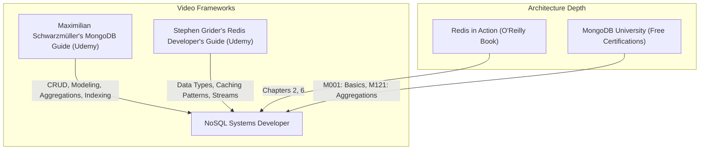

# Part 8: NoSQL Databases & Redis Caching

*[← Back to Master Index](/blog/it-career-guide)*

---

## 1. Introduction: Balancing Consistency and Latency

In modern backend architectures, a single relational database cannot handle every workload. While PostgreSQL is excellent for transactional consistency, ACID bounds, and complex joins, routing every single user session lookup, configuration fetch, or real-time analytics read through SQL schemas is highly inefficient. 

In **2026**, elite systems developers utilize **Polyglot Persistence architectures**. They choose the right database for the right job:
- **Document Databases (like MongoDB):** To store unstructured, evolutionary, or highly nested hierarchical data (e.g. user profiles, catalog schemas, content metadata) that benefit from fast, single-document writes.
- **In-Memory Key-Value Stores (like Redis):** To act as a lightning-fast caching layer, session store, rate limiter, and message broker, reducing API response times to sub-millisecond brackets.

To land a highly paid systems position, you must master non-relational document modeling (when to embed vs. reference schemas), the MongoDB Aggregation Framework, caching patterns (cache-aside, write-through), cache invalidation traps, and Redis advanced structures.

This chapter is your **NoSQL & Redis Master Resource Directory**. It contains no basic syntax tutorials. Instead, it points you to the exact video courses, O'Reilly textbooks, and interactive sandbox certifications you must master.

---

## 2. Master Resource Directory: NoSQL & Caching

Here are the precise learning resources, specific syllabus modules, and technical chapters you must consume:

---

### Source 1: *MongoDB - The Complete Developer's Guide* by Maximilian Schwarzmüller
*   **Format:** Project-First Video Course
*   **Platform:** Udemy Business (Free via your TCS Ultimatix SSO gateway)
*   **Direct Link Reference:** [Udemy Course Page](https://www.udemy.com/)
*   **Why It is Selected:** Maximilian provides a highly detailed, comprehensive video path. It guides you from simple document structures into advanced document relationships, index optimization, and the powerful MongoDB Aggregation Framework.

#### Exact Course Modules to Watch & Execute:
1.  **Watch Section: Relations & Schema Design:** Master the critical architectural decision: **Embedding** (storing nested data inside a single document for fast reads) vs. **Referencing** (linking documents via IDs to prevent document swelling).
2.  **Watch Section: The Aggregation Framework:** This is the most critical module. Master constructing multi-stage processing pipelines using operators like `$match`, `$group`, `$project`, `$unwind`, and `$sort`.
3.  **Watch Section: Indexes:** Master single-field indexes, compound indexes, text searches, and using `explain()` to study execution metrics.

---

### Source 2: *Redis: The Complete Developer's Guide* by Stephen Grider
*   **Format:** Hands-On Video Course
*   **Platform:** Udemy Business (Free via your TCS Ultimatix SSO gateway)
*   **Why It is Selected:** Stephen Grider focuses deeply on application integration. Instead of treating Redis as a simple black box, this course teaches you how to map actual backend logic to Redis data types, handle concurrency, and execute caching patterns.

#### Exact Course Modules to Watch & Execute:
1.  **Watch Section: Redis Data Structures:** Master the exact usage of Strings, Hashes, Lists, Sets, and **Sorted Sets (ZSET)**.
2.  **Watch Section: Caching Patterns:** Master configuring the **Cache-Aside Pattern**, establishing time-to-live **(TTL)** strategies, and handling stale cache states.
3.  **Watch Section: Streams and Pub/Sub:** Learn how to utilize Redis as a lightweight event broker.

---

### Source 3: *Redis in Action* by Josiah L. Carlson
*   **Format:** Technical Systems Architecture Book
*   **Platform:** O'Reilly Learning (Search inside your TCS O'Reilly account)
*   **Direct Link Reference:** [O'Reilly Book Profile Page](https://learning.oreilly.com/)
*   **Why It is Selected:** This is the definitive O'Reilly guide to caching patterns. It explains the exact memory overheads of Redis structures and details real-world code designs for session stores, ad-servers, and task queues.

#### Exact Chapters to Read:
1.  **Read Chapter 2: Anatomy of a Redis Web Application:** Master the exact implementation of session cookie caching, shopping cart storage, and page caching.
2.  **Read Chapter 6: Advanced Components:** Master writing distributed locks, search indexing patterns, and task execution queues.

---

### Source 4: *MongoDB University* (Free Certifications)
*   **Format:** Interactive Video & Sandbox Coding Platform
*   **Platform:** MongoDB Official portal (Free Public Access)
*   **Direct Link Reference:** [learn.mongodb.com](https://learn.mongodb.com/)
*   **Why It is Vetted:** The official training arm of MongoDB. It is completely free, runs interactive cloud IDE containers directly in your browser, and awards official digital badges that look outstanding on developer portfolios.

#### Exact Courses to Complete:
1.  **Complete Course M001: MongoDB Basics:** Master essential document structures and query parameters.
2.  **Complete Course M121: MongoDB Aggregation Framework:** The definitive, master-level guide to building high-performance data processing pipelines.

---

## 3. Hands-On Portfolio Lab Project: Cache-Aside Aggregate API

To demonstrate your polyglot database competency, you must build and commit a **High-Performance Cache-Aside API** to your public GitHub profile (`github.com/chirag127`).

### The Lab Project Guidelines:
1.  **Multi-Container Infrastructure:** Build a `docker-compose.yml` file spinning up local instances of **MongoDB** and **Redis**.
2.  **Mock Data Loader:** Write a script to ingest **50,000 nested sales transaction documents** into MongoDB.
3.  **Cache-Aside Execution Pipeline:**
    - Build an endpoint `GET /api/reports/sales-summary` (using FastAPI or Express).
    - **Step A (Check Cache):** When a request hits, check Redis for the key `reports:sales:summary` using a Redis Hash. If it exists (Cache Hit), return the data immediately in under **2ms**.
    - **Step B (Execute DB Aggregate):** If the key does not exist (Cache Miss), execute a heavy, multi-stage **MongoDB Aggregation query** (`$match` by year, `$group` by category, `$sort` by volume).
    - **Step C (Hydrate Cache):** Store the aggregated result string into Redis, configuring a strict **60-second TTL (Time to Live)** to prevent memory bloat, and return the result to the user.
4.  **Diagnostic Benchmarking:** Write a benchmarking script that executes 100 sequential requests, logs the latency of each request, and outputs a chart in your `README.md` comparing Cache Hit latency (`< 2 ms`) vs Cache Miss database read latency (`> 120 ms`).

---

## 4. Technical Interview Self-Assessment

Use these questions to verify if you have successfully digested these learning sources:

| Concept | High-Frequency Interview Question | Expected Technical Answer Framework |
| :--- | :--- | :--- |
| **Cache Avalanche** | What is a Cache Avalanche, and how do you mitigate it? | It occurs when a large batch of cached keys expire at the exact same moment, routing massive traffic to the database all at once, leading to database crashes. **Mitigation:** Add a **randomized jitter** (e.g. 1-5 minutes) to the TTL of every cached key to spread out expirations. |
| **Embedding vs Referencing** | When should you embed a document instead of referencing it in MongoDB? | Embed when data belongs exclusively to the parent document and has a strict bound (e.g. street addresses for a user). Reference when data is highly dynamic, unbounded, or shared across documents (e.g. followers list) to prevent crossing the 16MB document limit. |
| **Redis Sorted Sets** | Why are Redis Sorted Sets (ZSET) uniquely useful? | Every element inside a ZSET is mapped to a floating-point **score**. Redis maintains the set in sorted order, allowing you to fetch range queries (e.g. leaderboards, rate limiters) in logarithmic ($O(\log N)$) time. |
| **Cache Penetration** | What is Cache Penetration, and how do you resolve it? | It occurs when requests query keys that exist neither in the cache nor the database (e.g. malicious IDs). **Mitigation:** Store empty/null results in the cache with a short TTL, or use a **Bloom Filter** to reject invalid keys before hitting the cache. |

---

## 5. Exit Tasks for this Phase

Complete these verification steps before proceeding to Part 9:

- [ ] Complete the targeted sections of Maximilian's MongoDB and Stephen Grider's Redis courses.
- [ ] Read Chapters 2 and 6 in *Redis in Action* via O'Reilly.
- [ ] Complete the M001 and M121 courses on MongoDB University.
- [ ] Commit your containerized `nosql-cache-aside-api` benchmark project to your GitHub profile.

---

*[Proceed to Part 9: Distributed Systems & Message Queues with Kafka →](/blog/it-career-guide/part-09-distributed-systems-kafka)*

---

### The 2026 IT Career Blueprint Series Navigation

- **[Master Index: The 2026 IT Career Blueprint](/blog/it-career-guide)**
- **Part 1:** [The Blueprint & Escape Plan →](/blog/it-career-guide/part-01-the-blueprint)
- **Part 2:** [Advanced Version Control & Git Mastery →](/blog/it-career-guide/part-02-git-github)
- **Part 3:** [The Elite Developer Toolkit & Workflows →](/blog/it-career-guide/part-03-developer-toolkit)
- **Part 4:** [Python Mastery from Scratch →](/blog/it-career-guide/part-04-python-mastery)
- **Part 5:** [Async programming & FastAPI Backend Services →](/blog/it-career-guide/part-05-async-python-fastapi)
- **Part 6:** [TypeScript & Node.js Backend Ecosystems →](/blog/it-career-guide/part-06-typescript-backend)
- **Part 7:** [Relational Databases & Advanced PostgreSQL →](/blog/it-career-guide/part-07-postgresql)
- **Part 8:** [NoSQL Databases (MongoDB & Redis Caching) →](/blog/it-career-guide/part-08-nosql-databases)
- **Part 9:** [Distributed Systems & Message Queues with Kafka →](/blog/it-career-guide/part-09-distributed-systems-kafka)
- **Part 10:** [System Design Principles & Scalable Architecture →](/blog/it-career-guide/part-10-system-design)
- **Part 11:** [Microservices Architecture Patterns →](/blog/it-career-guide/part-11-microservices)
- **Part 12:** [Docker & Containerization for Backend Developers →](/blog/it-career-guide/part-12-docker)
- **Part 13:** [Kubernetes & Container Orchestration →](/blog/it-career-guide/part-13-kubernetes)
- **Part 14:** [Continuous Integration & Deployment (CI/CD) with GitHub Actions →](/blog/it-career-guide/part-14-cicd)
- **Part 15:** [AWS Cloud & Serverless Architectures →](/blog/it-career-guide/part-15-aws-serverless)
- **Part 16:** [Front-End Mastery: React, Next.js & Client-Side Architectures →](/blog/it-career-guide/part-16-frontend-react)
- **Part 17:** [Generative AI & Large Language Models (LLM) Integration →](/blog/it-career-guide/part-17-genai-llms)
- **Part 18:** [Retrieval-Augmented Generation (RAG) & Vector Databases →](/blog/it-career-guide/part-18-rag-vector-db)
- **Part 19:** [AI Agents & Advanced Workflows with LangGraph →](/blog/it-career-guide/part-19-ai-agents-langgraph)
- **Part 20:** [Enterprise Security, Authentication & OWASP Top 10 →](/blog/it-career-guide/part-20-security-auth)
- **Part 21:** [Comprehensive Testing: Unit, Integration, & E2E Testing →](/blog/it-career-guide/part-21-testing)
- **Part 22:** [Data Structures & Algorithms (DSA) and LeetCode Blueprint →](/blog/it-career-guide/part-22-dsa-leetcode)
- **Part 23:** [Tech Interview Success: System Design & Behavioral STAR Method →](/blog/it-career-guide/part-23-tech-interviews)
- **Part 24:** [Global Remote Jobs and Freelancing Platforms →](/blog/it-career-guide/part-24-global-remote)
- **Part 25:** [Immigration, Visas & Tech Relocation →](/blog/it-career-guide/part-25-immigration-visas)
