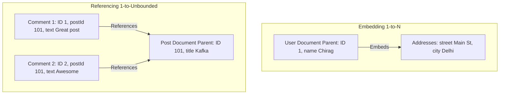
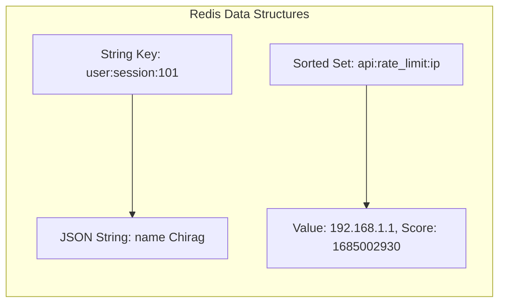
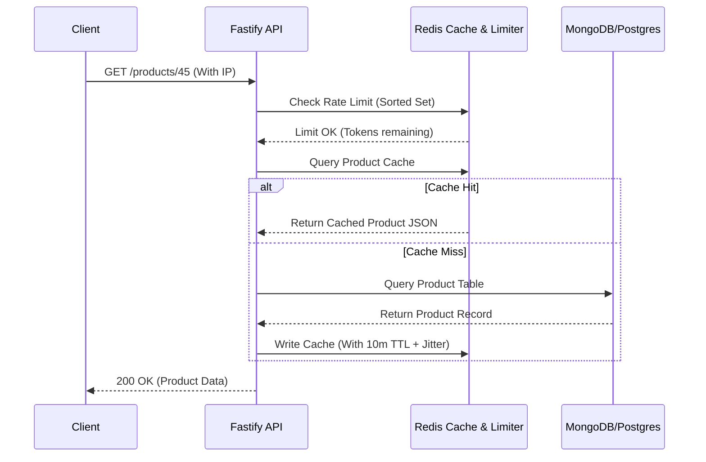

# Part 8: NoSQL Databases (MongoDB & Redis Caching)

*[← Back to Master Index](/blog/it-career-guide)*

---

## 1. Core Concept Refresher: Document Stores vs. In-Memory Caches

Relational databases excel at maintaining rigid structures and data integrity, but their scaling properties degrade under massive, unpredictable write loads or high-concurrency request spikes. To build systems that handle millions of users, backend developers must utilize secondary database systems: **NoSQL Document Databases** (like MongoDB) and **In-Memory Key-Value Caches** (like Redis).

---

### MongoDB Internals: BSON, WiredTiger, and Document Modeling

MongoDB stores data as **BSON (Binary JSON)** documents. BSON extends JSON to support additional data types (like `Date`, `ObjectId`, and `Binary Data`) and allows for fast parsing inside the database engine.

Unlike PostgreSQL's process-per-connection model, MongoDB uses the **WiredTiger storage engine**, which handles concurrent queries using multi-threaded execution and optimistic concurrency control. Key aspects of WiredTiger include:
*   **Document-Level Locking:** Multiple clients can write to different documents inside a single collection simultaneously without blocking each other.
*   **Compression:** Data and indexes are compressed in memory and on disk, reducing storage footprint.
*   **Shared Buffer Cache:** WiredTiger reserves 50% of the server's RAM minus 1GB for caching documents and indexes, reducing disk reads.

#### Document Modeling: Embedding vs. Referencing
In relational SQL, normalize-first is the default pattern. In NoSQL, design-for-access is the golden rule:
*   **Embedding (Denormalization):** Storing child data directly inside the parent document as an array or nested object. Best for $1:1$ or bounded $1:N$ relationships (e.g., a user and their shipping addresses). It guarantees that all relevant data can be retrieved in a single disk seek.
*   **Referencing (Normalization):** Storing the `ObjectId` of the target document in another collection. Best for unbounded $1:N$ (e.g., a post and millions of comments) or $M:N$ relationships. It prevents documents from exceeding MongoDB's strict **16MB limit** and avoids performance degradation from massive document mutations.

---

### Redis Caching Topologies & Data Structures

Redis is a single-threaded, in-memory key-value data store. Because it runs in memory, read and write operations execute in sub-millisecond durations ($<1\text{ms}$). Redis is single-threaded to avoid lock contention overhead, relying on the OS non-blocking multiplexed I/O loop (`epoll`) to handle tens of thousands of concurrent client requests.

#### Primary Redis Data Structures:
1.  **Strings:** Basic key-values. Max size: 512MB. Used for session data and HTML fragments.
2.  **Hashes:** Fields and values. Perfect for representing database object profiles.
3.  **Lists:** Ordered collections of strings. Used as simple message queues.
4.  **Sets:** Unordered collections of unique strings. Perfect for tracking unique user visitors.
5.  **Sorted Sets (ZSETs):** Sets where every member is associated with a numeric score. Members are kept ordered by score. Essential for leaderboards and rate limiters.

---

### Cache Update Policies & Mitigation Strategies

When implementing Redis as a cache in front of a primary database (like PostgreSQL), you must choose an update topology:

*   **Cache-Aside (Lazy Loading):**
    1.  The application receives a read request.
    2.  It queries Redis. If the key exists (Cache Hit), return the data.
    3.  If the key is missing (Cache Miss), query the primary database, write the result to Redis with a Time-To-Live (TTL), and return the data.
*   **Write-Through:**
    1.  The application writes data.
    2.  It writes first to the cache, then to the database, ensuring consistency at the cost of write latency.

#### Cache Failures and Mitigation:
*   **Cache Penetration:** Requests target keys that never exist in the database (e.g., malicious requests targeting ID `-999`). Since these are cache misses, they hit the primary database every time, overloading it.
    *   *Solution:* Store empty/null placeholders in the cache with a short TTL, or use a **Bloom Filter** to reject invalid keys before hitting the cache.
*   **Cache Avalanche:** Multiple cached keys expire at the exact same second, or the Redis container crashes. All incoming traffic routes to the primary database, crashing it.
    *   *Solution:* Add a random "jitter" to TTL expirations (e.g., `3600 + random(0, 300)` seconds) so keys expire at staggered intervals.
*   **Cache Stampede (Thundering Herd):** A highly popular cached key expires. Multiple concurrent request threads observe a cache miss and all execute the same heavy database query simultaneously.
    *   *Solution:* Implement locking mechanisms, or pre-warm keys in the background before they expire.

---

## 2. Master Resource Directory: NoSQL & Redis Caching

Transitioning developers must understand when to use SQL vs NoSQL, and how to apply caching without introducing data inconsistencies. Below are the top resources.

---

### Resource 1: *Designing Data-Intensive Applications* by Martin Kleppmann
*   **Why It Was Selected:** Kleppmann's book is selected again because it details the structural trade-offs of relational schemas vs document models. It analyzes the differences in query languages, storage layouts, schemas-on-read vs schemas-on-write, and consistency guarantees, ensuring you make logical architectural decisions based on access patterns rather than trend-chasing.
*   **Target Syllabus Modules/Chapters:**
    *   Chapter 2: Query Languages and Data Models (SQL vs. Document)
    *   Chapter 6: Partitioning (Key-value clustering, Routing)
*   **Time Investment Required:** 15 hours of reading and comparative modeling.
*   **Value Assessment:** Exceptional.
*   **Actionable Study Strategy:** Focus on the structural limits of document models. Write down a checklist of when to choose PostgreSQL (complex joins, strict constraints, transactional safety) versus MongoDB (dynamic schemas, nested JSON structures, high write scaling).

---

### Resource 2: *Redis University* (university.redis.com)
*   **Why It Was Selected:** Offered directly by Redis Labs, this platform is the absolute gold standard for learning Redis. Many developers only use Redis as a basic key-value store. These courses teach you how to write Redis Lua scripts, design rate-limiters using Sorted Sets, and manage high-availability clusters, which are vital scaling skills.
*   **Target Syllabus Modules/Chapters:**
    *   RU101: Introduction to Redis Data Structures
    *   RU201: RediSearch / Redis Developer guides
*   **Time Investment Required:** 20 hours of interactive lab training.
*   **Value Assessment:** High. Certifications/course completions from Redis University look excellent on backend resumes.
*   **Actionable Study Strategy:** Take the **RU101** course. Replicate every CLI exercise in a local Redis container. Pay special attention to the difference between Hash and String memory footprints.

---

### Resource 3: *MongoDB University* (learn.mongodb.com)
*   **Why It Was Selected:** The official training library for MongoDB. It covers index tuning, aggregation pipelines, replica set configurations, and sharding principles.
*   **Target Syllabus Modules/Chapters:**
    *   MongoDB Aggregation Framework Course
    *   M201: MongoDB Performance Tuning
*   **Time Investment Required:** 20 hours.
*   **Value Assessment:** High.
*   **Actionable Study Strategy:** Focus on **M201 (Performance)**. Study how indexes behave inside document collections. Learn to read MongoDB execution plans using `explain()` (specifically identifying `COLLSCAN` vs `IXSCAN` operations).

---

### Resource 4: *System Design Primer* caching guide by Donne Martin
*   **Why It Was Selected:** A rapid, high-efficiency refresher on cache eviction algorithms (LRU, LFU, FIFO) and cache invalidation patterns.
*   **Target Syllabus Modules/Chapters:**
    *   Cache section (eviction policies, Cache-Aside, Write-Through, Write-Behind)
*   **Time Investment Required:** 5 hours of reading and review.
*   **Value Assessment:** Medium-High.
*   **Actionable Study Strategy:** Understand the mechanics of **LRU (Least Recently Used)** cache eviction. Draw the data structures required to build an LRU cache (a Hash Map coupled with a Doubly Linked List) and understand its $O(1)$ operations.

---

## 3. Hands-On Portfolio Lab Project: Cache-Aside Framework & Rate Limiter

To showcase your caching and database engineering skills, you will build a **Rate-Limited, Cached Product API** using PostgreSQL, MongoDB, Redis, and Express/Fastify.

### Lab Specifications:
1.  **Database Integration:**
    *   Spin up PostgreSQL (storing transactions/orders), MongoDB (storing user product catalog metadata), and Redis (caching and rate-limiting) inside a Docker Compose mesh.
2.  **API Construction:**
    *   Write a Node.js/TypeScript Fastify API.
    *   Implement `GET /products/:id` with Cache-Aside logic:
        *   Look up product in Redis.
        *   On cache miss, fetch from MongoDB, cache the BSON converted JSON in Redis with a TTL of 300 seconds, and return the data.
3.  **Distributed Sliding Window Rate Limiter:**
    *   Write a custom middleware using Redis **Sorted Sets (ZSETs)** to implement a sliding-window rate limiter.
    *   The limiter must restrict client IPs to 100 requests per minute.
    *   For every request:
        *   Add a member to the ZSET: key = `rate_limit:<IP>`, value = current timestamp, score = current timestamp.
        *   Remove ZSET elements with scores older than `current_timestamp - 60`.
        *   Check the card of the ZSET (`ZCARD`). If it exceeds 100, reject the request with HTTP `429 Too Many Requests`.

---

## 4. Technical Interview Self-Assessment

Use these questions to verify your caching and document database skills:

| Concept | High-Frequency Interview Question | Expected Technical Answer Framework |
| :--- | :--- | :--- |
| **Cache Stampede** | How do you prevent a Cache Stampede when a high-traffic key expires? | A Cache Stampede can be prevented using **Mutex Locking** or **Probabilistic Early Expiration**. With locking, the first request thread that notices a cache miss acquires a distributed lock (e.g. via Redis `SETNX`) to query the database and rebuild the cache. Other threads wait, preventing database overload. With probabilistic expiration, the application checks the remaining TTL; as it nears expiration, a background thread recalculates the key early with a calculated probability. |
| **BSON Limits** | Why does MongoDB enforce a strict 16MB document limit? | The 16MB limit is designed to prevent performance degradation. During query execution, MongoDB transmits entire documents over the network to the application layer. Massive documents require significant memory allocation, CPU serialization overhead, and network bandwidth. If your schema design exceeds 16MB, it indicates a structural design flaw (such as unbounded arrays), which should be refactored into normalized collections. |
| **Eviction Policies** | What is the difference between volatile-lru and allkeys-lru eviction in Redis? | Under `volatile-lru`, Redis only evicts keys that have an explicit expiration (TTL) set, using the Least Recently Used algorithm. Under `allkeys-lru`, Redis scans all keys in the database for eviction, regardless of whether they have a TTL or not. If your cache stores persistent keys (like application settings) alongside temporary cached data, `volatile-lru` prevents the persistent data from being evicted under memory pressure. |

---

## 5. Exit Tasks for this Phase

Confirm these objectives are complete before proceeding:

- [ ] Write a script that implements sliding window rate-limiting using Redis Sorted Sets.
- [ ] Connect a Node.js API to MongoDB and execute an Aggregation Pipeline.
- [ ] Set up Redis and simulate cache penetration and eviction behaviors.
- [ ] Implement TTL jitter in a backend script to prevent cache avalanches.

---

*[Proceed to Part 9: Distributed Systems & Message Queues with Kafka →](/blog/it-career-guide/part-09-kafka)*
