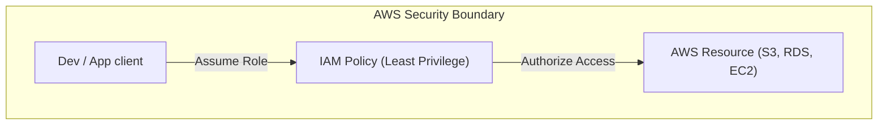
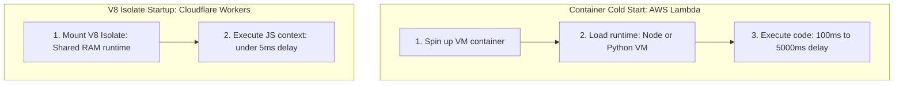
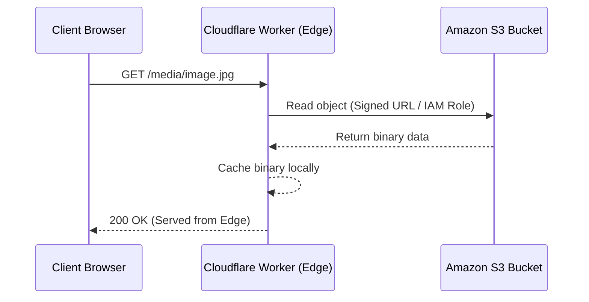

# Part 15: AWS Cloud & Serverless Architectures

*[← Back to Master Index](/blog/it-career-guide)*

---

## 1. Core Concept Refresher: Virtualization, Serverless, and Edge Concurrency

Modern application deployment has evolved beyond physical servers and Virtual Machines. In product engineering, managing infrastructure (operating system updates, scaling load balancers, provisioning host memory) is increasingly offloaded to cloud providers.

Backend developers must master two primary cloud paradigms: **Cloud Infrastructure (IaaS)** using Amazon Web Services (AWS) and **Serverless Edge Computing** using V8 Isolates (like Cloudflare Workers).

---

### AWS Cloud Foundations: Compute and Identity

When building applications on AWS, two pillars are critical: **Compute models** and **Security boundaries (IAM)**.

#### AWS IAM (Identity and Access Management):
*   **The Principle of Least Privilege:** You must never run applications with admin access. Spawns dedicated IAM roles with specific, minimal permissions (e.g. read access to a single S3 bucket).
*   **AWS Security Credentials:** Applications running inside AWS (e.g. on EC2 instances or Lambda) must never use hardcoded credentials. Instead, associate an IAM Role directly with the service; the AWS SDK automatically retrieves temporary, short-lived security tokens behind the scenes.

#### AWS Compute Models:
*   **EC2 (Elastic Compute Cloud):** Standard virtual machines in the cloud. You have full control over the OS kernel, libraries, and runtime packages. Suitable for monolithic platforms or custom service engines.
*   **ECS/EKS (Elastic Container Service / Kubernetes):** Managed container orchestration meshes. Allows deploying Dockerized services without managing underlying VM nodes directly.
*   **AWS Lambda (Serverless Compute):** Function-as-a-Service (FaaS). You write the code; AWS manages execution processes, scaling from zero to thousands of instances automatically in response to traffic.

---

### Cold Starts vs. V8 Isolates

While AWS Lambda is highly popular, it suffers from a significant latency bottleneck known as a **Cold Start**:
1.  When a Lambda function has not been called for a while, or during scale-up, AWS must spin up a new container instance.
2.  It mounts the function code, boots the runtime environment (e.g. Node.js or Python VM), compiles the code, and finally executes the function callback.
3.  This can introduce a latency delay of **100ms to over 5 seconds**, which is unacceptable for user-facing API routes.

#### The Edge Solution: V8 Isolates (Cloudflare Workers)
To bypass cold starts and minimize latency, systems architects deploy services to global edge networks using **V8 Isolates**.
*   Unlike Lambda (which runs code inside dedicated VM containers), Cloudflare Workers execute JavaScript inside the same shared memory process using Google V8 engine boundaries (Isolates).
*   Isolates are extremely lightweight, requiring virtually zero memory overhead.
*   *Result:* Spawning a V8 Isolate takes **under 5 milliseconds**, completely eliminating cold start latency. Code executes at edge data centers located closest to the user.

---

## 2. Master Resource Directory: Cloud Computing & Serverless

AWS and Edge computing require deep operational and structural understanding. Below are the definitive manuals and courses.

---

### Resource 1: *The DynamoDB Book* by Alex DeBrie
*   **Why It Was Selected:** Alex DeBrie is the world's leading authority on Amazon DynamoDB. In serverless cloud-native architectures, standard relational databases (like PostgreSQL) struggle with scaling connections during sudden Lambda execution spikes. DynamoDB (AWS's managed NoSQL database) scales seamlessly to millions of concurrent requests but requires completely different data modeling techniques (Single-Table Design). This book is selected because it is the comprehensive guide to modeling structured data for NoSQL systems.
*   **Target Syllabus Modules/Chapters:**
    *   Chapter 5: NoSQL design vs SQL design
    *   Chapter 6: Key Concepts (Partition keys, Sort keys, Indexes)
    *   Chapter 12: Single-Table Design patterns
*   **Time Investment Required:** 30 hours.
    *   *Week 1:* Chapters 5 & 6 (15 hours)
    *   *Week 2:* Chapter 12 and modeling labs (15 hours)
*   **Value Assessment:** Exceptional. Modeling DynamoDB databases is a highly paid skill in Cloud Architecture.
*   **Actionable Study Strategy:** Study **Single-Table Design**. Replicate the e-commerce schema design in the book. Map multiple entities (Users, Orders, Payments) into a single DynamoDB table using compound partition keys (`PK`) and sort keys (`SK`) to satisfy all access patterns in a single database read call.

---

### Resource 2: *AWS Certified Developer Official Guide* (aws.amazon.com/certification/)
*   **Why It Was Selected:** The official AWS documentation and study guides are the definitive resources for learning cloud services, computing systems, database parameters, and IAM policies.
*   **Target Syllabus Modules/Chapters:**
    *   AWS Lambda & API Gateway configurations
    *   AWS IAM policy design guides
    *   DynamoDB and caching configurations (DAX)
*   **Time Investment Required:** 25 hours.
*   **Value Assessment:** High. Even if you do not take the certification exam immediately, studying the syllabus establishes deep, production-grade cloud capabilities.
*   **Actionable Study Strategy:** Focus on **IAM Policies**. Practice writing JSON security policies that grant a specific Lambda function read-only access to a single S3 bucket pathway, testing access limits.

---

### Resource 3: *Cloudflare Workers Developer Docs* (developers.cloudflare.com/workers/)
*   **Why It Was Selected:** The official manuals for Cloudflare Workers, detailing runtime APIs, Wrangler CLI, caching parameters, Key-Value (KV) stores, and Durable Objects.
*   **Target Syllabus Modules/Chapters:**
    *   Get started guide & Wrangler configurations
    *   Runtime API guides (Requests, Responses, Fetch API)
    *   KV Storage structures
*   **Time Investment Required:** 15 hours.
*   **Value Assessment:** Critical for modern edge and full-stack backend developers.
*   **Actionable Study Strategy:** Install the Wrangler CLI locally. Write a simple API Worker that receives incoming request parameters, fetches data from an external API, caches the response using the Cache API at the edge, and returns the response under 10ms.

---

### Resource 4: *Serverless Architectures* by Mike Roberts
*   **Why It Was Selected:** A highly conceptual guide detailing FaaS parameters, serverless database integration issues, cost optimization, and deployment patterns.
*   **Time Investment Required:** 10 hours.
*   **Value Assessment:** Medium-High.
*   **Actionable Study Strategy:** Study the **Serverless connection scaling problem**. Understand how RDS Proxy resolves database connection starvation when thousands of Lambdas spawn concurrently.

---

## 3. Hands-On Portfolio Lab Project: Serverless API Deployment with Cloudflare Workers & AWS S3

To showcase your cloud and serverless capabilities, you will build and deploy a **Serverless Media Service** using Cloudflare Workers, the Wrangler CLI, and AWS S3 storage.

### Lab Specifications:
1.  **S3 Bucket Provisioning:**
    *   Create an AWS account (free tier).
    *   Create a private S3 bucket named `chirag-media-bucket`.
    *   Upload a test image to the bucket.
2.  **AWS IAM Authorization:**
    *   Create an IAM User with programmatic access.
    *   Attach an IAM policy granting read-only access to your S3 bucket.
    *   Retrieve the Access Key ID and Secret Access Key.
3.  **Cloudflare Workers API:**
    *   Write a Cloudflare Worker script in TypeScript using the Wrangler CLI.
    *   Configure Wrangler environment variables in a secure `.dev.vars` file to store AWS credentials.
    *   Implement a `GET /media/:key` endpoint:
        *   Read the target key from request parameters.
        *   Fetch the object from your AWS S3 bucket. Sign the request using the S3 AWS credentials to authenticate securely.
        *   Return the file stream directly to the client browser.
    *   **Edge Caching:** Configure the Worker to cache S3 objects in Cloudflare's edge cache for 1 hour to prevent redundant external AWS requests.

---

## 4. Technical Interview Self-Assessment

Use these questions to verify your cloud and serverless knowledge:

| Concept | High-Frequency Interview Question | Expected Technical Answer Framework |
| :--- | :--- | :--- |
| **Isolates vs. VMs** | Why do Cloudflare Workers boot faster than AWS Lambda functions? | AWS Lambda runs code inside containerized Virtual Machines. Booting a Lambda requires spinning up a VM, loading the runtime (Node.js/Python), compiling the code, and initializing the handler (cold start). Cloudflare Workers use Google V8 **Isolates**, which share a single operating system process. Spawning an Isolate only requires allocating a small, isolated segment of memory inside the running V8 process, which takes $<5\text{ms}$. |
| **IAM Security** | Why shouldn't you hardcode AWS Access Keys in your application code? | Hardcoding credentials in source code creates high security risks; if the repository is leaked or compromised, attackers gain access to your cloud account. Best practice is to use **IAM Roles** associated directly with the compute resource (EC2, ECS, or Lambda). The application SDK will then automatically request short-lived, temporary security credentials from the AWS Metadata Service at runtime. |
| **NoSQL modeling** | Why does DynamoDB recommend Single-Table Design instead of Normalization? | In relational SQL, normalizations require multi-table joins. In distributed NoSQL systems, joins are not supported because tables are partitioned across separate physical servers. **Single-Table Design** models all entities inside a single physical table using custom Partition Keys (`PK`) and Sort Keys (`SK`). This allows retrieving parent-child relationships in a single database read query, maximizing scalability. |

---

## 5. Exit Tasks for this Phase

Verify these objectives are complete before ending this phase:

- [ ] Write a JSON policy document restricting access to a single AWS S3 bucket.
- [ ] Deploy a Cloudflare Worker using the Wrangler CLI.
- [ ] Connect a Serverless function to a NoSQL database and execute queries.
- [ ] Verify S3 object fetching from an Edge Worker.

---

*[Proceed to Part 16: Front-End Mastery: React, Next.js & Client-Side Architectures →](/blog/it-career-guide/part-16-frontend)*
