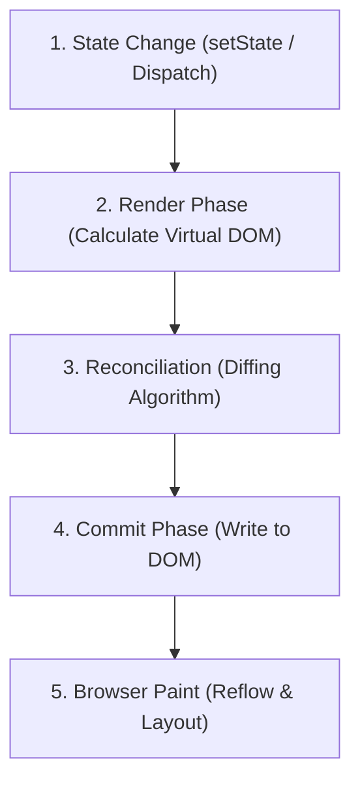
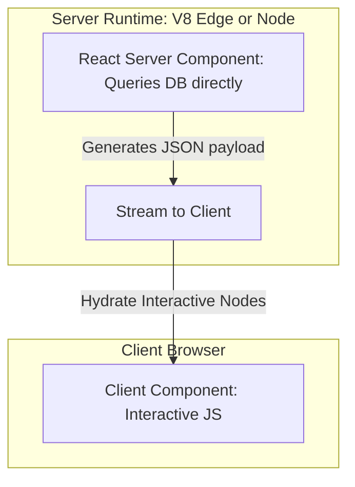
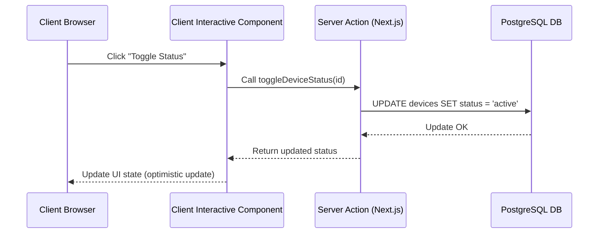

# Part 16: Front-End Mastery — React, Next.js & Client-Side Architectures

*[← Back to Master Index](/blog/it-career-guide)*

---

## 1. Core Concept Refresher: The Virtual DOM, React Lifecycle, and App Router

For years, backend developers viewed frontend engineering as writing simple markup and minor styling scripts. In **2026**, frontend development has evolved into a highly complex systems engineering discipline. Modern client-side applications run complex state synchronization trees, manage concurrent rendering runs, handle virtual DOM diffing operations, and compile server-side data directly into edge-routed visual layouts.

To transition into elite product-focused developer roles, backend engineers must master client-side rasing, framework architectures, and rendering cycles.

---

### React Component Lifecycle and rendering loops

React operates on a declarative programming model. You describe *what* the UI should look like based on current data (Props and State), and React handles updating the physical DOM.



The React render-update pipeline runs in three distinct phases:
1.  **Render Phase:** React executes the component function to generate the virtual representation of the UI (a JSX tree representing Virtual DOM nodes). This is a pure phase with no side effects.
2.  **Reconciliation Phase (Diffing):** React compares the newly generated virtual tree against the previous virtual tree. Using its **Fiber Engine** (a linked-list traversal representation of the component tree), it calculates the minimal set of changes needed to update the DOM.
3.  **Commit Phase:** React writes the differences directly to the physical DOM. This is where side effects (like DOM manipulation, inserting scripts) are executed.
4.  **Browser Paint:** The browser engine detects the DOM updates, calculates layout positions (Reflow), and paints the pixels on the screen.

---

### The React Fiber Engine and Concurrency

Originally, React updated components using a recursive, synchronous rendering stack. If a component tree was large, updating state blocked the main JavaScript execution thread, preventing user interactions (clicks, inputs) from responding, which degraded user experience.

To solve this, React re-implemented its engine to use **React Fiber**:
*   Fiber structures the component tree as a doubly linked list of "Fiber nodes."
*   Instead of synchronous recursion, Fiber operates as an asynchronous, cooperative scheduler. It can pause a rendering run, yield control back to the browser to handle user input events, and resume rendering when the thread is free.
*   It supports **Concurrent Features** (such as `useTransition` and `useDeferredValue`), allowing developers to split state changes into high-priority updates (like typing in a text field) and low-priority updates (like rendering search results).

---

### Next.js App Router and React Server Components (RSC)

The traditional Single Page Application (SPA) architecture requires sending a massive bundle of JavaScript to the client browser. The browser must download the JS, parse it, execute it, and query APIs to fetch data before it can render any HTML on the screen (Client-Side Rendering - CSR), leading to slow page load times.

Next.js solves this using the **App Router** based on **React Server Components (RSC)**:



*   **Server Components (Default):** Render exclusively on the server. They can fetch data directly from databases, read local files, and call internal gRPC microservices. The JavaScript required to render them remains on the server, keeping client bundle sizes small.
*   **Client Components (marked with `'use client'`):** Render on the server as static HTML placeholders, and are then **hydrated** in the browser. Hydration is the process where React downloads the component's JavaScript, attaches event listeners to the static HTML, and merges the virtual DOM tree, making the page interactive.

---

## 2. Master Resource Directory: React & Next.js

Mastering frontend client architectures requires reading deep technical documentations, interactive rendering courses, and styling frameworks. Below are the definitive resources.

---

### Resource 1: *The Joy of React* by Josh W. Comeau
*   **Why It Was Selected:** Josh Comeau is one of the most talented visual educators in the industry. For backend engineers who struggle with CSS alignment and React's reactivity models, this course is selected because it uses interactive playgrounds, animations, and zero-assumption builders to demystify state loops, component scoping, and custom hooks. It is the best course to build an intuitive mental model of how React handles state updates.
*   **Target Syllabus Modules/Chapters:**
    *   Module 1: React Fundamentals
    *   Module 2: Working With State (State lifecycles, Forms)
    *   Module 3: React Hooks (`useEffect`, `useRef`, `useMemo`, `useCallback`)
    *   Module 4: Component API Design (Props, Children patterns)
*   **Time Investment Required:** 30 hours of interactive study.
    *   *Week 1:* Modules 1 & 2 (15 hours)
    *   *Week 2:* Modules 3 & 4 (15 hours)
*   **Value Assessment:** Exceptional ($300 course, but saves months of debugging React race conditions and stale closures).
*   **Actionable Study Strategy:** Complete all coding playgrounds in the course. Pay special attention to **Module 3: Hooks**. Write down the exact conditions under which a component re-renders. Practice memoizing components using `React.memo` and `useCallback` to prevent unnecessary child re-renders.

---

### Resource 2: *Next.js Official Documentation & Learn Course* (nextjs.org/learn)
*   **Why It Was Selected:** The official Next.js documentation and structured courses are exceptionally written and kept constantly up to date with new App Router specifications. It covers Server Components, Client Components, Server Actions, Route Handlers, and Caching configurations, ensuring you write optimized, full-stack React code.
*   **Target Syllabus Modules/Chapters:**
    *   Next.js App Router basics
    *   Server and Client Components
    *   Data Fetching, Caching, and Revalidation
    *   Routing and Rendering (Static vs Dynamic)
*   **Time Investment Required:** 20 hours.
    *   *Week 1:* Routing & Components (10 hours)
    *   *Week 2:* Data fetching & Caching (10 hours)
*   **Value Assessment:** Critical. The App Router caching system is complex; mastering it prevents database overload during production deployments.
*   **Actionable Study Strategy:** Complete the **Dashboard App** tutorial. Build it using Server Components to fetch data directly from a PostgreSQL instance. Set up a Server Action to handle form submissions and update the database, then use `revalidatePath` to refresh the cached pages dynamically.

---

### Resource 3: *Epic React* by Kent C. Dodds (epicreact.dev)
*   **Why It Was Selected:** Kent Dodds is a master of testing and advanced React patterns. This resource is selected because it is code-focused and exercise-driven, forcing you to solve real-world optimization problems (profiling component renders, designing reusable hooks, and managing compound components).
*   **Target Syllabus Modules/Chapters:**
    *   Advanced React Hooks
    *   Advanced React Patterns (Compound components, State reducers)
    *   React Performance (Profiling, code splitting)
*   **Time Investment Required:** 25 hours.
*   **Value Assessment:** High.
*   **Actionable Study Strategy:** Focus heavily on the **React Performance** workshop. Open the React DevTools Profiler and analyze your local app. Identify which components are rendering repeatedly, track the cause of the commits, and apply code splitting (`React.lazy` and `Suspense`) to optimize LCP (Largest Contentful Paint) metrics.

---

### Resource 4: *React.dev Documentation*
*   **Why It Was Selected:** The official React docs were completely rewritten, focusing on functional components and hooks. It is a comprehensive reference guide to every React hook, component API, and state pattern.
*   **Target Syllabus Modules/Chapters:**
    *   Describing the UI & Adding Interactivity
    *   Managing State
    *   Escape Hatches (`useRef`, `useEffect`)
*   **Time Investment Required:** 15 hours.
*   **Value Assessment:** Critical.
*   **Actionable Study Strategy:** Read the **Escape Hatches** section twice. Pay close attention to how `useEffect` synchronization works. Learn how to clean up subscriptions and event listeners inside the return function of a `useEffect` hook to prevent memory leaks.

---

## 3. Hands-On Portfolio Lab Project: Full-Stack Next.js Dashboard with RSC & Server Actions

To showcase your full-stack capability, you will build a **Real-Time System Monitoring Dashboard** using Next.js App Router, TypeScript, React Server Components, Server Actions, and Tailwind CSS.



### Lab Specifications:
1.  **Project Setup:**
    *   Initialize a Next.js App Router application using TypeScript:
        ```bash
        npx create-next-app@latest my-dashboard --typescript --tailwind --app
        ```
2.  **Server Component Integration:**
    *   Create a dashboard home page (`app/page.tsx`) as a **Server Component**.
    *   Query data directly from a database or an external API inside the component using async/await. Render the data as a static HTML grid using Tailwind.
3.  **Client Interactive Components:**
    *   Create a custom toggle switch component (`components/StatusToggle.tsx`) marked with `'use client'`.
    *   Pass the initial status from the Server Component to the client component as a prop. Manage local state changes using `useState` and trigger optimistic UI updates using `useOptimistic` to ensure immediate UI feedback.
4.  **Server Actions for Data Mutations:**
    *   Write a Server Action `updateDeviceStatus` inside `app/actions.ts`.
    *   Import and call this action inside your client components to write data mutations directly to the database. Use `revalidatePath('/')` inside the action to trigger cache updates across the server components.

---

## 4. Technical Interview Self-Assessment

Use these questions to verify your frontend knowledge:

| Concept | High-Frequency Interview Question | Expected Technical Answer Framework |
| :--- | :--- | :--- |
| **Hydration Errors** | What causes a React Hydration Error, and how do you resolve it? | Hydration errors occur when the pre-rendered HTML generated by the server does not match the initial HTML rendered by React in the browser. Common causes include using browser-specific variables (like `window` or `localStorage`) inside the render loop, or using dynamic elements (like `new Date()`) directly in the markup. Resolve this by wrapping browser-specific operations inside a `useEffect` hook, or disabling SSR for that component. |
| **React.memo vs. useMemo** | What is the difference between `React.memo` and the `useMemo` hook? | `React.memo` is a higher-order component used to wrap a functional component, preventing it from re-rendering if its props have not changed. `useMemo` is a hook executed inside a component to memoize the result of a computationally expensive calculation, preventing it from executing again during re-renders unless its dependency array values change. |
| **RSCs vs. SSR** | How do React Server Components (RSC) differ from Server-Side Rendering (SSR)? | **SSR** is a deployment pattern that compiles a JavaScript application into static HTML on the server on request; however, all application JavaScript must still be downloaded and hydrated in the browser. **React Server Components** render exclusively on the server. The code used to fetch data and compile the components remains on the server, resulting in zero client-side JavaScript overhead. |

---

## 5. Exit Tasks for this Phase

Verify these checklist items before moving forward:

- [ ] Boot a Next.js App Router application using TypeScript and Tailwind.
- [ ] Implement Server Components that fetch data from an asynchronous database connection.
- [ ] Create interactive Client Components that hook into Server Actions for mutations.
- [ ] Run a production build (`npm run build`) and confirm no hydration errors.

---

*[Proceed to Part 17: Generative AI & Large Language Models (LLM) Integration →](/blog/it-career-guide/part-17-genai)*
