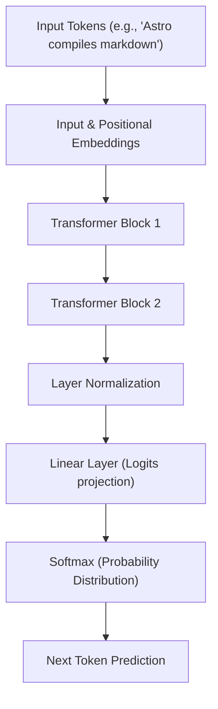
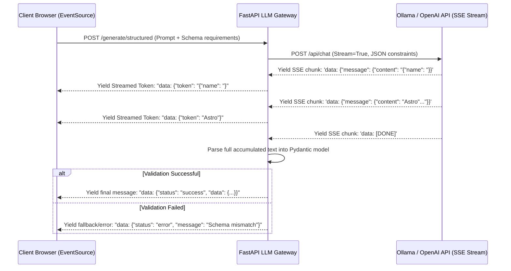

# Part 17: Generative AI & Large Language Models (LLM) Integration

*[← Back to Master Index](/blog/it-career-guide)*

---

## 1. Deep-Dive Core Concepts: Transformer Internals, Tokenization, and API Architectures

In **2026**, Generative AI is no longer a niche research field or a simple wrapper API call. It has become a foundational layer of modern software platforms. Building production-grade AI systems requires a deep, systems-level understanding of what happens inside a Large Language Model (LLM), how text is transformed into numerical matrices, and how to design reliable APIs that wrap these non-deterministic systems.

---

### The Transformer Architecture: Self-Attention Mechanics

The modern LLM revolution is built on the **Transformer** architecture. Unlike legacy recurrent architectures (RNNs, LSTMs) that processed text sequentially token by token (making parallelization impossible and failing to capture long-range dependencies), the Transformer uses **Self-Attention** to process all tokens in a sequence simultaneously.



#### The Self-Attention Equation
The core of the self-attention mechanism lies in transforming each input token embedding into three separate vectors:
1.  **Query (Q):** What the token is looking for.
2.  **Key (K):** What the token contains.
3.  **Value (V):** The actual content or meaning of the token.

The mathematical formulation for Scaled Dot-Product Attention is:

$$
Attention(Q, K, V) = \text{softmax}\left(\frac{QK^T}{\sqrt{d_k}}\right)V
$$

Where:
*   $Q$ is the Query matrix.
*   $K$ is the Key matrix.
*   $V$ is the Value matrix.
*   $d_k$ is the dimension of the Key vectors (used for scaling).
*   $QK^T$ represents the dot product between all queries and keys, measuring how much attention each token should pay to every other token.
*   $\sqrt{d_k}$ is the scaling factor. As dimensions grow, the dot products grow large in magnitude, pushing the softmax function into regions with extremely small gradients. Scaling prevents this gradient vanishing issue.
*   $\text{softmax}$ normalizes the raw attention scores into a probability distribution.
*   Multiplying by $V$ produces a weighted sum of the values, representing the context-aware representation of each token.

#### Multi-Head Attention (MHA)
Rather than calculating a single attention distribution, modern Transformers split the query, key, and value vectors into multiple subspaces, running attention calculations in parallel across separate "heads":

$$
\text{MultiHead}(Q, K, V) = \text{Concat}(\text{head}_1, \dots, \text{head}_h)W^O
$$

$$
\text{where} \quad \text{head}_i = \text{Attention}(QW_i^Q, KW_i^K, VW_i^V)
$$

This allows the model to simultaneously attend to information from different representation subspaces at different positions (e.g., one head tracking grammatical syntax, another tracking pronoun references, and another identifying entities).

---

### Tokenization Mechanics: BPE, WordPiece, and Truncation Strategies

An LLM does not read raw text. It processes a sequence of numerical identifiers (token IDs) representing sub-word units. The process of converting string characters into these token IDs is called **Tokenization**.

```
Raw Text: "Unbelievably, it compiles!"
    ↓
Sub-word Tokenization: ["Un", "believ", "ably", ",", " it", " comp", "iles", "!"]
    ↓
Vocabulary Mapping: [421, 10294, 381, 11, 354, 8292, 1092, 0]
```

#### Tokenization Algorithms
1.  **Byte-Pair Encoding (BPE):** Used by models like GPT-4 and LLaMA. It starts with a base vocabulary of individual bytes/characters and iteratively merges the most frequently adjacent pairs of tokens in a corpus until the target vocabulary size is reached.
2.  **WordPiece:** Used by BERT. Similar to BPE, but merges pairs based on the maximum likelihood of training data, optimizing for the probability of the vocabulary co-occurrence.
3.  **SentencePiece:** A language-independent tokenizer that treats whitespace as a normal character (usually represented by a special symbol like `_`), avoiding the need for language-specific pre-tokenizers.

#### Context Management & Truncation
Every LLM has a hard physical limit on the maximum number of tokens it can process in a single execution loop (the **Context Window**). If an application feeds a prompt that exceeds this limit, the API will throw a validation error. 

To manage this, engineers must write truncation strategies:
*   **Sliding Window:** Splitting the input document into overlapping chunks, processing each chunk individually, and consolidating the outputs.
*   **Targeted System Truncation:** Programmatically removing or summarizing historical conversation turns or non-critical context (such as old chat logs) while retaining the core system instructions and the most recent queries.

---

### Embeddings and Vector Spaces

An **Embedding** is a high-dimensional vector of floating-point numbers that represents the semantic meaning of a token, sentence, or document.

```
Vector Dimensions: d = 1536 (e.g., text-embedding-3-small)
[ 0.0125, -0.0432,  0.0891, ... , -0.0012 ]
```

When text is converted into an embedding, it is projected into a continuous **Vector Space**. In this space, texts with similar semantic meanings are positioned close to one another, regardless of whether they share the same words.

#### Distance Metrics
To determine how similar two pieces of text are, engineers calculate mathematical distance metrics between their embeddings:
1.  **Cosine Similarity:** Measures the cosine of the angle between two vectors, focusing on directional alignment rather than magnitude. Ideal for comparing document topics:

$$
\text{Cosine Similarity}(A, B) = \frac{A \cdot B}{\|A\| \|B\|}
$$

2.  **Dot Product (Inner Product):** Faster to calculate but assumes the vectors are normalized (i.e., unit length of 1). If normalized, the dot product equals cosine similarity.
3.  **Euclidean Distance (L2):** Measures the straight-line distance between two points in the vector space. Highly sensitive to vector magnitude variations.

---

### Prompt Engineering and Inference Parameters

Interacting with LLMs requires writing structured instructions and adjusting inference parameters to manage the predictability and creativity of the model.

#### Advanced Prompting Paradigms
*   **Few-Shot Prompting:** Providing the model with a few examples of input-output pairs within the prompt before asking the final question. This establishes format constraints and contextual patterns.
*   **Chain-of-Thought (CoT):** Directing the model to output its step-by-step reasoning process before generating the final answer. This forces the model to execute intermediate reasoning paths, reducing logical errors.
*   **System Prompts:** Special instructions passed at the start of the chat history that define the model's persona, system boundaries, security constraints, and response formatting rules.

#### Tuning Inference Parameters
When calling an LLM API, you pass parameters that alter how tokens are sampled:
1.  **Temperature:** Controls the scaling of the raw model output logits before the softmax normalization.
    *   $\text{Temperature} \to 0$: The logits are divided by a tiny fraction, amplifying differences and making the model highly deterministic, always picking the single highest probability token.
    *   $\text{Temperature} > 1$: Logits are flattened, increasing the probability of lower-ranked tokens, resulting in highly creative and unpredictable output.
2.  **Top-P (Nucleus Sampling):** Limits token selection to the smallest set of tokens whose cumulative probability exceeds the value $P$ (e.g., $P = 0.9$ uses only the top 90% of token options, discarding highly unlikely outliers).
3.  **Top-K:** Restricts sampling to the $K$ most probable tokens at each step.
4.  **Presence and Frequency Penalties:**
    *   `presence_penalty` penalizes tokens that have already appeared in the output, encouraging the model to introduce new topics.
    *   `frequency_penalty` penalizes tokens based on how many times they have already appeared, preventing repetitive phrases.

---

### API Architectures: Server-Sent Events & Structured Outputs

Integrating LLMs into standard web services introduces latency challenges. Waiting for a large model to generate a full response before sending a response back to the client can result in a blank screen for several seconds, leading to a poor user experience.

#### Server-Sent Events (SSE) for Streaming
To solve latency, web applications use **Server-Sent Events (SSE)** to stream the generated tokens to the client as they are computed. SSE is an HTTP-based standard that keeps a connection open, allowing the server to push text fragments using the `text/event-stream` MIME type.

```
HTTP/1.1 200 OK
Content-Type: text/event-stream
Cache-Control: no-cache
Connection: keep-alive

data: {"choices": [{"delta": {"content": "Hello"}}]}

data: {"choices": [{"delta": {"content": " world"}}]}

data: [DONE]
```

#### Structured Outputs
For APIs and backend processes, unstructured text blocks are difficult to parse reliably. Modern AI pipelines require **Structured Outputs**, where the model is forced to output JSON that strictly adheres to a predefined JSON Schema.

To guarantee compliance, modern runtimes (such as OpenAI's Structured Outputs or Llama.cpp grammar constraints) parse the JSON schema into a state machine at runtime. During generation, the engine restricts token selection to only those characters that fit the schema structure (e.g., forcing a `"` or `{` when the schema requires a JSON boundary), ensuring 100% valid, typable responses.

---

## 2. Master Resource Directory: Generative AI & LLMs

Mastering generative AI engineering requires studying Transformer mathematical frameworks, prompt design guides, local runtimes, and official SDK APIs. Below are the 7 definitive learning resources.

---

### Resource 1: Generative AI with Large Language Models (Coursera by DeepLearning.AI & AWS)
*   **Why It Was Selected:** This course is the absolute gold standard for transitioning from basic API consumers to true AI engineers. Created by Andrew Ng's DeepLearning.AI in collaboration with AWS, it does not just show how to call APIs; it covers model pre-training, instruction fine-tuning, parameter-efficient fine-tuning (PEFT/LoRA), and RLHF alignment. This is the resource that provides the theoretical and systems foundation required for senior-level AI positions.
*   **Target Syllabus Modules/Chapters:**
    *   *Week 1:* Transformer Architecture, Pre-training Lifecycle, and Computational Challenges.
    *   *Week 2:* Instruction Fine-Tuning, Parameter-Efficient Fine-Tuning (PEFT), and LoRA mechanics.
    *   *Week 3:* Reinforcement Learning from Human Feedback (RLHF), KL Divergence, and Model Optimization for Deployment.
*   **Time Investment Required:** 30 hours of focused study.
    *   *Week 1:* Weeks 1 & 2 video sessions (15 hours)
    *   *Week 2:* Week 3 videos and AWS labs (15 hours)
*   **Value Assessment:** Exceptional. Fully included in the TCS-provided Coursera/Udemy/O'Reilly library. It bridges the gap between software engineering and ML systems.
*   **Actionable Study Strategy:** Focus heavily on the **LoRA** mathematical concepts. Understand why adjusting low-rank update matrices $W_0 + BA$ drastically reduces GPU memory overhead during tuning. Complete all three Amazon SageMaker coding labs, verifying how Hugging Face APIs are structured.

---

### Resource 2: Prompt Engineering Guide (PromptingGuide.ai by DAIR.AI)
*   **Why It Was Selected:** PromptingGuide.ai is the industry-standard reference manual for prompt design, reasoning paradigms, and model interactions. Written by DAIR.AI, it is constantly updated to include the latest academic research on LLM reasoning, alignment, and security boundaries.
*   **Target Syllabus Modules/Chapters:**
    *   *Introduction:* Settings (Temperature, Top-P) and Elements of a Prompt.
    *   *Techniques:* Zero-shot, Few-shot, Chain-of-Thought (CoT), and ReAct Prompting.
    *   *Applications:* Code Generation, SQL Generation, and Synthetic Data.
    *   *Security:* Prompt Injection, Jailbreaking, and Adversarial Prompting.
*   **Time Investment Required:** 12 hours of reading and experimentation.
*   **Value Assessment:** Free, open-source. Essential reference guide for learning how to consistently extract structured responses from LLMs.
*   **Actionable Study Strategy:** Setup a local playground using Ollama and go through the **ReAct (Reasoning and Acting)** framework section. Write a prompt that forces a model to act as a system administrator, executing step-by-step actions and logs before making tool calls.

---

### Resource 3: OpenAI Developer Documentation & Guides (platform.openai.com/docs)
*   **Why It Was Selected:** OpenAI is the creator of the industry's most widely used APIs. Their official developer guides cover best practices for Chat Completions, Assistants API, function calling, Structured Outputs (using Zod or Pydantic), and fine-tuning configurations.
*   **Target Syllabus Modules/Chapters:**
    *   *Text Generation:* Structured Outputs & Function Calling.
    *   *Embeddings:* Semantic Search and Vector Mechanics.
    *   *Production:* Rate Limits, Error Handling, and Cost Optimization.
*   **Time Investment Required:** 15 hours.
*   **Value Assessment:** Critical. Modern API integrations follow the patterns defined in these docs.
*   **Actionable Study Strategy:** Read the **Structured Outputs** guide. Set up a Python script using the `openai` library and write a Pydantic schema using `"strict": True`. Trigger a completion run to verify how the model handles input fields.

---

### Resource 4: Anthropic Developer Documentation & SDK Reference (docs.anthropic.com)
*   **Why It Was Selected:** Anthropic's Claude models are highly regarded for their reasoning capabilities, system prompt adherence, and long context performance. Their developer documentation is selected because it provides detailed guides on writing complex system instructions, structured tool use, and caching.
*   **Target Syllabus Modules/Chapters:**
    *   *Developer Guide:* System Prompts, Tool Use (Function Calling).
    *   *API Reference:* Messages API and Streaming Protocols.
    *   *Model Context Protocol (MCP):* Introduction to connecting models to local data sources.
*   **Time Investment Required:** 10 hours.
*   **Value Assessment:** Critical. Highly relevant as enterprise architectures increasingly leverage Claude 3.5 Sonnet for reasoning tasks.
*   **Actionable Study Strategy:** Read the **Tool Use** guide. Understand how the Messages API processes content blocks, specifically how it separates text blocks from `tool_use` blocks. Write a local script that simulates a multi-turn tool-call loop.

---

### Resource 5: Hugging Face Transformers Hub & Pipeline API Docs (huggingface.co/docs)
*   **Why It Was Selected:** Hugging Face is the central hub for open-source AI. Their Transformers library provides the standard Python API used to download, run, and fine-tune open weights models (like LLaMA 3, Mistral, and Phi-3) locally.
*   **Target Syllabus Modules/Chapters:**
    *   *Tutorials:* Pipelines for inference, AutoModel configurations, and Tokenizers.
    *   *Developer Guides:* Generation parameters and Quantization options.
*   **Time Investment Required:** 20 hours.
*   **Value Assessment:** Essential for any engineer working with local or self-hosted model pipelines.
*   **Actionable Study Strategy:** Install `transformers` and `torch` in a local virtual environment. Write a python script using `AutoModelForCausalLM` and `AutoTokenizer` to load a small model (like `Qwen/Qwen2.5-1.5B-Instruct` or `microsoft/Phi-3-mini-4k-instruct`) locally. Run inference and print out the tokenized representation of your input.

---

### Resource 6: Ollama Documentation & API Guides (github.com/ollama/ollama)
*   **Why It Was Selected:** Ollama is the leading runtime for running LLMs locally on consumer hardware. It wraps low-level `llama.cpp` implementations inside a clean CLI and daemon process, providing a local, OpenAI-compatible HTTP API.
*   **Target Syllabus Modules/Chapters:**
    *   *Ollama Library:* Model files, customizing system prompts, and configuration parameters.
    *   *Ollama API Reference:* Streaming chat generation endpoints.
*   **Time Investment Required:** 8 hours.
*   **Value Assessment:** Free. Essential for prototyping and testing GenAI applications locally without incurring cloud API costs.
*   **Actionable Study Strategy:** Install Ollama on your system, download `llama3` or `mistral`, and use `curl` to interact with its local HTTP server on port `11434`. Write a custom Modelfile to set system instructions and parameter boundaries.

---

### Resource 7: vLLM Production Inference Engine Docs (docs.vllm.ai)
*   **Why It Was Selected:** vLLM is the industry standard for hosting open-source LLM inference APIs in production. It uses a custom memory management technique called PagedAttention, which reduces VRAM fragmentation and allows models to process multiple concurrent requests.
*   **Target Syllabus Modules/Chapters:**
    *   *Engine:* PagedAttention Mechanics and Continuous Batching.
    *   *Deployment:* Setting up an OpenAI-compatible API server using Docker.
*   **Time Investment Required:** 12 hours.
*   **Value Assessment:** Critical. Essential knowledge for scaling AI services on cloud GPU instances (AWS EC2, RunPod).
*   **Actionable Study Strategy:** Read the **PagedAttention** research paper summary on the site. Understand how key-value (KV) caching causes memory fragmentation and how page tables solve this. Practice deploying vLLM inside a Docker container on a local GPU or cloud instance.

---

## 3. Hands-On Portfolio Lab Project: Secure, Structured, and Streaming LLM Gateway

To demonstrate your Generative AI engineering credentials, you will build a production-grade **LLM Gateway Service** using FastAPI. This gateway will connect to a local LLM (running via Ollama) or an external provider, stream raw tokens back to the client using Server-Sent Events, parse the output dynamically, and validate the response structure against a Pydantic v2 schema.

```
~/llm_gateway/
├── app/
│   ├── __init__.py
│   ├── main.py             # FastAPI entrypoint & router registration
│   ├── config.py           # Configuration schema
│   ├── schemas.py          # Zod-like Pydantic models for Structured Output
│   └── services/
│       └── llm.py          # Asynchronous SSE Client & Parser
├── tests/
│   ├── __init__.py
│   └── test_gateway.py     # Integration tests
├── requirements.txt        # Package dependencies
└── run.sh                  # Setup and execution script
```

### Lab Architecture Flow

The sequence diagram below displays the interaction between the client, gateway service, and the underlying inference engine:



---

### Step 1: Initialize Project Directory and Dependencies

Create the project directory and file structures:
```bash
mkdir -p ~/llm_gateway/app/services ~/llm_gateway/tests
cd ~/llm_gateway
```

#### File: `~/llm_gateway/requirements.txt`
Declares the required libraries for our asynchronous gateway service.
```
fastapi>=0.110.0
uvicorn[standard]>=0.28.0
pydantic>=2.6.0
httpx>=0.27.0
pytest>=8.0.0
pytest-asyncio>=0.23.0
```

---

### Step 2: Implement Configuration and Schemas

#### File: `~/llm_gateway/app/config.py`
Defines application configuration settings.
```python
from pydantic import Field
from pydantic_settings import BaseSettings

class Settings(BaseSettings):
    app_name: str = "Secure GenAI LLM Gateway"
    # Port 11434 is the default Ollama port
    ollama_api_url: str = Field(default="http://localhost:11434/api/chat", env="OLLAMA_API_URL")
    default_model: str = "qwen2.5:1.5b" # Lightweight model for easy testing

    class Config:
        env_file = ".env"

settings = Settings()
```

#### File: `~/llm_gateway/app/schemas.py`
Defines input prompt schema and the structured output format model using Pydantic v2.
```python
from pydantic import BaseModel, Field
from typing import List

class GenerationRequest(BaseModel):
    prompt: str = Field(..., min_length=5, description="Input query for the model")
    system_prompt: str = Field(
        default="You are a helpful database schema generation assistant.",
        description="Core instruction rules for the LLM"
    )
    temperature: float = Field(default=0.1, ge=0.0, le=2.0)

class DatabaseColumn(BaseModel):
    name: str = Field(..., description="Column name, must be snake_case")
    data_type: str = Field(..., description="SQL type (e.g., VARCHAR, INTEGER, TIMESTAMP)")
    is_nullable: bool = Field(default=True, description="Whether the column accepts null values")

class DatabaseSchema(BaseModel):
    table_name: str = Field(..., description="Table name, must be snake_case")
    columns: List[DatabaseColumn] = Field(..., description="List of columns in the table")
```

---

### Step 3: Implement the Asynchronous SSE Client Service

#### File: `~/llm_gateway/app/services/llm.py`
Handles streaming and parsing the JSON responses from Ollama.
```python
import json
import logging
from typing import AsyncGenerator
import httpx
from app.config import settings
from app.schemas import DatabaseSchema

logging.basicConfig(level=logging.INFO)
logger = logging.getLogger(__name__)

class LLMService:
    def __init__(self) -> None:
        self.client = httpx.AsyncClient(timeout=60.0)

    async def close(self) -> None:
        await self.client.aclose()

    async def stream_structured_completion(
        self, prompt: str, system_prompt: str, temperature: float
    ) -> AsyncGenerator[str, None]:
        """Queries local Ollama instance, streams raw tokens, and validates final JSON structure."""
        
        # Inject system instructions to force JSON schema output
        json_schema_info = DatabaseSchema.model_json_schema()
        formatted_system = (
            f"{system_prompt}\n\n"
            f"You MUST respond ONLY with a raw JSON object matching this JSON Schema:\n"
            f"{json.dumps(json_schema_info)}\n"
            f"Do not include any explanation, markdown code blocks, or leading text."
        )

        payload = {
            "model": settings.default_model,
            "messages": [
                {"role": "system", "content": formatted_system},
                {"role": "user", "content": prompt}
            ],
            "options": {
                "temperature": temperature,
            },
            # Ollama API supports forcing JSON output format
            "format": "json",
            "stream": True
        }

        accumulated_chunks = []

        try:
            # Connect to Ollama endpoint with streaming enabled
            async with self.client.stream("POST", settings.ollama_api_url, json=payload) as response:
                if response.status_code != 200:
                    yield f"data: {json.dumps({'status': 'error', 'message': f'Upstream error {response.status_code}'})}\n\n"
                    return

                # Read line-by-line streaming payload
                async for line in response.iter_lines():
                    if not line:
                        continue
                    
                    try:
                        chunk_data = json.loads(line)
                        token = chunk_data.get("message", {}).get("content", "")
                        if token:
                            accumulated_chunks.append(token)
                            # Yield token chunk immediately to client
                            yield f"data: {json.dumps({'status': 'generating', 'token': token})}\n\n"
                    except json.JSONDecodeError:
                        continue

            # Validate the complete accumulated response
            full_text = "".join(accumulated_chunks).strip()
            logger.info(f"Finished generating. Raw payload received: {full_text}")

            try:
                parsed_json = json.loads(full_text)
                validated_schema = DatabaseSchema(**parsed_json)
                # Yield successful, structured validation schema
                yield f"data: {json.dumps({'status': 'success', 'data': validated_schema.model_dump()})}\n\n"
            except (json.JSONDecodeError, Exception) as val_err:
                logger.error(f"JSON validation failed: {str(val_err)}")
                yield f"data: {json.dumps({'status': 'validation_error', 'message': 'Output did not match expected database schema format.'})}\n\n"

        except httpx.ConnectError:
            logger.error("Ollama connection failed. Ensure Ollama service is running locally.")
            yield f"data: {json.dumps({'status': 'error', 'message': 'Ollama connection failed. Ensure service is running.'})}\n\n"

llm_service = LLMService()
```

---

### Step 4: Implement Main Application Server

#### File: `~/llm_gateway/app/main.py`
Configures routers and lifespan operations.
```python
from contextlib import asynccontextmanager
from fastapi import FastAPI, Depends, status
from fastapi.responses import StreamingResponse
from app.schemas import GenerationRequest
from app.services.llm import llm_service

@asynccontextmanager
async def lifespan(app: FastAPI):
    # Setup actions before API startup
    yield
    # Cleanup client connections on shutdown
    await llm_service.close()

app = FastAPI(
    title="GenAI LLM Integration Gateway",
    version="1.0.0",
    lifespan=lifespan
)

@app.post("/generate/structured", status_code=status.HTTP_202_ACCEPTED)
async def generate_database_schema(request: GenerationRequest):
    """Generates structured database schema definitions, streaming tokens via SSE."""
    return StreamingResponse(
        llm_service.stream_structured_completion(
            prompt=request.prompt,
            system_prompt=request.system_prompt,
            temperature=request.temperature
        ),
        media_type="text/event-stream"
    )

@app.get("/health", status_code=200)
async def check_health() -> dict[str, str]:
    return {"status": "healthy"}
```

---

### Step 5: Implement Integration Tests

#### File: `~/llm_gateway/tests/test_gateway.py`
Validates application health and endpoint stream responses.
```python
import json
import pytest
from fastapi.testclient import TestClient
from app.main import app
from app.services.llm import llm_service

client = TestClient(app)

def test_health_check():
    response = client.get("/health")
    assert response.status_code == 200
    assert response.json() == {"status": "healthy"}

@pytest.mark.asyncio
async def test_stream_structured_completion_mocked():
    # Mocking Ollama client stream generator output
    async def mock_stream_completion(prompt, system_prompt, temperature):
        yield f'data: {json.dumps({"status": "generating", "token": "{\\"table_name\\": \\"users\\""})}\n\n'
        yield f'data: {json.dumps({"status": "generating", "token": ", \\"columns\\": [{\\"name\\": \\"id\\", \\"data_type\\": \\"INT\\"}]}"})}\n\n'
        yield f'data: {json.dumps({"status": "success", "data": {"table_name": "users", "columns": [{"name": "id", "data_type": "INT", "is_nullable": True}]}})}\n\n'

    # Override service generator
    original_stream = llm_service.stream_structured_completion
    llm_service.stream_structured_completion = mock_stream_completion

    payload = {
        "prompt": "Create a users table with an id column.",
        "temperature": 0.1
    }

    response = client.post("/generate/structured", json=payload)
    assert response.status_code == 202
    assert "text/event-stream" in response.headers["content-type"]

    # Parse streamed body lines
    body_lines = response.text.split("\n\n")
    valid_chunks = [line for line in body_lines if line.strip()]
    
    assert len(valid_chunks) == 3
    assert "generating" in valid_chunks[0]
    assert "success" in valid_chunks[2]

    # Restore service mapping
    llm_service.stream_structured_completion = original_stream
```

---

### Step 6: Build and Run Setup Automation

#### File: `~/llm_gateway/run.sh`
Configures environment and tests the application.
```bash
#!/usr/bin/env bash

# Exit script on any execution error
set -euo pipefail

echo "=== Stage 1: Creating Virtual Environment ==="
python3 -m venv .venv
source .venv/bin/activate

echo "=== Stage 2: Installing Gateway Dependencies ==="
pip install --upgrade pip
pip install -r requirements.txt

echo "=== Stage 3: Running Integration Tests ==="
pytest tests/

echo "=== Stage 4: Starting Gateway API Server ==="
echo "Starting Uvicorn server on port 8000..."
uvicorn app.main:app --reload --port 8000
```

Make the script executable:
```bash
chmod +x ~/llm_gateway/run.sh
```

To run and start the service (ensure you have Ollama installed and running `ollama run qwen2.5:1.5b` or a similar model):
```bash
./run.sh
```

---

## 4. Technical Interview Self-Assessment

Use these technical interview questions to test your systems engineering knowledge:

| Category | High-Frequency Interview Question | Expected Technical Answer Framework |
| :--- | :--- | :--- |
| **Model Architectures** | What is the main difference between self-attention and cross-attention in Transformer models? | **Self-attention** connects keys, queries, and values from the same sequence, allowing the model to compute context representations of tokens relative to each other. **Cross-attention** combines queries from one sequence (e.g., target language in translation) with keys and values from another sequence (e.g., source language), passing information across different contexts. |
| **Inference Scaling** | Why does LLM inference memory scale lineally with context length, and what is the KV Cache? | During generation, the model recursively calculates attention. To avoid recalculating Key and Value vectors for past tokens, the system stores them in a memory buffer called the **KV Cache**. Since a new key and value vector is appended to memory for each token generated, VRAM consumption increases lineally with sequence length, causing memory limits on long contexts. |
| **Quantization Formats** | Explain the difference between post-training quantization (PTQ) and quantization-aware training (QAT). | **PTQ** (Post-Training Quantization) converts a model's weights to a lower precision format (e.g., FP16 to INT8 or INT4) after training is complete, using calibration datasets to minimize accuracy loss. **QAT** (Quantization-Aware Training) simulates quantization errors during the training process itself, allowing the model to adjust weights to maintain higher accuracy before conversion. |
| **Streaming Technologies** | Why are Server-Sent Events (SSE) preferred over WebSockets for streaming LLM outputs in web apps? | SSE operates over standard HTTP connections, supports automatic reconnection out-of-the-box, and uses a simple text format. Since LLM text streaming is a unidirectional communication channel (data flows only from server to client), SSE is simpler to configure, scale, and secure compared to WebSockets, which are designed for bidirectional communication. |
| **Structured Decoders** | How do structured output engines guarantee JSON schema compliance during token generation? | Traditional systems rely on regex checks and retries after parsing errors. Structured decoders modify the model's token selection loop directly. At each token step, they convert the JSON Schema rules into a context-free grammar state machine, adjusting logits to set the probability of invalid characters (e.g., a comma instead of a closing quote) to zero. |
| **Token Boundaries** | Explain why word-based regex parsers can fail when extracting code strings from tokenized sequences. | Word-based parsers assume that words align with boundaries. Because tokenization splits words into arbitrary sub-words (e.g., `compile` might split into `comp` and `ile`), character index searches can fail if key syntax strings span across token boundaries, requiring raw byte extraction instead. |

---

## 5. Exit Tasks for this Phase

Complete these verification steps before moving to the next batch:
- [ ] Install Ollama locally and pull a lightweight model: `ollama pull qwen2.5:1.5b`.
- [ ] Run the `run.sh` script to verify your virtual environment and run the test suite.
- [ ] Confirm that Pytest executes and passes all test cases successfully.
- [ ] Query the gateway using `curl -X POST -H "Content-Type: application/json" -d '{"prompt": "Generate a user_accounts schema"}' http://localhost:8000/generate/structured`.
- [ ] Verify that the server returns a stream of token updates followed by a validated JSON schema.

---

*[Proceed to Part 18: Retrieval-Augmented Generation (RAG) & Vector Databases →](/blog/it-career-guide/part-18-rag)*
