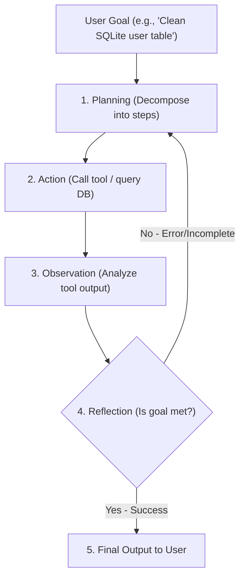
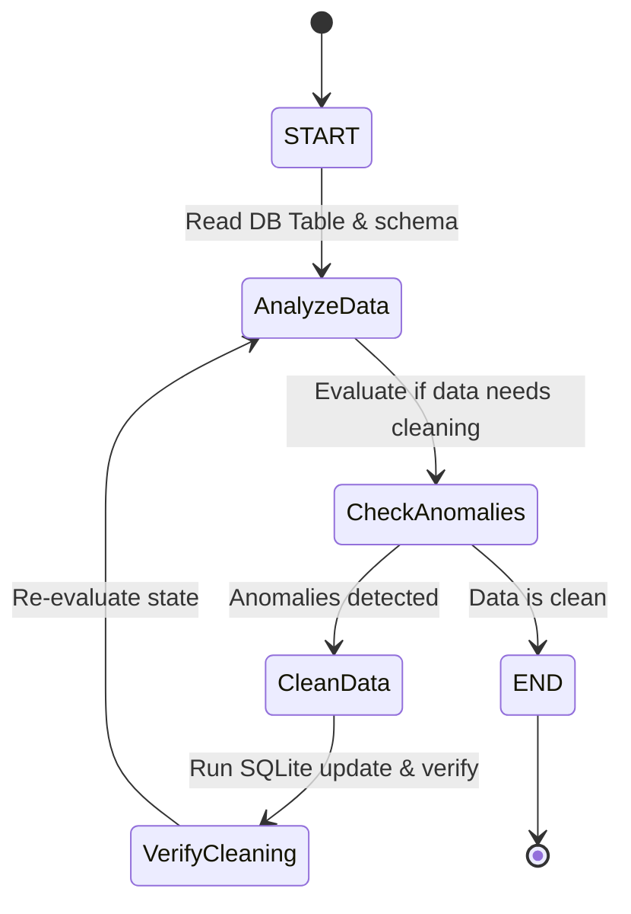

# Part 19: AI Agents & Advanced Workflows with LangGraph

*[← Back to Master Index](/blog/it-career-guide)*

---

## 1. Deep-Dive Core Concepts: Autonomous Execution Loops, State Management, and MCP

In the initial stages of Generative AI integration, applications functioned as basic single-turn request-response bridges (e.g., sending a prompt to an LLM and rendering the static text output). In **2026**, the industry has shifted to **Agentic AI**—systems that use LLMs as reasoning engines to plan complex tasks, invoke external tools, evaluate intermediate results, correct errors, and execute loops autonomously to achieve user goals.

---

### The Evolution of Agentic Architectures

An **AI Agent** is an autonomous software entity that senses its environment, makes decisions using a reasoning model, and executes actions using available tools.



#### Core Agentic Design Patterns
1.  **ReAct (Reasoning and Acting):** The model interleaves thinking traces (Reasoning) with action execution steps (Acting). It generates a thought, selects a tool, runs the tool, observes the output, and repeats this cycle until the task is complete.
2.  **Plan-and-Solve:** The model generates a structured sequence of sub-tasks before executing them. This is more efficient than ReAct for large projects, as it prevents the model from wandering off-track during long execution loops.
3.  **Reflection & Self-Correction:** The agent generates an output, passes it to a validation node (or another model) to evaluate correctness, feeds the criticism back into its prompt window, and refines the output until it meets the target criteria.
4.  **Multi-Agent Coordination:** Complex workflows are divided among specialized agents (e.g., a "Writer Agent" drafting content, an "Editor Agent" checking grammar, and a "Manager Agent" coordinating execution), using structured communication networks to collaborate.

---

### LangGraph State Machine Internals

Standard LLM orchestration libraries (like early LangChain or Index configurations) structure workflows as linear directed acyclic graphs (DAGs). This structure fails to handle agentic loops, where an error in Step 4 requires the model to cycle back to Step 2.

**LangGraph** solves this by modeling agent workflows as stateful, cyclic graphs using state-machine concepts.

```
LangGraph Core Components:
- State: Shared memory dict, updated by nodes.
- Nodes: Python functions executing logic, returning state updates.
- Edges: Routes connecting nodes.
- Conditional Edges: Routers evaluating state to decide the next node.
- Checkpointer: Thread-safe memory saver, enables history playback.
```

#### The Graph State and Reducers
In LangGraph, the graph is governed by a central state structure (usually a `TypedDict` or Pydantic model). 
*   **Node Execution:** Each node in the graph is a function that receives the current state, executes its logic, and returns a dictionary containing state updates.
*   **State Merging (Reducers):** By default, when a node returns an update for a state key, LangGraph overwrites the old value. To append data instead (such as tracking a list of messages or logs), engineers define **Reducer Functions** using Python's `Annotated` types:

```python
from typing import Annotated, List

def append_logs(current: List[str], update: List[str]) -> List[str]:
    # Custom reducer merging lists safely
    return (current or []) + (update or [])

class GraphState(TypedDict):
    logs: Annotated[List[str], append_logs]
```

#### Memory Checkpointing & Human-in-the-Loop
LangGraph compiles graphs with a **Checkpointer** (e.g., `MemorySaver` for in-memory persistence or PostgreSQL adapters for production). 
*   **Checkpoint Saving:** After each node completes, LangGraph saves a snapshot of the state.
*   **Time Travel & Playback:** If a process fails or if an operator wants to review execution history, the application can reload the state at any historical checkpoint and resume execution from that node.
*   **Human-in-the-Loop (Interrupts):** The graph can be configured to pause execution before running a sensitive node (e.g., executing a database write or sending an email), allowing a human operator to inspect the state, approve the action, or edit the values before resuming.

---

### The Model Context Protocol (MCP)

As the agentic ecosystem grew, connecting models to external tools (such as local file systems, databases, git repos, or search APIs) required writing custom wrappers for each provider, creating an integration bottleneck.

The **Model Context Protocol (MCP)** is an open standard that acts as a unified interface for connecting AI models to data sources and tools, operating like a "USB-C port for AI."

```mermaid
graph LR
    subgraph Host Application (Cursor / VS Code / Claude Desktop)
        MCPClient["MCP Client"]
    end
    subgraph MCP Server (Local Process / Subprocess)
        MCPServer["MCP Server Interface"] --> Resources["Resources (Local Files / DB)"]
        MCPServer --> Tools["Tools (File edit / Run tests)"]
        MCPServer --> Prompts["Prompts (Templates)"]
    end
    MCPClient <-->|JSON-RPC 2.0 over stdio/HTTP| MCPServer
```

#### MCP Architecture
MCP uses a modular Host-Client-Server design:
1.  **Host:** The application hosting the AI (e.g., Cursor, VS Code, Claude Desktop, or your custom agent runner).
2.  **Client:** The bridge running inside the Host, establishing connection streams to the servers.
3.  **Server:** An independent process that exposes capabilities to the host.
4.  **Transport Layers:**
    *   **stdio:** The client spawns the server as a local subprocess and communicates using standard input/output streams.
    *   **SSE / HTTP:** The client connects to a remote server over HTTP, receiving messages via Server-Sent Events.
5.  **Capability Protocol:**
    *   **Resources:** Static data sources (e.g., file contents, database tables).
    *   **Tools:** Executable functions that the model can invoke (e.g., writing a file, running a shell command).
    *   **Prompts:** Pre-defined templates for structuring model queries.

---

## 2. Master Resource Directory: AI Agents & LangGraph

Mastering autonomous AI workflows requires studying state-machine graphs, tool-use protocols, and multi-agent coordination frameworks. Below are the 6 definitive learning resources.

---

### Resource 1: LangGraph Documentation & Tutorials (langchain-ai.github.io/langgraph)
*   **Why It Was Selected:** The official LangGraph documentation is the authoritative guide to building stateful, multi-agent cyclic applications. It covers core concepts like state reducers, conditional edges, memory savers, error handling, and human-in-the-loop patterns.
*   **Target Syllabus Modules/Chapters:**
    *   *Conceptual Guides:* State, Nodes, Edges, and Checkpoints.
    *   *How-to Guides:* Creating loops, adding human interrupts, and time travel.
    *   *Multi-Agent:* Supervisor and Network agent topologies.
*   **Time Investment Required:** 20 hours of reading and exercises.
    *   *Week 1:* Core graph building and reducers (10 hours)
    *   *Week 2:* Memory, interrupts, and multi-agent systems (10 hours)
*   **Value Assessment:** Critical. It is the industry-standard library for building complex, cyclic LLM workflows.
*   **Actionable Study Strategy:** Complete the **Chatbot with Memory** tutorial. Implement a graph that pauses execution before calling a tool, allowing you to edit the tool's input parameters in the terminal before resuming.

---

### Resource 2: Model Context Protocol Specification & Docs (modelcontextprotocol.io)
*   **Why It Was Selected:** MCP is a key standard for agent integrations. The official documentation explains the JSON-RPC communication schemas, stdio/SSE transports, and capability listings, ensuring you can build custom servers to connect your agents to local tools.
*   **Target Syllabus Modules/Chapters:**
    *   *Introduction:* Host-Client-Server architecture overview.
    *   *Server Guides:* Building servers in TypeScript and Python.
    *   *Protocol Spec:* Schema specs for Tools, Resources, and Prompts.
*   **Time Investment Required:** 12 hours.
*   **Value Assessment:** Critical. Connects your AI models to external tools using a standard protocol rather than custom, ad-hoc integrations.
*   **Actionable Study Strategy:** Build a simple Python MCP server that exposes local file reading as a resource and a terminal execution script as a tool. Connect it to Cursor or Claude Desktop to verify the model can discover and use them.

---

### Resource 3: AI Agents and Applications (O'Reilly Book)
*   **Why It Was Selected:** A comprehensive guide detailing how to build, test, and deploy agentic applications using LangChain, LangGraph, and the Model Context Protocol.
*   **Target Syllabus Modules/Chapters:**
    *   *Chapter 3:* The Agent Loop (ReAct, Plan-and-Solve).
    *   *Chapter 6:* State Machines and LangGraph structures.
    *   *Chapter 9:* Enterprise Integration using MCP.
*   **Time Investment Required:** 15 hours.
*   **Value Assessment:** Free via O'Reilly library access. Ideal for learning how to design and build production-grade agentic architectures.
*   **Actionable Study Strategy:** Read the design chapters. Build a sample agent that reads database schemas, plans migrations, and runs tests to verify the changes.

---

### Resource 4: LLM Engineering: Master AI, Large Language Models & Agents (Udemy Course)
*   **Why It Was Selected:** A practical, video-based course covering LLM APIs, function calling, vector stores, agent loops, and building multi-agent systems using LangGraph.
*   **Target Syllabus Modules/Chapters:**
    *   *Section 6:* Function Calling and Tool Use.
    *   *Section 8:* Building State Graphs with LangGraph.
    *   *Section 10:* Deploying Agents as Microservices.
*   **Time Investment Required:** 18 hours.
*   **Value Assessment:** Included with TCS-provided Udemy access. Good for visual learners transitioning from basic API calls to building structured agent workflows.
*   **Actionable Study Strategy:** Watch the videos at 1.25x speed. Build the sample multi-agent workflow alongside the instructor, writing the state configurations and routing logic.

---

### Resource 5: AI Agent Short Courses (DeepLearning.AI)
*   **Why It Was Selected:** A series of short courses covering AI agent design patterns, building multi-agent systems, and evaluating agent workflows.
*   **Target Syllabus Modules/Chapters:**
    *   *AI Agent Design Patterns:* Reflection, Tool use, Planning, and Multi-agent collaboration.
    *   *LangGraph:* Building stateful agent graphs.
*   **Time Investment Required:** 8 hours.
*   **Value Assessment:** High. Great for understanding the conceptual patterns behind agentic workflows before diving into code.
*   **Actionable Study Strategy:** Watch the conceptual videos, then write a simple Reflection agent in Python without using libraries to understand how self-correction loops work under the hood.

---

### Resource 6: AutoGen Documentation & Guides (microsoft.github.io/autogen)
*   **Why It Was Selected:** AutoGen is Microsoft's framework for building multi-agent conversation systems. It is selected because it provides an alternative design pattern to LangGraph, focusing on conversation-driven agent coordination.
*   **Target Syllabus Modules/Chapters:**
    *   *Core Concepts:* ConversableAgent, GroupChat, and Custom Agents.
    *   *Use Cases:* Multi-agent coding tasks and database queries.
*   **Time Investment Required:** 10 hours.
*   **Value Assessment:** High. Useful for understanding how conversation-driven agent coordination compares to graph-based state-machine designs.
*   **Actionable Study Strategy:** Build a simple two-agent conversation loop where a 'User Proxy' agent coordinates with an 'Assistant' agent to generate and run a Python script locally.

---

## 3. Hands-On Portfolio Lab Project: Autonomous Data Cleaning Agent with LangGraph

To demonstrate your Agentic AI engineering credentials, you will build an **Autonomous Data Cleaning Agent** using LangGraph, Python, SQLite, and an LLM. The agent will read a database table, identify missing values or format anomalies, write a SQL update query, execute it against the database, and verify the changes.

```
~/data_cleaner_agent/
├── app/
│   ├── __init__.py
│   ├── main.py             # LangGraph StateGraph definition and execution loop
│   ├── db.py               # Local SQLite database setup and tools
│   └── schemas.py          # State schemas and models
├── tests/
│   ├── __init__.py
│   └── test_agent.py       # Integration tests
├── requirements.txt        # Package dependencies
└── run.sh                  # Setup and execution script
```

### Agent State Transition Flow

The diagram below details the state machine routing of the cleaning agent:



---

### Step 1: Initialize Project Directory and Dependencies

Create the project directory and file structures:
```bash
mkdir -p ~/data_cleaner_agent/app ~/data_cleaner_agent/tests
cd ~/data_cleaner_agent
```

#### File: `~/data_cleaner_agent/requirements.txt`
Declares the required libraries for our state-machine agent.
```
langgraph>=0.0.30
langchain-core>=0.1.30
pydantic>=2.6.0
pytest>=8.0.0
pytest-asyncio>=0.23.0
```

---

### Step 2: Implement SQLite Database Handler

#### File: `~/data_cleaner_agent/app/db.py`
Sets up a local SQLite database containing raw, uncleaned mock user accounts.
```python
import sqlite3
from typing import List, Dict, Any

class DatabaseManager:
    def __init__(self, db_path: str = "users.db") -> None:
        self.db_path = db_path
        self._setup_db()

    def _setup_db(self) -> None:
        """Creates table and inserts uncleaned dummy data."""
        with sqlite3.connect(self.db_path) as conn:
            cursor = conn.cursor()
            cursor.execute("""
                CREATE TABLE IF NOT EXISTS users (
                    id INTEGER PRIMARY KEY,
                    name TEXT NOT NULL,
                    email TEXT,
                    signup_date TEXT
                );
            """)
            
            # Reset table content
            cursor.execute("DELETE FROM users;")
            
            # Ingest dirty data (missing emails, inconsistently formatted dates)
            dirty_users = [
                (1, "Chirag Singhal", None, "2026-05-26"),
                (2, "john doe", "john@test.com", "26/05/2026"),
                (3, "Alice Smith", "alice.smith@oriz.in", "2026-05-27"),
                (4, "Bob Brown", "bob@gmail", "invalid_date_format")
            ]
            cursor.executemany(
                "INSERT INTO users (id, name, email, signup_date) VALUES (?, ?, ?, ?);",
                dirty_users
            )
            conn.commit()

    def query(self, sql: str, params: tuple = ()) -> List[Dict[str, Any]]:
        """Executes read queries, returning rows as dictionaries."""
        with sqlite3.connect(self.db_path) as conn:
            conn.row_factory = sqlite3.Row
            cursor = conn.cursor()
            cursor.execute(sql, params)
            return [dict(row) for row in cursor.fetchall()]

    def execute(self, sql: str, params: tuple = ()) -> None:
        """Executes write/update operations."""
        with sqlite3.connect(self.db_path) as conn:
            cursor = conn.cursor()
            cursor.execute(sql, params)
            conn.commit()

db_manager = DatabaseManager()
```

---

### Step 3: Implement Agent Schemas & States

#### File: `~/data_cleaner_agent/app/schemas.py`
Defines the graph state structure and reducer function.
```python
from typing import TypedDict, Annotated, List, Optional

def reduce_logs(current: Optional[List[str]], update: Optional[List[str]]) -> List[str]:
    """Reducer that appends logs to a list, handling None values."""
    if not current:
        current = []
    if not update:
        update = []
    return current + update

class AgentState(TypedDict):
    # Log trace of agent execution decisions
    logs: Annotated[List[str], reduce_logs]
    # Data extracted from DB for analysis
    raw_data: List[dict]
    # Generated SQL scripts to execute
    sql_updates: List[str]
    # Flag tracking validation state
    is_clean: bool
```

---

### Step 4: Implement LangGraph State Nodes and Routing

#### File: `~/data_cleaner_agent/app/main.py`
Builds the LangGraph state machine, nodes, and compiled execution flow.
```python
import logging
from typing import Literal
from langgraph.graph import StateGraph, START, END
from langgraph.checkpoint.memory import MemorySaver
from app.db import db_manager
from app.schemas import AgentState

logging.basicConfig(level=logging.INFO)
logger = logging.getLogger(__name__)

# --- Node 1: Analyze Data ---
def analyze_data_node(state: AgentState) -> dict:
    """Reads database entries and logs status updates."""
    rows = db_manager.query("SELECT * FROM users;")
    logs = [f"Analyzing database table: {len(rows)} records found."]
    
    # Analyze dirty records
    anomalies = []
    for row in rows:
        if not row["email"] or "@" not in row["email"]:
            anomalies.append(f"Invalid email: ID {row['id']} - {row['email']}")
        if len(row["signup_date"].split("-")) != 3:
            anomalies.append(f"Invalid date format: ID {row['id']} - {row['signup_date']}")

    if anomalies:
        logs.append(f"Anomalies detected: {'; '.join(anomalies)}")
        return {"raw_data": rows, "logs": logs, "is_clean": False}
    
    logs.append("No data anomalies detected. Table is clean.")
    return {"raw_data": rows, "logs": logs, "is_clean": True}

# --- Node 2: Clean Data ---
def clean_data_node(state: AgentState) -> dict:
    """Generates clean data update queries based on identified anomalies."""
    logs = ["Formulating cleaning scripts."]
    sql_updates = []

    # Iterate over active data records to generate fix actions
    for row in state["raw_data"]:
        # Fix missing or invalid emails
        if not row["email"]:
            fixed_email = f"{row['name'].lower().replace(' ', '')}@placeholder.com"
            sql_updates.append(f"UPDATE users SET email = '{fixed_email}' WHERE id = {row['id']};")
            logs.append(f"Generated email correction query for ID {row['id']}.")
        elif "@" in row["email"] and "." not in row["email"].split("@")[1]:
            # Simple domain fix
            fixed_email = f"{row['email']}.com"
            sql_updates.append(f"UPDATE users SET email = '{fixed_email}' WHERE id = {row['id']};")
            logs.append(f"Generated email format correction query for ID {row['id']}.")

        # Standardize date formats to YYYY-MM-DD
        date_parts = row["signup_date"].split("/")
        if len(date_parts) == 3:
            # Conversion of DD/MM/YYYY to YYYY-MM-DD
            standard_date = f"{date_parts[2]}-{date_parts[1]}-{date_parts[0]}"
            sql_updates.append(f"UPDATE users SET signup_date = '{standard_date}' WHERE id = {row['id']};")
            logs.append(f"Generated date format conversion query for ID {row['id']}.")
        elif len(row["signup_date"].split("-")) != 3:
            # General fallback fix
            sql_updates.append(f"UPDATE users SET signup_date = '2026-05-26' WHERE id = {row['id']};")
            logs.append(f"Generated date fallback update query for ID {row['id']}.")

    return {"sql_updates": sql_updates, "logs": logs}

# --- Node 3: Execute and Verify ---
def execute_and_verify_node(state: AgentState) -> dict:
    """Runs execution updates and logs results."""
    logs = [f"Executing {len(state['sql_updates'])} SQLite update queries."]
    
    for query in state["sql_updates"]:
        try:
            db_manager.execute(query)
            logs.append(f"Executed query: {query.strip()}")
        except Exception as e:
            logs.append(f"Query execution failed: {str(e)}")

    # Clear pending sql update queue
    return {"sql_updates": [], "logs": logs}

# --- Conditional Router ---
def anomaly_router(state: AgentState) -> Literal["clean_data", "__end__"]:
    """Decides if graph execution continues or terminates."""
    if state["is_clean"]:
        return "__end__"
    return "clean_data"

# --- Graph Construction ---
builder = StateGraph(AgentState)

# Add nodes to graph
builder.add_node("analyze_data", analyze_data_node)
builder.add_node("clean_data", clean_data_node)
builder.add_node("execute_and_verify", execute_and_verify_node)

# Configure transitions and paths
builder.add_edge(START, "analyze_data")

# Route conditionally based on anomaly check
builder.add_conditional_edges(
    "analyze_data",
    anomaly_router,
    {
        "clean_data": "clean_data",
        "__end__": END
    }
)

builder.add_edge("clean_data", "execute_and_verify")
# Loop execute results back to analysis node to verify data is clean
builder.add_edge("execute_and_verify", "analyze_data")

# Compile graph with thread-safe memory checkpointer
memory = MemorySaver()
agent_graph = builder.compile(checkpointer=memory)
```

---

### Step 5: Write Integration Tests

#### File: `~/data_cleaner_agent/tests/test_agent.py`
Verifies SQLite operations and the graph execution loop.
```python
import pytest
from app.db import db_manager
from app.main import agent_graph

def test_database_initialization():
    rows = db_manager.query("SELECT * FROM users;")
    assert len(rows) == 4
    assert rows[0]["email"] is None

def test_agent_graph_execution():
    config = {"configurable": {"thread_id": "test_thread_1"}}
    
    # Invoke state machine graph
    final_state = agent_graph.invoke(
        {"logs": [], "raw_data": [], "sql_updates": [], "is_clean": False},
        config
    )
    
    assert final_state["is_clean"] is True
    assert len(final_state["sql_updates"]) == 0
    assert any("Anomalies detected" in log for log in final_state["logs"])
    assert any("No data anomalies detected" in log for log in final_state["logs"])
    
    # Confirm database records were cleaned
    cleaned_rows = db_manager.query("SELECT * FROM users;")
    assert cleaned_rows[0]["email"] == "chiragsinghal@placeholder.com"
    assert cleaned_rows[1]["signup_date"] == "2026-05-26"
```

---

### Step 6: Build and Run Setup Automation

#### File: `~/data_cleaner_agent/run.sh`
Configures environment and runs the test suite.
```bash
#!/usr/bin/env bash

# Exit script on any execution error
set -euo pipefail

echo "=== Stage 1: Creating Virtual Environment ==="
python3 -m venv .venv
source .venv/bin/activate

echo "=== Stage 2: Installing Agent App Dependencies ==="
pip install --upgrade pip
pip install -r requirements.txt

echo "=== Stage 3: Running Agent Integration Tests ==="
pytest tests/

echo "=== Stage 4: Executing Agent Execution Demo ==="
python -c '
from app.main import agent_graph
config = {"configurable": {"thread_id": "demo_run"}}
result = agent_graph.invoke({"logs": [], "raw_data": [], "sql_updates": [], "is_clean": False}, config)
print("\n=== Agent Run Logs ===")
for log in result["logs"]:
    print(log)
'
```

Make the script executable:
```bash
chmod +x ~/data_cleaner_agent/run.sh
```

To run and verify the agent:
```bash
./run.sh
```

---

## 4. Technical Interview Self-Assessment

Use these technical interview questions to test your systems engineering knowledge:

| Category | High-Frequency Interview Question | Expected Technical Answer Framework |
| :--- | :--- | :--- |
| **Graph Topologies** | How do cyclic graphs in LangGraph differ from standard Directed Acyclic Graphs (DAGs)? | Standard **DAGs** execute in a linear path where nodes run sequentially without loops. **Cyclic Graphs** in LangGraph support loops, allowing nodes to cycle back to previous nodes (e.g., repeating task nodes if validation checks fail), which is essential for agentic loops and self-correction workflows. |
| **State Reducers** | What is the purpose of state reducer functions, and what happens if a node returns updates without one? | **State Reducers** define how node updates are merged into the graph state. If a node returns an update for a key without a reducer, LangGraph overwrites the old value (last-write-wins). Reducers (such as `add_messages`) merge updates (e.g., appending new messages to a list), maintaining execution history. |
| **Compiled Graphs** | What is the purpose of the compiling step in LangGraph, and what does it generate? | Compiling converts the Graph builder configuration (nodes, edges, routers) into a stateful executable structure. It validates the graph (checking for dead ends or unmapped edges), registers the state schema, and wraps the execution loop inside a thread-safe transaction wrapper. |
| **Persistence Layers** | How does LangGraph handle thread safety and multi-session states during checkpointing? | LangGraph saves state snapshots to a checkpointer (e.g., PostgreSQL) after each node completes, keyed by `thread_id`. Multiple concurrent users run in isolated sessions under separate thread IDs. The database transaction wrapper locks the target thread row during execution, ensuring session isolation and thread-safe updates. |
| **Interoperability Standards** | Explain the Model Context Protocol (MCP) and how it addresses tool integration challenges. | MCP standardizes the communication protocol between AI clients and external tools using a Host-Client-Server design. Instead of writing custom integration adapters for every tool (creating an $N \times M$ integration problem), developers write MCP servers that expose capabilities via standard schemas, allowing any client to discover and use them. |
| **Human Approvals** | How do you implement a human-in-the-loop validation step in a LangGraph workflow? | To insert a human-in-the-loop step, you compile the graph with a checkpointer and configure it to pause before running a specific node using the `interrupt_before` setting. LangGraph executes the graph up to that node and pauses, allowing an operator to inspect the state, edit values, and resume execution. |

---

## 5. Exit Tasks for this Phase

Complete these verification steps before moving to the next batch:
- [ ] Run the `run.sh` script to verify your virtual environment and start the SQLite demo run.
- [ ] Confirm that Pytest executes and passes all test cases successfully.
- [ ] Inspect the output logs in the terminal to verify the agent successfully identifies the dirty database records and runs the SQLite queries to clean them.
- [ ] Commit your agent code to GitHub to keep your progress backed up.

---

*[Proceed to Part 20: Enterprise Security, Authentication & OWASP Top 10 →](/blog/it-career-guide/part-20-security)*
