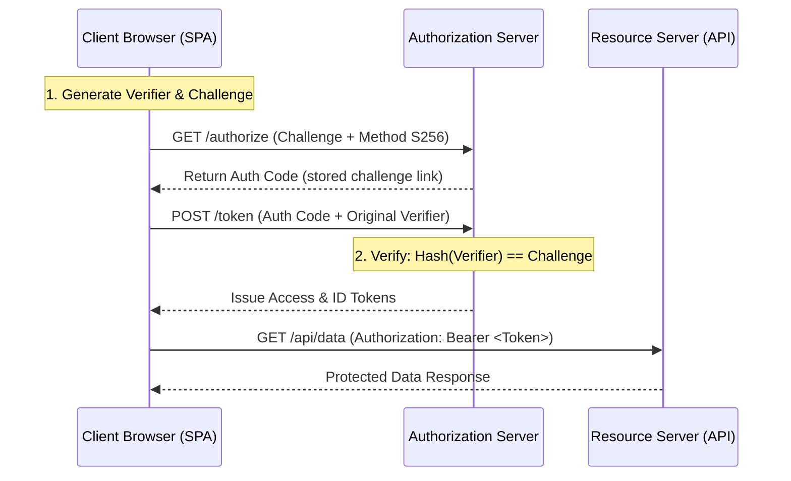
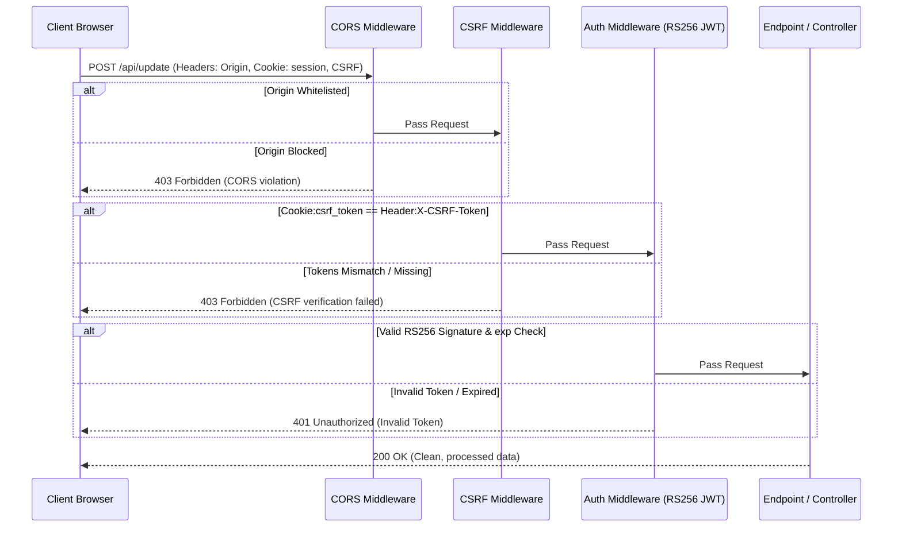

# Part 20: Enterprise Security, Authentication & OWASP Top 10

*[← Back to Master Index](/blog/it-career-guide)*

---

## 1. Deep-Dive Core Concepts: The CIA Triad, OWASP Vectors, and Cryptographic Authentication

In modern software engineering, security is no longer an afterthought delegated to a separate compliance team. In **2026**, product companies expect platform and backend engineers to write secure-by-default code, manage cryptographic tokens, secure APIs, and protect infrastructure against malicious threats. 

---

### The CIA Triad and Threat Modeling

Enterprise security is built on the **CIA Triad**:
*   **Confidentiality:** Ensuring that sensitive data is accessible only to authorized users (enforced via encryption in transit/at rest, and strict access controls).
*   **Integrity:** Guarding against unauthorized modification or destruction of information (enforced via cryptographic hashing, database constraints, and audit logs).
*   **Availability:** Ensuring reliable and timely access to data and resources for authorized users (enforced via rate limiting, load balancing, and DDoS protection).

Before writing code, engineers must perform **Threat Modeling** (e.g., using the **STRIDE** methodology):
*   **S**poofing identity (Mitigated by strong authentication).
*   **T**ampering with data (Mitigated by integrity checks).
*   **R**epudiation (Mitigated by immutable audit logs).
*   **I**nformation disclosure (Mitigated by encryption and data masking).
*   **D**enial of Service (Mitigated by rate limiting and scaling).
*   **E**levation of privilege (Mitigated by role-based access control - RBAC).

---

### OWASP Top 10: Attack Vectors and Mitigations

The **OWASP Top 10** lists the most critical security vulnerabilities for web applications. Understanding these vectors and writing code to prevent them is a core requirement for backend engineers.

#### 1. Injection (SQLi, Command Injection)
*   **The Vector:** User input is concatenated directly into command execution scripts or SQL queries, allowing attackers to execute arbitrary commands or bypass checks.
    *   *Payload:* `' OR '1'='1`
*   **The Mitigation:** Never concatenate inputs. Always use **Parameterized Queries** (Prepared Statements) or Object-Relational Mappers (ORMs) where data parameters are bound separately from command logic. Sanitize and validate all system inputs.

#### 2. Broken Authentication
*   **The Vector:** Weak password hashing, session identifier prediction, or failing to rotate session tokens after login allows attackers to hijack user accounts.
*   **The Mitigation:** Use modern, slow-hashing algorithms like **bcrypt** or **Argon2id**. Enforce multi-factor authentication (MFA) and rotate session IDs.

#### 3. Broken Object Level Authorization (BOLA / IDOR)
*   **The Vector:** An API endpoint retrieves records based on user-supplied IDs (e.g., `/api/user/101/invoice`) without validating whether the currently logged-in user actually owns that invoice.
    *   *Payload:* Changing ID `101` to `102` in the URL to read another user's invoice.
*   **The Mitigation:** Implement authorization checks on every data query: `SELECT * FROM invoices WHERE id = $1 AND owner_id = $2;`.

#### 4. Server-Side Request Forgery (SSRF)
*   **The Vector:** The application accepts a URL parameter from a user (e.g., to fetch a profile picture) and makes an HTTP request to that URL from the backend server, allowing attackers to query internal resources (such as AWS metadata endpoints at `http://169.254.169.254/`).
*   **The Mitigation:** Whitelist allowed domains for external requests. Avoid resolving user-provided hostnames to local or private IP ranges (`10.0.0.0/8`, `192.168.0.0/16`, `127.0.0.1`).

---

### OAuth 2.0 and PKCE (Proof Key for Code Exchange)

For client-side applications (Single Page Apps - SPAs, mobile apps), standard OAuth 2.0 flows are vulnerable to authorization code interception because these public clients cannot securely store a `client_secret`. 

To solve this, **PKCE (RFC 7636)** replaces static client secrets with dynamic, cryptographic challenges.



#### The Cryptographic Exchange
1.  **Code Verifier:** A cryptographically random, high-entropy string generated locally by the client:
    
    $$\text{verifier} \in [a-zA-Z0-9\-\.\_\~] \quad (\text{length } 43 \text{ to } 128)$$

2.  **Code Challenge:** The SHA-256 hash of the verifier, URL-safe Base64 encoded:
    
    $$\text{challenge} = \text{Base64URL}(\text{SHA256}(\text{verifier}))$$

3.  **Authorization Request:** The client redirects the user to the authorization server, passing the challenge and indicating the hashing method (`code_challenge_method=S256`). The server stores the challenge.
4.  **Token Exchange:** After receiving the authorization code, the client sends a POST request to the token endpoint, passing the code along with the raw `code_verifier`.
5.  **Validation:** The server hashes the received verifier using SHA-256 and compares the output with the challenge stored during Step 3. If they match, the server issues the tokens, ensuring the client requesting the tokens is the same one that initiated the authorization flow.

---

### JSON Web Tokens (JWT) and Secure Signatures

A **JWT (RFC 7519)** is a compact, URL-safe container used to securely transmit claims between parties. It consists of three parts separated by dots: `header.payload.signature`.

```
JWT Layout:
[Header]: Specifies algorithm (alg) and token type (typ).
[Payload]: Contains claims (sub, exp, iss, roles).
[Signature]: Cryptographic verification hash.
```

#### Cryptographic Signature Algorithms
*   **HS256 (HMAC with SHA-256):** Symmetric encryption. The server uses a single shared secret key to both sign and verify tokens. If a microservice needs to verify tokens, it must have access to this secret key, creating a key-compromise risk.
*   **RS256 (RSA Signature with SHA-256):** Asymmetric encryption. The authorization server signs the token using a private key, and microservices verify the signature using the corresponding public key. Public keys can be exposed safely (often via a JSON Web Key Set - JWKS endpoint), making RS256 the industry standard for distributed systems.

#### High-Frequency Vulnerabilities
*   **The `none` Algorithm Exploit:** If a server fails to validate the `alg` header during verification, an attacker can modify a token's header to `"alg": "none"`, remove the signature, and change user IDs in the payload to gain unauthorized access.
    *   *Mitigation:* Always explicitly specify allowed algorithms (e.g., `["RS256"]`) in your verification libraries, rejecting `none` explicitly.
*   **Key Confusion Attacks:** Occurs when an attacker takes an asymmetric public key (which is publicly visible), signs a modified token using HS256 (symmetric) with that public key, and sends it to a server configured to accept either HS256 or RS256, tricking the server into verifying the signature using the public key as an HMAC secret.
    *   *Mitigation:* Force token validation routines to use a single algorithm type based on configuration rules.

---

### Web Security Headers & CORS

Securing your application server requires setting browser-level configuration directives using HTTP response headers.

#### 1. Content Security Policy (CSP)
Controls which resources (scripts, stylesheets, images, connections) the browser is allowed to load and execute, mitigating Cross-Site Scripting (XSS) attacks:
```http
Content-Security-Policy: default-src 'self'; script-src 'self' https://apis.google.com;
```

#### 2. HTTP Strict Transport Security (HSTS)
Forces the browser to communicate with the server exclusively over HTTPS, preventing SSL stripping man-in-the-middle attacks:
```http
Strict-Transport-Security: max-age=63072000; includeSubDomains; preload
```

#### 3. X-Frame-Options
Prevents your website from being rendered inside an `<iframe>` on external sites, mitigating **Clickjacking** attacks:
```http
X-Frame-Options: DENY
```

#### 4. CORS (Cross-Origin Resource Sharing)
A browser security mechanism that restricts scripts running in a webpage from requesting resources on a different origin (domain).
*   **Preflight Request (`OPTIONS`):** For non-simple requests (e.g., requests with JSON body payloads or custom headers), the browser sends an initial HTTP `OPTIONS` request to the backend. The backend must respond with allowed origins, headers, and methods.
*   **Production Rule:** Never set `Access-Control-Allow-Origin: *` for authenticated endpoints. Always configure an explicit whitelist of allowed domain origins.

---

## 2. Master Resource Directory: Enterprise Security

Mastering enterprise application security requires studying OWASP remediation sheets, cryptographic RFCs, browser header settings, and secure coding practices. Below are the 7 definitive learning resources.

---

### Resource 1: OWASP Top 10 Documentation (owasp.org/Top10)
*   **Why It Was Selected:** The Open Web Application Security Project (OWASP) is the global authority on web security. Their Top 10 documentation is selected because it is the definitive guide detailing modern application vulnerabilities, explaining the underlying vectors, business impacts, and code-level remediation steps.
*   **Target Syllabus Modules/Chapters:**
    *   *Vulnerability Profiles:* Broken Access Control, Cryptographic Failures, and SSRF.
    *   *Prevention Manuals:* Code design recommendations and access control principles.
*   **Time Investment Required:** 15 hours of self-directed study.
    *   *Week 1:* Vulnerabilities 1 to 5 (7 hours)
    *   *Week 2:* Vulnerabilities 6 to 10 (8 hours)
*   **Value Assessment:** Essential reference guide. A thorough understanding of these concepts is required to pass modern backend engineering interviews.
*   **Actionable Study Strategy:** Read the **Broken Access Control** section. Note the differences between Role-Based Access Control (RBAC) and Attribute-Based Access Control (ABAC), and sketch an authorization enforcement schema on paper.

---

### Resource 2: RFC 7636: Proof Key for Code Exchange (ietf.org/rfc/rfc7636.txt)
*   **Why It Was Selected:** Implementing secure OAuth 2.0 client integrations requires reading the official specification. This RFC is selected because it defines the exact verifier and challenge generation mathematics, query parameters, and validation flows, ensuring your authentication code handles token exchanges securely.
*   **Target Syllabus Modules/Chapters:**
    *   *Section 4:* Protocol Flow and Challenge Generation.
    *   *Section 6:* Server Verification Rules.
*   **Time Investment Required:** 8 hours.
*   **Value Assessment:** Free. Essential technical specification for understanding modern federated login pipelines.
*   **Actionable Study Strategy:** Read Section 4. Write a local script that generates a cryptographically secure random verifier and computes its SHA-256 Base64URL-encoded challenge string, matching the RFC examples.

---

### Resource 3: Web Application Security by Andrew Hoffman (O'Reilly Book)
*   **Why It Was Selected:** Andrew Hoffman is a security researcher at Salesforce. This book is selected because it provides practical, code-focused security exercises, showing how to audit databases, prevent XSS/CSRF attacks, and configure secure transport layers.
*   **Target Syllabus Modules/Chapters:**
    *   *Part II: Auditing Applications:* Code reviews and vulnerability scanning.
    *   *Part III: Preventing Vulnerabilities:* Input sanitization, CSP configuration, and database security.
*   **Time Investment Required:** 18 hours.
*   **Value Assessment:** Free via O'Reilly library access. Ideal for learning how to secure and patch production applications.
*   **Actionable Study Strategy:** Focus on **Part III**. Write a script that parses input payloads and strips HTML tags programmatically, comparing the results against existing sanitization libraries.

---

### Resource 4: Mastering Authentication in Node.js / Python (Udemy Course)
*   **Why It Was Selected:** A video course detailing secure session management, cookie authentication, OAuth 2.0 implementations, and JWT configurations.
*   **Target Syllabus Modules/Chapters:**
    *   *Section 4:* Session-based vs Token-based Authentication.
    *   *Section 7:* Implementing OAuth 2.0 with PKCE.
    *   *Section 9:* Token Cryptography and RS256 signature verification.
*   **Time Investment Required:** 20 hours.
*   **Value Assessment:** Included with TCS-provided Udemy access. Good for visual learners transitioning from basic mock logins to secure, production-ready federated authentication systems.
*   **Actionable Study Strategy:** Watch the videos at 1.25x speed. Build the sample OAuth integration yourself, writing the token request hooks and signature verification middleware.

---

### Resource 5: Auth0 Developer Guides & Academy (auth0.com/docs)
*   **Why It Was Selected:** Auth0's developer guides provide excellent conceptual breakdowns of identity management, SSO, OAuth flows, and JWT standards.
*   **Target Syllabus Modules/Chapters:**
    *   *Identity Academy:* Understanding OpenID Connect (OIDC) and OAuth 2.0.
    *   *Security Guides:* Token rotation, sliding sessions, and token revocation.
*   **Time Investment Required:** 10 hours.
*   **Value Assessment:** Free. Excellent for learning best practices for identity architecture and secure token management.
*   **Actionable Study Strategy:** Read the **Token Best Practices** guide. Note how refresh token rotation mitigates key compromise risks, and map out the storage rules for access tokens in client browsers.

---

### Resource 6: Helmet.js Security Middleware Guides (helmetjs.github.io)
*   **Why It Was Selected:** Helmet.js is the standard security header package for Express/Node applications. Their documentation explains the purpose of each security header (CSP, HSTS, XSS protection), showing how to configure response headers to secure endpoints against browser-level attacks.
*   **Target Syllabus Modules/Chapters:**
    *   *Middleware:* CSP configuration, HSTS limits, and frame protections.
*   **Time Investment Required:** 6 hours.
*   **Value Assessment:** Free. Essential knowledge for configuring security headers on backend APIs.
*   **Actionable Study Strategy:** Review the default headers set by Helmet. Write a custom configuration block that defines a strict Content Security Policy, whitelist domains, and test the responses.

---

### Resource 7: OWASP Cheat Sheet Series (cheatsheetseries.owasp.org)
*   **Why It Was Selected:** The OWASP Cheat Sheet Series provides concise, actionable guidelines for specific security tasks, such as JWT handling, SQL injection prevention, password storage, and CORS configurations.
*   **Target Syllabus Modules/Chapters:**
    *   *Cheat Sheets:* JSON Web Token (JWT) Security, SQL Injection Prevention, and Cross-Origin Resource Sharing.
*   **Time Investment Required:** 12 hours of reference study.
*   **Value Assessment:** Free. Highly practical resource for reviewing security checklist items before code deployments.
*   **Actionable Study Strategy:** Read the **JWT Security Cheat Sheet**. Check your local token implementation code against their recommendations (e.g., verifying signature algorithms, setting token expiration limits).

---

## 3. Hands-On Portfolio Lab Project: Secure JWT & CSRF Middleware Gateway

To demonstrate your application security credentials, you will build a **Secure API Gateway Service** using FastAPI. The service will implement:
1.  **RS256 Asymmetric JWT Verification:** Decoding tokens using a public RSA key.
2.  **CORS Configuration:** Setting strict origin validation headers.
3.  **CSRF (Cross-Site Request Forgery) Middleware:** Implementing the Double Submit Cookie pattern to protect POST requests.
4.  **Input Sanitization:** Stripping malicious HTML scripts to prevent XSS.

```
~/secure_gateway/
├── app/
│   ├── __init__.py
│   ├── main.py             # FastAPI application and route definitions
│   ├── config.py           # Keys and system settings
│   ├── security.py         # RS256 token verification and sanitization
│   └── middleware/
│       └── csrf.py         # Custom CSRF Double-Submit cookie validation
├── keys/
│   ├── jwt_key.pem         # Private signing key (used to generate mock tokens)
│   └── jwt_key.pub         # Public verification key
├── tests/
│   ├── __init__.py
│   └── test_security.py    # Security integration tests
├── requirements.txt        # Package dependencies
└── run.sh                  # Key generation and test automation script
```

### Security Verification Flow

The sequence diagram below displays the layered security checks executed by the gateway for incoming API requests:



---

### Step 1: Initialize Project Directory and Dependencies

Create the project directory and file structures:
```bash
mkdir -p ~/secure_gateway/app/middleware ~/secure_gateway/keys ~/secure_gateway/tests
cd ~/secure_gateway
```

#### File: `~/secure_gateway/requirements.txt`
Declares the required libraries for our secure gateway service.
```
fastapi>=0.110.0
uvicorn[standard]>=0.28.0
pydantic>=2.6.0
pyjwt[crypto]>=2.8.0
cryptography>=42.0.0
pytest>=8.0.0
pytest-asyncio>=0.23.0
```

---

### Step 2: Implement Config and Key Verification

#### File: `~/secure_gateway/app/config.py`
Defines application configuration settings.
```python
import os
from pydantic import Field
from pydantic_settings import BaseSettings

class Settings(BaseSettings):
    app_name: str = "Secure Authentication Gateway"
    allowed_origin: str = Field(default="http://localhost:3000", env="ALLOWED_ORIGIN")
    
    # Path settings for public RSA keys
    public_key_path: str = Field(default="keys/jwt_key.pub")
    private_key_path: str = Field(default="keys/jwt_key.pem")

    @property
    def public_key(self) -> str:
        with open(self.public_key_path, "r") as f:
            return f.read()

    @property
    def private_key(self) -> str:
        with open(self.private_key_path, "r") as f:
            return f.read()

settings = Settings()
```

---

### Step 3: Implement Custom CSRF Double-Submit Middleware

#### File: `~/secure_gateway/app/middleware/csrf.py`
Validates POST/PUT requests using the Double Submit Cookie pattern.
```python
import secrets
from fastapi import Request, Response
from starlette.middleware.base import BaseHTTPMiddleware, RequestResponseEndpoint
from starlette.responses import JSONResponse

class CSRFMiddleware(BaseHTTPMiddleware):
    async def dispatch(self, request: Request, call_next: RequestResponseEndpoint) -> Response:
        # 1. Read tokens from Cookie and Header
        csrf_cookie = request.cookies.get("csrf_token")
        csrf_header = request.headers.get("X-CSRF-Token")

        # GET/OPTIONS requests do not modify server state; bypass checks but issue a new token
        if request.method in ["GET", "OPTIONS", "HEAD"]:
            response = await call_next(request)
            # If cookie does not exist, set a new cryptographically secure random token
            if not csrf_cookie:
                new_token = secrets.token_hex(32)
                response.set_cookie(
                    key="csrf_token",
                    value=new_token,
                    httponly=False, # Must be visible to client JS to send in custom header
                    secure=True,
                    samesite="strict"
                )
            return response

        # 2. Enforce CSRF checks on state-changing methods (POST, PUT, DELETE)
        if not csrf_cookie or not csrf_header or csrf_cookie != csrf_header:
            return JSONResponse(
                status_code=403,
                content={"detail": "CSRF validation failed. Token mismatch or missing."}
            )

        return await call_next(request)
```

---

### Step 4: Implement Asymmetric JWT Verification and Input Sanitization

#### File: `~/secure_gateway/app/security.py`
Decodes RS256 signed JSON Web Tokens and sanitizes input text data.
```python
import re
from fastapi import Header, HTTPException, status
import jwt
from app.config import settings

def sanitize_html_input(text: str) -> str:
    """Strips HTML script tags programmatically to mitigate XSS inputs."""
    # Strip script tags and content: <script>...</script>
    clean_text = re.sub(r"<script\b[^>]*>(.*?)</script>", "", text, flags=re.IGNORECASE)
    # Strip inline HTML tags: <tag ...>
    clean_text = re.sub(r"<[^>]+>", "", clean_text)
    return clean_text.strip()

async def verify_jwt_token(authorization: str = Header(...)) -> dict:
    """Verifies RS256 token signatures using public RSA key, validating expiration."""
    if not authorization.startswith("Bearer "):
        raise HTTPException(
            status_code=status.HTTP_401_UNAUTHORIZED,
            detail="Invalid authorization schema. Use Bearer token."
        )
    
    token = authorization.split(" ")[1]

    try:
        # Decode and verify token using the public key
        # Explicitly enforce RS256 algorithm to prevent alg: none or key confusion exploits
        payload = jwt.decode(
            token,
            settings.public_key,
            algorithms=["RS256"],
            options={"require": ["exp", "sub"]}
        )
        return payload
    except jwt.ExpiredSignatureError:
        raise HTTPException(
            status_code=status.HTTP_401_UNAUTHORIZED,
            detail="Token has expired."
        )
    except jwt.InvalidTokenError as err:
        raise HTTPException(
            status_code=status.HTTP_401_UNAUTHORIZED,
            detail=f"Invalid authorization token: {str(err)}"
        )
```

---

### Step 5: Implement Main Application Server

#### File: `~/secure_gateway/app/main.py`
Configures routers and security layers.
```python
from fastapi import FastAPI, Depends, status
from fastapi.middleware.cors import CORSMiddleware
from pydantic import BaseModel, Field
from app.config import settings
from app.middleware.csrf import CSRFMiddleware
from app.security import verify_jwt_token, sanitize_html_input

app = FastAPI(
    title="Secure Gateway Service",
    version="1.0.0"
)

# Configure CORS Middleware
app.add_middleware(
    CORSMiddleware,
    allow_origins=[settings.allowed_origin],
    allow_credentials=True,
    allow_methods=["GET", "POST", "OPTIONS"],
    allow_headers=["Content-Type", "Authorization", "X-CSRF-Token"],
)

# Configure CSRF Middleware
app.add_middleware(CSRFMiddleware)

class UserInput(BaseModel):
    username: str = Field(..., min_length=3)
    bio: str = Field(..., description="User bio page content")

@app.post("/profile", status_code=status.HTTP_200_OK)
async def update_user_profile(
    payload: UserInput,
    user_claims: dict = Depends(verify_jwt_token)
) -> dict:
    """Updates user profile page, sanitizing input values and verifying claims."""
    sanitized_bio = sanitize_html_input(payload.bio)
    return {
        "status": "success",
        "user_id": user_claims["sub"],
        "username": payload.username,
        "sanitized_bio": sanitized_bio
    }

@app.get("/health", status_code=200)
async def check_health() -> dict[str, str]:
    return {"status": "healthy"}
```

---

### Step 6: Write Integration Tests

#### File: `~/secure_gateway/tests/test_security.py`
Validates security middleware, tokens, and CSRF checks.
```python
from datetime import datetime, timedelta, timezone
import pytest
from fastapi.testclient import TestClient
import jwt
from app.main import app
from app.config import settings

client = TestClient(app)

def test_health_check():
    response = client.get("/health")
    assert response.status_code == 200
    assert response.json() == {"status": "healthy"}

def test_csrf_generation_on_get():
    response = client.get("/health")
    assert "csrf_token" in response.cookies
    token = response.cookies["csrf_token"]
    assert len(token) == 64 # Hex representation of 32 bytes

def test_post_fails_without_csrf():
    payload = {"username": "chirags", "bio": "Software Engineer"}
    response = client.post("/profile", json=payload)
    assert response.status_code == 403
    assert "CSRF validation failed" in response.json()["detail"]

def test_secure_profile_update_flow():
    # 1. Get CSRF Token
    get_res = client.get("/health")
    csrf_token = get_res.cookies["csrf_token"]

    # 2. Generate valid RS256 JWT using private key
    now = datetime.now(timezone.utc)
    token_claims = {
        "sub": "user_101",
        "username": "chirag127",
        "exp": now + timedelta(hours=1),
        "iat": now
    }
    encoded_jwt = jwt.encode(token_claims, settings.private_key, algorithm="RS256")

    # 3. Trigger POST with valid cookies, headers, and token
    payload = {
        "username": "chirags",
        "bio": "Expert in <script>alert('xss')</script>FastAPI security."
    }
    
    headers = {
        "Authorization": f"Bearer {encoded_jwt}",
        "X-CSRF-Token": csrf_token
    }
    
    client.cookies.set("csrf_token", csrf_token)
    response = client.post("/profile", json=payload, headers=headers)
    
    assert response.status_code == 200
    data = response.json()
    assert data["user_id"] == "user_101"
    # Verify input sanitization removed the script tag
    assert "script" not in data["sanitized_bio"]
    assert "alert" not in data["sanitized_bio"]
    assert data["sanitized_bio"] == "Expert in FastAPI security."
```

---

### Step 7: Build and Run Setup Automation

#### File: `~/secure_gateway/run.sh`
Generates keys, configures virtual environment, and executes tests.
```bash
#!/usr/bin/env bash

# Exit script on any execution error
set -euo pipefail

echo "=== Stage 1: Creating Cryptographic Keys ==="
# Generate private key
openssl genpkey -algorithm RSA -out keys/jwt_key.pem -pkeyopt rsa_keygen_bits:2048
# Extract public key
openssl rsa -pubout -in keys/jwt_key.pem -out keys/jwt_key.pub

echo "=== Stage 2: Creating Virtual Environment ==="
python3 -m venv .venv
source .venv/bin/activate

echo "=== Stage 3: Installing Gateway Dependencies ==="
pip install --upgrade pip
pip install -r requirements.txt

echo "=== Stage 4: Running Security Tests ==="
pytest tests/

echo "=== Stage 5: Starting Gateway API Server ==="
echo "Starting Uvicorn security gateway locally..."
uvicorn app.main:app --reload --port 8000
```

Make the script executable:
```bash
chmod +x ~/secure_gateway/run.sh
```

To run and verify the gateway security:
```bash
./run.sh
```

---

## 4. Technical Interview Self-Assessment

Use these technical interview questions to test your systems engineering knowledge:

| Category | High-Frequency Interview Question | Expected Technical Answer Framework |
| :--- | :--- | :--- |
| **Auth Architectures** | How does Proof Key for Code Exchange (PKCE) secure authentication on public clients? | Public clients (like SPAs) cannot store a client secret. PKCE secures them by generating a dynamic, one-time cryptographically secure random string called the **Code Verifier** and its SHA-256 hash, the **Code Challenge**. The challenge is sent during the initial authorization request. During the token request, the client sends the raw verifier, allowing the authorization server to hash it and compare it to the original challenge, verifying the identity of the client. |
| **JWT Cryptography** | Why is RS256 preferred over HS256 for microservices architectures? | **HS256** is a symmetric algorithm where a single shared secret key is used to both sign and verify tokens, requiring every service that verifies tokens to store the secret key. **RS256** is an asymmetric algorithm where the authorization server signs tokens using a private key, and microservices verify the signature using a public key. Since public keys can be safely distributed, RS256 minimizes key-compromise risks in distributed systems. |
| **Attack Vectors** | Explain how a CSRF attack works and how the Double Submit Cookie pattern prevents it. | In a **CSRF** attack, a malicious site tricks a user's browser into sending state-changing requests to a target site where the user is authenticated, using the browser's automatic cookie transmission. The **Double Submit Cookie** pattern prevents this by generating a random token, setting it as a cookie, and requiring client-side scripts to read the cookie and send the value in a custom header (e.g., `X-CSRF-Token`). The server checks if the cookie matches the header, rejecting requests that lack the header. |
| **Security Headers** | Explain the purpose of a Content Security Policy (CSP) header and how it mitigates XSS. | A **CSP** header restricts the sources from which the browser is allowed to load and execute scripts, stylesheets, and assets (e.g., allowing scripts only from `'self'` and specific domains). This prevents browsers from executing inline scripts or loading malicious payloads injected by attackers during XSS exploits. |
| **Token Audits** | Explain the Key Confusion vulnerability in JWT libraries and how to patch it. | **Key Confusion** occurs when an attacker signs a token using HS256 (symmetric) with a service's public key (asymmetric), and sends it to a server that accepts either HS256 or RS256. If the server does not enforce algorithm types, it will verify the token using the public key as the HMAC secret key. This is patched by explicitly specifying allowed verification algorithms (e.g., `["RS256"]`) and rejecting HS256 tokens. |
| **Cross-Origin Requests** | How does the CORS Preflight request flow work? | When a client script executes a non-simple request (such as a request with a JSON body or custom headers) across origins, the browser sends an HTTP `OPTIONS` request (the preflight) to the server. The server must respond with headers indicating the allowed origins, methods, and headers. The browser executes the actual request only if the preflight checks succeed. |

---

## 5. Exit Tasks for this Phase

Complete these verification steps before moving to the next batch:
- [ ] Run `openssl` commands to verify your public and private keys are configured correctly.
- [ ] Run the `run.sh` script to verify your virtual environment and start the development server.
- [ ] Confirm that Pytest executes and passes all test cases successfully.
- [ ] Query the gateway using `curl -I http://localhost:8000/health` and verify the security headers are returned.
- [ ] Test CSRF protections by attempting to POST to `/profile` without a token or headers, confirming the server returns a `403 Forbidden` response.
- [ ] Commit your gateway codebase to GitHub to keep your progress backed up.

---

*[Proceed to Part 21: Comprehensive Testing Strategies & Test-Driven Development (TDD) →](/blog/it-career-guide/part-21-testing)*
