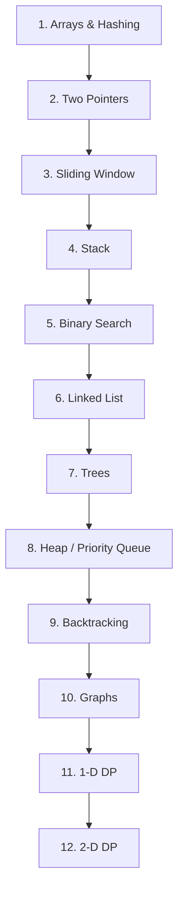
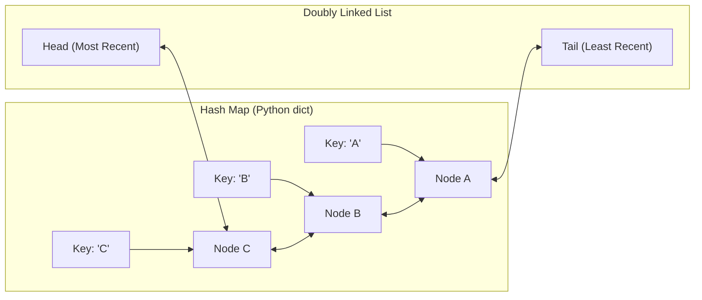

# Part 22: Data Structures, Algorithms & Coding Interviews

*[← Back to Master Index](/blog/it-career-guide)*

---

## 1. Deep-Dive Core Concepts: Big-O Complexity, Algorithmic Paradigms, and Python Internals

To secure an elite product engineering role (paying ₹18–50+ LPA or remote USD equivalents), backend and platform developers must pass coding interviews. These interviews evaluate your ability to analyze computational complexity, select optimal data structures, and implement efficient algorithms under time pressure. Mastering these patterns is essential to optimize software performance at scale.

---

### Big-O Notation and Complexity Analysis

**Big-O Notation** is a mathematical notation used to describe the limiting behavior of an algorithm's runtime or memory usage as the input size ($N$) grows to infinity. It provides an asymptotic upper bound on execution cost.

```
Big-O Complexity Scale:
O(1)        --> Constant time (Array index access, Hash map get)
O(log N)    --> Logarithmic time (Binary Search, Heap operations)
O(N)        --> Linear time (Single pass array loops)
O(N log N)  --> Linearithmic time (Merge Sort, Quick Sort average)
O(N^2)      --> Quadratic time (Nested loops, Bubble Sort)
O(2^N)      --> Exponential time (Recursive Fibonacci, subsets)
O(N!)       --> Factorial time (Traveling Salesperson permutations)
```

#### The Mathematical Definitions
*   **Big-O ($O$):** Asymptotic upper bound. $f(N) = O(g(N))$ if there exist positive constants $c$ and $N_0$ such that:
    
    $$0 \le f(N) \le c \cdot g(N) \quad \text{for all } N \ge N_0$$

*   **Big-Omega ($\Omega$):** Asymptotic lower bound. Represents the best-case behavior:
    
    $$f(N) = \Omega(g(N)) \quad \text{if } f(N) \ge c \cdot g(N) \quad \text{for all } N \ge N_0$$

*   **Big-Theta ($\Theta$):** Asymptotic tight bound. $f(N) = \Theta(g(N))$ if:
    
    $$f(N) = O(g(N)) \quad \text{and} \quad f(N) = \Omega(g(N))$$

---

### The NeetCode 150 Roadmap Patterns

To prepare for coding interviews efficiently, developers focus on the **NeetCode 150**—a curated subset of LeetCode problems organized into 18 logical categories:



#### Core Interview Patterns
1.  **Arrays & Hashing:** Identifying duplicates, calculating anagrams, or running two-sum checks. Focuses on using HashMaps to reduce lookup times from $O(N^2)$ to $O(N)$ at the expense of $O(N)$ space.
2.  **Two Pointers:** Scanning sorted arrays from both ends (or distinct offsets) to find pairs, reverse arrays, or detect palindromes in $O(N)$ time with $O(1)$ space.
3.  **Sliding Window:** Maintaining a sub-array window over a sequence to find longest substrings or minimum sum subarrays, optimizing nested loops from $O(N^2)$ to $O(N)$.
4.  **Binary Search:** Searching sorted spaces by halving the search area at each step, achieving $O(\log N)$ latency. Used for arrays, peak detection, and search-in-rotated arrays.
5.  **Linked Lists:** Manipulating nodes (reversal, cycle detection using Floyd's Tortoise and Hare algorithm, merging sorted lists) to evaluate memory pointer manipulation.
6.  **Trees & Graphs:** Traversing nodes using Depth-First Search (DFS) or Breadth-First Search (BFS). Graph patterns include cycle detection, topological sorting, and Dijkstra's shortest path.
7.  **Dynamic Programming (DP):** Solving complex problems by breaking them into overlapping sub-problems:
    *   *Memoization (Top-Down):* Solving recursively and caching results.
    *   *Tabulation (Bottom-Up):* Solving iteratively, filling a table from base cases up.

---

### Python Data Structure Internals

Writing optimal algorithms in Python requires understanding how Python's built-in data structures are implemented under the hood in CPython.

#### 1. Python Lists: Dynamic Arrays
*   **The Structure:** Python lists are dynamic arrays of pointers referencing other Python objects.
*   **Allocation:** When a list is created, CPython over-allocates memory slots to prevent resizing on every `append` operation.
*   **Append Complexity:** Amortized $O(1)$. When the allocated space is full, CPython allocates a larger array (scaling by ~1.125x) and copies the pointers over, making that specific insert $O(N)$.
*   **Deletes/Inserts:** $O(N)$ at arbitrary indices, as elements must be shifted in memory.

#### 2. Python Dictionaries: Hash Tables
*   **The Structure:** Python dicts use an index array and a key-value entry array. Keys are hashed, and the hash modulo the size identifies the target slot.
*   **Collision Resolution:** Python uses **Open Addressing** with a pseudo-random probe sequence (quadratic probing) to find empty slots when hashes collide, avoiding the memory overhead of chaining.
*   **Operations:** Average-case $O(1)$ for get, set, and delete operations. If the table is 66% full, it is automatically resized, causing a temporary $O(N)$ performance hit.

---

## 2. Master Resource Directory: Data Structures & Algorithms

Mastering DSA requires structured practice on coding patterns, visual algorithm breakdowns, and analysis of data structures. Below are the 7 definitive learning resources.

---

### Resource 1: NeetCode 150 Roadmap (neetcode.io)
*   **Why It Was Selected:** NeetCode.io is the single most effective platform for coding interview preparation. Created by a former Google engineer, it organizes 150 high-frequency LeetCode questions into a progressive, dependency-based roadmap. For developers who struggle with unstructured LeetCode practice, this resource is selected because it provides structured video walk-throughs in Python and clean code solutions for every problem, making it the best starting point for interview prep.
*   **Target Syllabus Modules/Chapters:**
    *   *Core Roadmap:* Arrays, Two Pointers, Stack, Sliding Window, Binary Search, Trees, and Graphs.
    *   *Advanced Roadmap:* 1-D/2-D Dynamic Programming, Advanced Graphs, and Bit Manipulation.
*   **Time Investment Required:** 150 hours of active coding.
    *   *Month 1:* Linear structures (Arrays, Pointers, Windows, Stack, Lists) - 50 hours.
    *   *Month 2:* Non-linear structures (Trees, Heaps, Backtracking, Graphs) - 50 hours.
    *   *Month 3:* Dynamic Programming, Intervals, and Bit Manipulation - 50 hours.
*   **Value Assessment:** Exceptional, free tier covers the core 150 roadmap.
*   **Actionable Study Strategy:** Solve 2-3 problems daily. Attempt to write a solution for 25 minutes. If stuck, watch the NeetCode explanation video, close it, and write the solution in Python from memory, documenting the space and time complexities.

---

### Resource 2: LeetCode Practice Platform (leetcode.com)
*   **Why It Was Selected:** LeetCode is the industry-standard platform for coding practice. Its massive database of user-submitted solutions and execution test suites allows you to evaluate your code against memory limits, edge cases, and runtime distributions.
*   **Target Syllabus Modules/Chapters:**
    *   *Problem Sets:* Filter by Tag (e.g., Graphs, DP) and Difficulty (Easy/Medium).
    *   *Assessment Tools:* Mock interview templates and company-specific question sets.
*   **Time Investment Required:** Ongoing practice (1 hour/day).
*   **Value Assessment:** Essential. The premium tier is useful for accessing company-specific questions (e.g., Amazon, Google, Meta).
*   **Actionable Study Strategy:** Run your solutions and check the **Runtime Distribution** graph. Read the discussion forums to identify how other developers optimized their solutions (e.g., replacing recursive calls with iterative loops to save stack memory).

---

### Resource 3: *Grokking Algorithms* by Aditya Bhargava (Manning)
*   **Why It Was Selected:** For developers who find academic textbooks dry, Aditya Bhargava's visual guide is a highly accessible introduction. Using hand-drawn diagrams and step-by-step examples, it builds an intuitive understanding of basic search, sort, graph, and dynamic programming algorithms.
*   **Target Syllabus Modules/Chapters:**
    *   *Chapter 1:* Binary Search and Big-O Notation.
    *   *Chapter 4:* Quicksort and Divide & Conquer.
    *   *Chapter 6:* Breadth-First Search (BFS).
    *   *Chapter 7:* Dijkstra's Shortest Path Algorithm.
*   **Time Investment Required:** 10 hours of reading.
*   **Value Assessment:** Free via the O'Reilly library. Ideal for building a visual mental model of algorithms before writing code.
*   **Actionable Study Strategy:** Read the BFS and Dijkstra chapters. Draw the graph connections on paper, and manually trace the queue and distance dictionary updates as the algorithm runs.

---

### Resource 4: *Cracking the Coding Interview* by Gayle Laakmann McDowell
*   **Why It Was Selected:** The definitive manual on the tech interview process. Beyond coding problems, it covers behavioral questions, resume preparation, and system design frameworks.
*   **Target Syllabus Modules/Chapters:**
    *   *Part II:* Big-O Complexity.
    *   *Part III:* Data Structures (Linked Lists, Stacks, Trees).
    *   *Part V:* Technical Questions and Interview Algorithms.
*   **Time Investment Required:** 20 hours.
*   **Value Assessment:** High. Provides an inside look at how tech companies evaluate technical candidates.
*   **Actionable Study Strategy:** Read the **Big-O** chapter twice. Complete the 20 practice complexity problems, verifying your answers against the provided explanations.

---

### Resource 5: Master the Coding Interview (Udemy Course by Andrei Neagoie)
*   **Why It Was Selected:** A comprehensive video course covering computer science fundamentals, data structures, search/sort algorithms, and behavioral interview strategies.
*   **Target Syllabus Modules/Chapters:**
    *   *Section 5:* Big-O Notation.
    *   *Sections 6-11:* Data Structures from scratch (Arrays, Hash Tables, Trees).
    *   *Sections 12-15:* Algorithms (Recursion, Sorting, Searching, DP).
*   **Time Investment Required:** 22 hours.
*   **Value Assessment:** Included with TCS-provided Udemy access. Good for reviewing fundamental computer science concepts.
*   **Actionable Study Strategy:** Watch the videos at 1.25x speed. Complete the coding exercises, writing custom implementations of LinkedLists and HashTables in Python.

---

### Resource 6: Data Structures & Algorithms Mega Course (freeCodeCamp YouTube)
*   **Why It Was Selected:** A comprehensive, single-video lecture series covering sorting, searching, tree traversals, and dynamic programming patterns.
*   **Target Syllabus Modules/Chapters:**
    *   *Foundations:* Arrays, Lists, and Stacks.
    *   *Search/Sort:* Bubble, Insertion, Quick, and Merge Sort.
    *   *Complex Structures:* BST, AVL Trees, and Graph traversals.
*   **Time Investment Required:** 15 hours.
*   **Value Assessment:** Free. Excellent resource for reviewing core computer science concepts.
*   **Actionable Study Strategy:** Follow the lecture sections, pausing the video to implement the algorithms locally before the instructor presents their solution.

---

### Resource 7: Algorithms, Part I & II (Coursera by Princeton University)
*   **Why It Was Selected:** A rigorous academic introduction to algorithms, focusing on Union-Find structures, sorting bounds, red-black BSTs, MSTs, and network flow algorithms.
*   **Target Syllabus Modules/Chapters:**
    *   *Part I:* Union-Find, Sorting, Stacks/Queues, and Elementary Search Trees.
    *   *Part II:* Graph Algorithms (MST, Shortest Paths), and String Compression.
*   **Time Investment Required:** 40 hours of study.
*   **Value Assessment:** Free (audited tier). Excellent for developers who want a deep, mathematically rigorous understanding of algorithms.
*   **Actionable Study Strategy:** Watch the Union-Find lectures. Implement the Quick-Union algorithm, noting how path compression optimizes parent pointer traversals to amortized $O(\alpha(N))$ time.

---

## 3. Hands-On Portfolio Lab Project: Least Recently Used (LRU) Cache

To demonstrate your DSA engineering credentials, you will build a **Least Recently Used (LRU) Cache** from scratch in Python. An LRU Cache is a key-value store with a fixed capacity. When the cache is full and a new item is inserted, the cache must evict the least recently accessed item. Both `get` and `put` operations must run in **$O(1)$ time**.

```
~/lru_cache/
├── app/
│   ├── __init__.py
│   ├── cache.py            # Double-Linked List & LRU Cache implementation
│   └── main.py             # FastAPI wrapper for cache monitoring
├── tests/
│   ├── __init__.py
│   └── test_cache.py       # Pytest unit tests
├── requirements.txt        # Package dependencies
└── run.sh                  # Validation and run execution script
```

### LRU Cache Architecture

An optimal LRU Cache combines a **Doubly Linked List** (to track usage order) with a **HashMap** (for $O(1)$ lookups):



*   **`get(key)`:** Lookup the node in the HashMap ($O(1)$). Move the node to the Head of the list to mark it as recently accessed ($O(1)$).
*   **`put(key, value)`:** If the key exists, update its value and move the node to the Head. If it's a new key, insert a new node at the Head. If the cache exceeds capacity, delete the node at the Tail from both the list and the HashMap ($O(1)$).

---

### Step 1: Initialize Project Directory and Dependencies

Create the project directory and file structures:
```bash
mkdir -p ~/lru_cache/app ~/lru_cache/tests
cd ~/lru_cache
```

#### File: `~/lru_cache/requirements.txt`
Declares the required libraries for our cache pipeline.
```
fastapi>=0.110.0
uvicorn[standard]>=0.28.0
pytest>=8.0.0
```

---

### Step 2: Implement Cache and Doubly Linked List

#### File: `~/lru_cache/app/cache.py`
Defines LinkedList Node and the LRU Cache logic.
```python
from typing import Dict, Optional

class Node:
    def __init__(self, key: str, val: int) -> None:
        self.key: str = key
        self.val: int = val
        self.prev: Optional[Node] = None
        self.next: Optional[Node] = None

class LRUCache:
    def __init__(self, capacity: int) -> None:
        self.capacity: int = capacity
        # HashMap for O(1) node lookups
        self.cache: Dict[str, Node] = {}
        
        # Initialize sentinel Head and Tail nodes to simplify boundary operations
        self.head: Node = Node("head_sentinel", 0)
        self.tail: Node = Node("tail_sentinel", 0)
        self.head.next = self.tail
        self.tail.prev = self.head

    def _remove(self, node: Node) -> None:
        """Removes an existing node from the linked list."""
        prev_node = node.prev
        next_node = node.next
        if prev_node and next_node:
            prev_node.next = next_node
            next_node.prev = prev_node

    def _insert_at_head(self, node: Node) -> None:
        """Inserts a node immediately after the sentinel head (Most Recently Used)."""
        first_node = self.head.next
        self.head.next = node
        node.prev = self.head
        node.next = first_node
        if first_node:
            first_node.prev = node

    def get(self, key: str) -> int:
        """Retrieves value from cache, updating its usage priority to Head."""
        if key in self.cache:
            node = self.cache[key]
            self._remove(node)
            self._insert_at_head(node)
            return node.val
        return -1

    def put(self, key: str, value: int) -> None:
        """Saves a key-value pair, evicting the Tail node if capacity is exceeded."""
        if key in self.cache:
            # Update existing node
            node = self.cache[key]
            node.val = value
            self._remove(node)
            self._insert_at_head(node)
        else:
            # Create new node
            new_node = Node(key, value)
            self.cache[key] = new_node
            self._insert_at_head(new_node)
            
            # Check capacity limits
            if len(self.cache) > self.capacity:
                # Evict least recently used (node immediately before sentinel tail)
                lru_node = self.tail.prev
                if lru_node and lru_node != self.head:
                    self._remove(lru_node)
                    del self.cache[lru_node.key]
```

---

### Step 3: Implement Web Wrapper Interface

#### File: `~/lru_cache/app/main.py`
Exposes the LRU Cache via HTTP endpoints.
```python
from fastapi import FastAPI, HTTPException, status
from pydantic import BaseModel
from app.cache import LRUCache

app = FastAPI(title="LRU Cache Monitoring Service")
# Initialize cache with capacity of 3 items for demonstration
lru = LRUCache(capacity=3)

class CacheEntry(BaseModel):
    key: str
    value: int

@app.post("/cache", status_code=status.HTTP_201_CREATED)
async def put_cache_entry(entry: CacheEntry) -> dict:
    lru.put(entry.key, entry.value)
    return {"status": "success", "message": f"Saved key: {entry.key}"}

@app.get("/cache/{key}", status_code=status.HTTP_200_OK)
async def get_cache_entry(key: str) -> dict:
    val = lru.get(key)
    if val == -1:
        raise HTTPException(
            status_code=status.HTTP_404_NOT_FOUND,
            detail="Key not found in cache or already evicted."
        )
    return {"key": key, "value": val}

@app.get("/health", status_code=200)
async def check_health() -> dict[str, str]:
    return {"status": "healthy"}
```

---

### Step 4: Write Unit Tests

#### File: `~/lru_cache/tests/test_cache.py`
Validates LRU operations, capacity limits, and eviction logic.
```python
import pytest
from app.cache import LRUCache

def test_cache_initialization():
    lru = LRUCache(2)
    assert lru.capacity == 2
    assert len(lru.cache) == 0

def test_cache_get_and_put():
    lru = LRUCache(2)
    lru.put("A", 1)
    lru.put("B", 2)
    
    assert lru.get("A") == 1
    assert lru.get("B") == 2
    assert lru.get("C") == -1

def test_cache_eviction_logic():
    lru = LRUCache(2)
    lru.put("A", 1)
    lru.put("B", 2)
    # Cache is at capacity: ["B", "A"]
    
    lru.put("C", 3)
    # "A" should be evicted: ["C", "B"]
    assert lru.get("A") == -1
    assert lru.get("B") == 2
    assert lru.get("C") == 3

def test_cache_update_priority():
    lru = LRUCache(2)
    lru.put("A", 1)
    lru.put("B", 2)
    
    # Accessing "A" makes it recently accessed: ["A", "B"]
    lru.get("A")
    
    lru.put("C", 3)
    # "B" should be evicted: ["C", "A"]
    assert lru.get("B") == -1
    assert lru.get("A") == 1
    assert lru.get("C") == 3
```

---

### Step 5: Build and Run Setup Automation

#### File: `~/lru_cache/run.sh`
Configures environment and runs the test suite.
```bash
#!/usr/bin/env bash

# Exit script on any execution error
set -euo pipefail

echo "=== Stage 1: Creating Virtual Environment ==="
python3 -m venv .venv
source .venv/bin/activate

echo "=== Stage 2: Installing Dependencies ==="
pip install --upgrade pip
pip install -r requirements.txt

echo "=== Stage 3: Running Cache Unit Tests ==="
pytest tests/

echo "=== Stage 4: Starting API Cache Server ==="
echo "Starting Uvicorn API server locally..."
uvicorn app.main:app --reload --port 8000
```

Make the script executable:
```bash
chmod +x ~/lru_cache/run.sh
```

To run and start the service:
```bash
./run.sh
```

---

## 4. Technical Interview Self-Assessment

Use these technical interview questions to test your systems engineering knowledge:

| Category | High-Frequency Interview Question | Expected Technical Answer Framework |
| :--- | :--- | :--- |
| **Complexity Analysis** | What is the difference between average-case and worst-case time complexity for Hash Map inserts? | In a **Hash Map**, inserts are average-case $O(1)$ because keys are hashed and mapped directly to array slots. The worst-case is $O(N)$ when keys hash to the same slot (causing collisions) and requires traversing all entries in that slot, or when the table exceeds its load factor (e.g., 66% full) and requires resizing, which copies all entries to a new array. |
| **Graph Traversals** | When should you use Breadth-First Search (BFS) over Depth-First Search (DFS) for graph traversal? | Use **BFS** when searching for the shortest path in unweighted graphs, as it explores nodes level-by-level, ensuring the first match found is the closest. Use **DFS** when checking for connectivity, topological sorting, or exploring all permutations (like backtracking), as it traverses deep down paths and consumes less memory than BFS on wide trees. |
| **Dynamic Programming** | What is the difference between Memoization and Tabulation in Dynamic Programming? | **Memoization** is a top-down approach that solves the problem recursively, caching intermediate results in a dictionary to prevent redundant calculations. **Tabulation** is a bottom-up approach that solves iteratively, filling a table from base cases up, which avoids recursive call stack overhead. |
| **Memory Allocation** | Explain how CPython's list scaling behaves during append operations. | CPython lists are dynamic arrays. To avoid resizing on every `append` operation, CPython over-allocates memory slots. When the capacity is full, CPython allocates a larger array (scaling by ~1.125x + 6 elements) and copies the elements over, making that specific append $O(N)$ while maintaining an amortized $O(1)$ complexity. |
| **Cache Design** | Why is a Doubly Linked List preferred over a Single Linked List in an LRU Cache design? | An LRU Cache requires $O(1)$ node deletions. In a **Single Linked List**, deleting a node requires finding its predecessor, which is $O(N)$. A **Doubly Linked List** stores pointers to both `prev` and `next` nodes, allowing you to bypass and remove any node in $O(1)$ time once you have its reference from the HashMap. |
| **Recursion Limits** | What causes a RecursionError in Python, and how do you optimize recursive DFS? | A `RecursionError` occurs when the recursive call stack exceeds Python's limits (default 1000 frames) to prevent stack overflows. Optimize this by increasing the recursion limit using `sys.setrecursionlimit()`, refactoring the recursion into an iterative loop using an explicit stack array, or using memoization. |

---

## 5. Exit Tasks for this Phase

Complete these verification steps before moving to the next batch:
- [ ] Run the `run.sh` script to verify your virtual environment and run the test suite.
- [ ] Confirm that Pytest executes and passes all test cases successfully.
- [ ] Query the cache server using `curl -X POST -H "Content-Type: application/json" -d '{"key": "A", "value": 100}' http://localhost:8000/cache` to test insertions.
- [ ] Insert more than 3 entries to confirm the least recently accessed item is evicted.
- [ ] Commit your LRU cache codebase to GitHub to keep your progress backed up.

---

*[Proceed to Part 23: Tech Interview Success & Behavioral Interviewing →](/blog/it-career-guide/part-23-interviews)*
