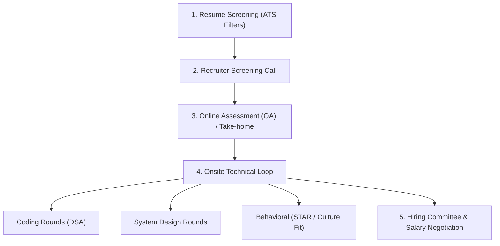
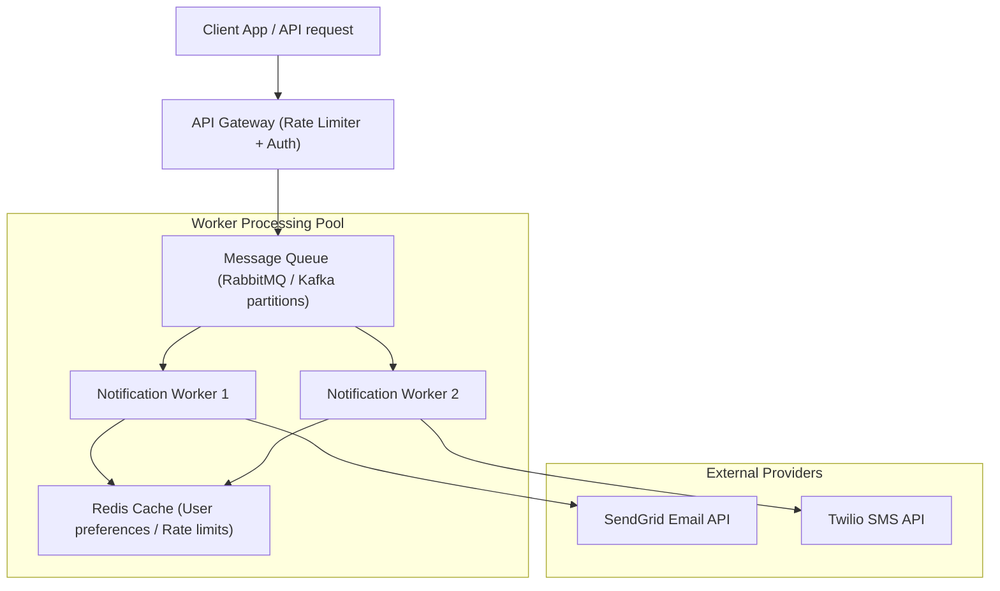

# Part 23: Tech Interview Success & Behavioral Interviewing

*[← Back to Master Index](/blog/it-career-guide)*

---

## 1. Deep-Dive Core Concepts: Interview Loops, System Design, Behavioral STAR, and Negotiation

Transitioning from a service-based IT support role (like Assistant Systems Engineer at TCS) to a high-paying product-focused Platform or GenAI Engineer role requires more than technical competency. You must navigate complex hiring loops, present system architecture decisions clearly, write behavioral stories, and negotiate salary packages. This phase covers the strategies needed to navigate the hiring loop.

---

### The Modern Tech Interview Cycle

Hiring loops at product companies follow a structured, multi-stage assessment process.



1.  **Resume Screening (ATS):** Automatic Applicant Tracking Systems (ATS) filter resumes based on keyword matching (e.g., searching for "FastAPI", "Kubernetes", "TypeScript"). Resumes must use clean, single-column markdown/PDF layouts without graphics or tables that disrupt parsing.
2.  **Recruiter Screening:** A 30-minute call to evaluate your career trajectory, communication skills, and salary expectations.
3.  **Technical Screening (OA / Coding Call):** A 45-to-60 minute live coding round focused on medium-difficulty data structures and algorithms, or a take-home coding project.
4.  **Onsite Technical Loop:**
    *   **Coding Rounds (1-2 sessions):** Focus on live coding, algorithmic problem solving, and complexity analysis.
    *   **System Design (1-2 sessions):** Evaluates your ability to design scalable, distributed software architectures (e.g., designing a URL shortener or a notification pipeline).
    *   **Behavioral Round (1 session):** Assesses team collaboration, conflict resolution, leadership, and alignment with company values.
5.  **Hiring Committee (HC) Review & Negotiation:** A panel reviews your interview scorecard to make a hiring decision, followed by compensation negotiations.

---

### The 4-Step System Design Interview Framework

System Design interviews evaluate how you navigate architectural ambiguity. Rather than jumping straight to drawing databases or boxes, you must follow a structured, collaborative engineering process.

```
Alex Xu's 4-Step System Design Framework:
Step 1: Understand the Problem and Scope (Ask clarifying questions, estimate scale).
Step 2: Propose High-Level Design (Draw API contracts, key components, data flow).
Step 3: Design Deep-Dive (Analyze bottlenecks, caching, database replication).
Step 4: Wrap Up (Summarize design, point out weaknesses, explain how to scale).
```

#### Step 1: Understand the Problem and Establish Design Scope (3-5 mins)
Do not make assumptions. Ask clarifying questions to narrow down requirements:
*   *Functional Requirements:* What are the core features? (e.g., "Do we need to support real-time notification delivery or only batch notifications?")
*   *Non-Functional Requirements:* What are the scaling targets? (e.g., High availability, low latency, durability, read-to-write ratios).
*   *Scale Estimation:* What is the expected Daily Active User (DAU) count? What is the data ingestion rate? (e.g., 10 million notifications/day $\approx$ 115 notifications/sec average, with 10x peak traffic of 1,150/sec).

#### Step 2: Propose High-Level Design and Get Agreement (10-15 mins)
Establish the system's skeleton:
*   **APIs:** Define the API endpoints (endpoints, request headers, payload schemas).
*   **Core Components:** Draw the primary components (API Gateway, message queues, databases, worker instances, cache layers).
*   **Data Flow:** Trace the path data takes from client requests to database storage. Get the interviewer's agreement before diving into details.

#### Step 3: Deep-Dive Design (15-20 mins)
Analyze specific bottlenecks and optimization strategies:
*   **Database Scaling:** SQL vs. NoSQL choice, sharding keys, replication.
*   **Caching Strategy:** Cache-aside vs. Write-through, eviction policies, handling cache stampedes.
*   **Resiliency:** Dead Letter Queues (DLQs), retry backoffs, circuit breakers, and rate limiters.

#### Step 4: Wrap Up (3-5 mins)
*   Summarize your design.
*   Acknowledge weaknesses and edge cases (e.g., "If our SMS provider fails, how do we failover?").
*   Discuss how you would monitor the system (metrics, logs, alerts).

---

### Behavioral Interviewing and the STAR Method

Behavioral questions evaluate how you handled situations in your past roles. Interrogators look for evidence of ownership, communication, and conflict resolution.

To answer these questions, structure your stories using the **STAR** method:

$$
\text{STAR} = \text{Situation} \to \text{Task} \to \text{Action} \to \text{Result}
$$

*   **Situation:** Describe the context of the project or problem (e.g., "Our production database suffered from connection starvation under high concurrent traffic, leading to 500 errors.").
*   **Task:** Explain the challenge you faced (e.g., "I was tasked with identifying the root cause and implementing a fix within 48 hours without causing downtime.").
*   **Action:** Detail the specific steps **you** took to address the problem. Use "I" rather than "we". Focus on your technical and coordination actions (e.g., "I ran database query analyzers, identified that slow queries were holding transaction locks, set up an asynchronous database connection pool using SQLAlchemy, and optimized database indexes.").
*   **Result:** Share the positive outcome, using measurable metrics (e.g., "This reduced database latency by 45%, eliminated connection starvation, and resolved the 500 errors. The system handled peak traffic of 5,000 concurrent requests without issues.").

---

### Salary Negotiation Loops: Resolving Information Asymmetry

Salary negotiations can feel intimidating. However, understanding the negotiation process helps you secure a fair offer.

#### Core Negotiation Strategies
1.  **Do Not Disclose Salary First:** Recruiters often ask for your current salary or expectations early to establish a baseline. Respond with: *"I am focused on finding the right role. I'd prefer to discuss compensation after we determine if I'm a good fit for the position."*
2.  **Evaluate Total Compensation (TC):** Do not focus only on base salary. Consider:
    
    $$\text{TC} = \text{Base Salary} + \text{Performance Bonus} + \text{Sign-on Bonus} + \text{Equity/RSUs}$$

3.  **Leverage Multiple Offers:** Having competing offers is the most effective way to negotiate. If you receive an offer from Company A, notify Company B: *"I have received an offer from Company A, but I prefer your team. If you can match their base salary, I am ready to sign today."*
4.  **Avoid Making Ultimatums:** Keep negotiations collaborative. Frame your requests around market rates and the value you bring to the team.

---

## 2. Master Resource Directory: Interview Prep

Mastering technical interviews requires studying system design architectures, mock interviews, and negotiation strategies. Below are the 6 definitive learning resources.

---

### Resource 1: Tech Interview Handbook (techinterviewhandbook.org)
*   **Why It Was Selected:** Created by Yangshun Tay (a former Meta engineer), this handbook is a comprehensive resource for tech interviews. It is selected because it provides structured guides on resume optimization, behavioral question rubrics, and coding round checklists, making it the best starting point for planning your interview prep.
*   **Target Syllabus Modules/Chapters:**
    *   *Resume:* ATS-friendly resume formatting and parsing guides.
    *   *Behavioral:* Standard behavioral questions, story preparation templates, and performance rubrics.
    *   *Coding:* Best practices for coding rounds (clarifying requirements, walking through examples).
*   **Time Investment Required:** 15 hours of self-directed study.
    *   *Week 1:* Resume writing and behavioral preparation (8 hours)
    *   *Week 2:* Coding round strategies and practice (7 hours)
*   **Value Assessment:** Free, open-source. Essential for structuring your application and interview process.
*   **Actionable Study Strategy:** Read the **Resume Guide**. Rewrite your resume using their single-column markdown layout, focusing on action verbs and metric-driven results.

---

### Resource 2: System Design Interview Vol 1 & 2 by Alex Xu (ByteByteGo)
*   **Why It Was Selected:** Alex Xu's books are highly regarded resources for system design interviews. They explain complex distributed systems (rate limiters, message queues, chat systems) using clean diagrams, step-by-step design processes, and scaling calculations.
*   **Target Syllabus Modules/Chapters:**
    *   *Vol 1, Chapter 4:* Design a Rate Limiter.
    *   *Vol 1, Chapter 12:* Design a Chat System.
    *   *Vol 2, Chapter 1:* Design a Notification System.
*   **Time Investment Required:** 25 hours.
*   **Value Assessment:** Critical. The 4-step framework defined in these books is the standard structure expected during system design interviews.
*   **Actionable Study Strategy:** Read the **Notification System** chapter. Draw the architecture diagram from memory, and calculate the queue sizing and worker capacity requirements for a system processing 10 million notifications/day.

---

### Resource 3: Interview Prep Frameworks (tryexponent.com)
*   **Why It Was Selected:** Exponent provides mock interviews and interview preparation courses. Their guides are selected because they explain the design and behavioral interview processes through video recordings of real mock interviews, showing how candidates navigate technical assessments.
*   **Target Syllabus Modules/Chapters:**
    *   *System Design:* Designing YouTube, Uber, and Instagram.
    *   *Behavioral:* Explaining project setbacks and handling team conflicts.
*   **Time Investment Required:** 15 hours.
*   **Value Assessment:** Free tier covers core guides; premium provides access to mock interviews.
*   **Actionable Study Strategy:** Watch 3 system design mock videos. Note how the candidate clarifies requirements, manages their time, and addresses scaling challenges.

---

### Resource 4: Pramp Mock Interviews (pramp.com)
*   **Why It Was Selected:** Peer-to-peer mock interviews are a highly effective way to practice under pressure. Pramp pairs you with other candidates to conduct mutual mock interviews, providing realistic practice for coding and design rounds.
*   **Target Syllabus Modules/Chapters:**
    *   *Mock Sessions:* Algorithmic Coding and System Design rounds.
*   **Time Investment Required:** 10 hours (5 mock sessions).
*   **Value Assessment:** Free. Essential for practicing your delivery and communication.
*   **Actionable Study Strategy:** Schedule a coding mock session. Focus on explaining your thought process out loud, writing the complexity analysis on the whiteboard before writing code.

---

### Resource 5: Never Split the Difference by Chris Voss (HarperCollins)
*   **Why It Was Selected:** Written by a former FBI hostage negotiator, this book explains negotiation techniques (mirroring, labeling, anchoring, calibrated questions) that can be applied to salary negotiations.
*   **Target Syllabus Modules/Chapters:**
    *   *Chapter 3:* Labeling and Mirroring.
    *   *Chapter 6:* Bending Reality (Negotiating salary and terms).
*   **Time Investment Required:** 12 hours.
*   **Value Assessment:** Free via O'Reilly. Useful for building negotiation habits.
*   **Actionable Study Strategy:** Read Chapter 6. Practice writing calibrated questions (e.g., *"How can I accept this offer when the base salary is below market rate?"*) to use during your negotiation calls.

---

### Resource 6: Fearless Salary Negotiation by Josh Doody
*   **Why It Was Selected:** A practical guide to salary negotiation written specifically for software engineers. It covers how to handle negotiation calls, evaluate counteroffers, and navigate compensation packages.
*   **Target Syllabus Modules/Chapters:**
    *   *The Negotiation Process:* Handling the initial offer and counteroffers.
    *   *Email Templates:* Templates for requesting salary increases and matching offers.
*   **Time Investment Required:** 8 hours.
*   **Value Assessment:** Free online guides. Essential for structuring your negotiation calls and emails.
*   **Actionable Study Strategy:** Read the **Counteroffer Guide**. Draft a template email requesting a base salary match based on a competing offer.

---

## 3. Hands-On Portfolio Lab Project: ATS Resume & System Design Portfolio

To showcase your preparation, you will write your professional **ATS-friendly markdown resume** (focusing on your actual upskilling projects: FastAPI, pgvector, LangGraph) and build the **System Architecture Map** for a Scalable Notification Service.

```
~/interview_portfolio/
├── resume.md               # ATS-Optimized Markdown Resume
├── system_designs/
│   ├── notification_service.md  # Scalable Notification Design
│   └── rate_limiter.md          # Distributed Rate Limiter Design
├── requirements.txt        # Documentation dependencies (grip for preview)
└── run.sh                  # Preview generator script
```

### Notification Service Architecture

The diagram below details the architecture of a Scalable Notification Service:



*   **API Gateway:** Authenticates requests and applies rate limiting to prevent spam.
*   **Message Queue:** Buffers incoming notification requests to handle traffic spikes.
*   **Worker Pool:** Processes requests asynchronously, checks user preferences in Redis, and routes notifications to the appropriate provider (e.g., SendGrid, Twilio).
*   **Redis Cache:** Stores user settings (e.g., opt-out preferences) and rate limits to minimize database queries.

---

### Step 1: Initialize Project Directory and Dependencies

Create the project directory and file structures:
```bash
mkdir -p ~/interview_portfolio/system_designs
cd ~/interview_portfolio
```

#### File: `~/interview_portfolio/requirements.txt`
Declares the required libraries for our portfolio preview setup.
```
grip>=4.6.1
```

---

### Step 2: Write the ATS-Optimized Markdown Resume

#### File: `~/interview_portfolio/resume.md`
ATS-friendly markdown resume for Chirag Singhal.
```markdown
# Chirag Singhal
**Location:** India | **Email:** whyiswhen@gmail.com | **GitHub:** github.com/chirag127 | **Website:** chirag127.in

---

## Professional Summary
Performance-focused Software Engineer specializing in backend systems, distributed architectures, and Generative AI integrations. Experienced in building scalable web APIs with FastAPI, optimizing relational databases with PostgreSQL/pgvector, and orchestrating autonomous agent workflows using LangGraph. Passionate about TDD, clean code, and deploying resilient systems.

---

## Technical Skills
*   **Languages:** Python, TypeScript, SQL (PostgreSQL, SQLite), HTML/CSS
*   **Backend & Frameworks:** FastAPI, Node.js, Express, Starlette, Pydantic v2
*   **Data & Databases:** PostgreSQL (pgvector, HNSW, IVFFlat), MongoDB, Redis Caching, Apache Kafka
*   **AI & GenAI:** LangGraph, LangChain, Model Context Protocol (MCP), Vector Similarity Search, Structured JSON Outputs
*   **DevOps & Cloud:** Docker, Kubernetes, GitHub Actions CI/CD, AWS Cloud, Cloudflare Pages/Workers
*   **Quality Assurance:** Test-Driven Development (TDD), Pytest, Playwright E2E Testing, Mocking / Patching

---

## Technical Upskilling Projects
### Autonomous Data Cleaning Agent | *Python, LangGraph, SQLite, Pytest*
*   Designed a stateful, cyclic agent workflow in LangGraph to clean database tables.
*   Implemented a custom message reducer function to maintain execution logs across runs.
*   Wrote integration tests using Pytest to verify SQLite table updates and state transitions.

### Semantic Document Search Engine | *FastAPI, pgvector, HNSW, Docker*
*   Built an asynchronous vector ingestion and search service using FastAPI.
*   Configured an HNSW index on a PostgreSQL table for fast cosine similarity calculations.
*   Wrote integration tests in Pytest using database mocks to verify search queries.

### E-Commerce Checkout Calculation Engine | *TDD, Pytest, Playwright, FastAPI*
*   Developed a cart calculation engine using Test-Driven Development (TDD) principles.
*   Wrote unit tests in Pytest using dependency mocking to isolate calculation logic.
*   Implemented E2E tests in Playwright using network routing mocks to test browser interactions.

---

## Experience
### Assistant Systems Engineer
**Tata Consultancy Services (TCS)** | *May 2026 – Present*
*   Collaborated on SAP CPQ development tasks, gaining familiarity with enterprise systems and backend configurations.
*   Engaged in continuous self-directed learning to master FastAPI, pgvector, LangGraph, and automated testing frameworks.
```

---

### Step 3: Implement System Design Specifications

#### File: `~/interview_portfolio/system_designs/notification_service.md`
System design specifications for the notification pipeline.
```markdown
# System Design: Scalable Notification Service

## 1. Requirements & Scope
*   **Functional:**
    *   Send notifications via Email, SMS, and Mobile Push.
    *   Support real-time delivery and batching.
    *   Query user contact details and notification preferences.
*   **Non-Functional:**
    *   **Scale:** 10 million notifications/day (~115 notifications/sec average, 1,150/sec peak).
    *   **Availability:** High availability (99.9% uptime).
    *   **Durability:** No lost notifications. Failures must be logged and retried.
    *   **Latency:** Delivery within 5 seconds for critical messages.

## 2. API Design
*   `POST /v1/notifications`
    *   *Headers:* `Authorization: Bearer <token>`, `X-Correlation-ID: <uuid>`
    *   *Payload:*
        ```json
        {
          "recipient_id": "user_10291",
          "priority": "high",
          "channels": ["email", "sms"],
          "content": {
            "title": "Account Security Alert",
            "body": "A new login was detected from your account."
          }
        }
        ```
    *   *Response:* `202 Accepted` with `notification_id`.

## 3. High-Level Architecture
*   **API Gateway:** Handles authentication, rate limiting, and request routing.
*   **User Preference Cache (Redis):** Caches user contact info and channels.
*   **Message Broker (Kafka):** Buffers incoming requests across partitioned topics (e.g., `high-priority`, `low-priority`) to manage traffic spikes.
*   **Notification Workers:** Read from Kafka, check user preferences, format payloads, and call provider APIs.
*   **Dead Letter Queue (DLQ):** Stores failed notification requests for manual inspection and retries.
```

---

### Step 4: Build and Run Setup Automation

#### File: `~/interview_portfolio/run.sh`
Configures environment and launches markdown preview tool.
```bash
#!/usr/bin/env bash

# Exit script on any execution error
set -euo pipefail

echo "=== Stage 1: Creating Virtual Environment ==="
python3 -m venv .venv
source .venv/bin/activate

echo "=== Stage 2: Installing Markdown Preview Tool (Grip) ==="
pip install --upgrade pip
pip install -r requirements.txt

echo "=== Stage 3: Project Setup Complete ==="
echo "To preview your resume in your browser, run:"
echo "grip resume.md"
echo ""
echo "To preview the System Design document, run:"
echo "grip system_designs/notification_service.md"
```

Make the script executable:
```bash
chmod +x ~/interview_portfolio/run.sh
```

To run the local setup:
```bash
./run.sh
```

---

## 4. Technical Interview Self-Assessment

Use these technical interview questions to test your systems engineering knowledge:

| Category | High-Frequency Interview Question | Expected Technical Answer Framework |
| :--- | :--- | :--- |
| **System Scalability** | How do you handle spikes in traffic in a notification pipeline? | Use a **Message Broker** (e.g., Kafka or RabbitMQ) between the API gateway and workers. The gateway accepts requests quickly, appends them to the queue, and returns a `202 Accepted` status. Worker pools then consume and process messages from the queue at a sustainable rate, protecting downstream services from being overwhelmed. |
| **API Resiliency** | How do you prevent duplicate notifications when provider calls timeout? | Implement **Idempotency Keys** (e.g., passing a unique UUID in the header). When a worker makes a request, it checks Redis to see if the key exists. If it does, the worker returns the cached status, preventing duplicate delivery. If the key is new, the worker processes the request and caches the result. |
| **Distributed Cache** | How do you handle cache stampedes in a high-traffic system design? | A **cache stampede** occurs when a popular cache key expires and multiple concurrent requests miss the cache and query the database at the same time, overloading the database. Prevent this by using mutual exclusion locks (Mutexes) so only one request updates the cache, pre-calculating cache values before they expire, or using background refresh runs. |
| **Behavioral Strategy** | What makes the 'Action' section the most critical part of a STAR answer? | The **Action** section is critical because it demonstrates your specific contribution, technical decisions, and execution capabilities. Interviewers evaluate how you analyze problems, coordinate resources, and resolve issues. Focus on the steps **you** took, using 'I' rather than 'we' to clarify your ownership. |
| **Salary Negotiation** | Why should you avoid disclosing your current salary or target compensation early? | Disclosing compensation early establishes a baseline that limits your negotiation room. If your expectations are below market rate, the company may anchor their offer to that lower figure. If they are too high, you may be filtered out. Frame negotiations around market rates and your skills after determining mutual fit. |
| **ATS Optimization** | Why are tables and graphics problematic in ATS resume parsers? | ATS parsers convert PDF/Word files into plain text to scan for keywords. Grid lines, tables, and sidebars disrupt the text layout, causing the parser to merge unrelated columns or fail to parse sections entirely, which can lead to your resume being filtered out. Use single-column layouts with clear text hierarchies. |

---

## 5. Exit Tasks for this Phase

Complete these verification steps before moving to the next batch:
- [ ] Run the `run.sh` script to verify your virtual environment.
- [ ] Preview your `resume.md` using `grip` to verify the layout renders cleanly.
- [ ] Verify that all resume project entries match the portfolio systems built in this guide.
- [ ] Review the **Notification Service** design against the 4-step framework checklists.
- [ ] Commit your resume and system design portfolio files to GitHub.

---

*[Proceed to Part 24: Global Remote Jobs & Independent Consulting →](/blog/it-career-guide/part-24-remote-jobs)*
