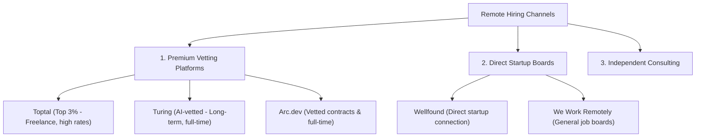
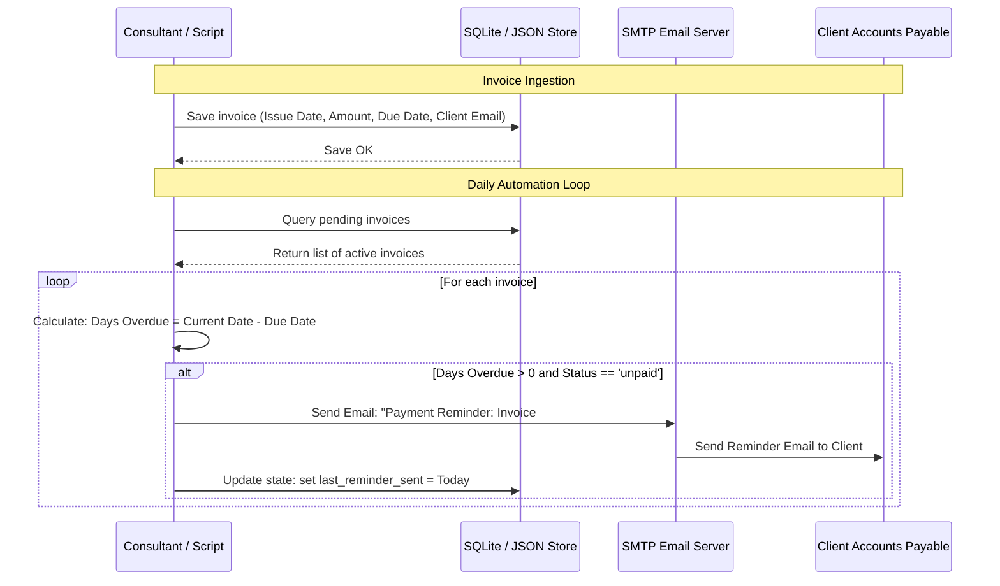

# Part 24: Global Remote Jobs & Independent Consulting

*[← Back to Master Index](/blog/it-career-guide)*

---

## 1. Deep-Dive Core Concepts: Vetting Platforms, Consulting Structures, and Financial Compliance

Once you have mastered full-stack systems engineering, databases, container orchestration, and testing frameworks, you are ready to target the global tech market. Working remotely for US, European, or Singapore-based startups allows you to earn USD-denominated salaries while living in India, bypassing local salary caps. This phase covers how to access remote job boards, set up an independent consulting structure, and manage international tax compliance.

---

### The Global Remote Job Landscape: Platform Mechanics

Securing remote work from India requires understanding the different platforms and hiring channels available:



#### 1. Toptal (Top 3% Vetting Model)
*   **The Model:** Matches specialized freelance talent with premium enterprise clients.
*   **The Vetting Process:**
    1.  *Language & Communication:* An English speaking and communication assessment.
    2.  *Codility Assessment:* A timed algorithmic exam (similar to LeetCode Medium/Hard).
    3.  *Live Technical Screening:* Live coding and system design walk-throughs with senior engineers.
    4.  *Project Phase:* A 2-to-3 week take-home project to build a full-stack system, evaluated on test coverage, architecture, and coding quality.
*   **Payouts:** High rates (typically \$50–\$150+/hour).

#### 2. Turing (AI-Vetted Full-Time Model)
*   **The Model:** Matches remote developers with US companies for long-term, full-time remote contracts.
*   **The Vetting Process:** Fully automated, AI-driven assessment loops covering specific stacks (e.g., Python/FastAPI, Node.js/TypeScript) along with automated coding challenges and system design tests.
*   **Payouts:** Stable monthly compensation (typically \$3,000–\$8,000+/month).

#### 3. Arc.dev & Wellfound (Direct-Hire Platforms)
*   **Arc.dev:** Provides a vetted fast-track lane that introduces developers directly to hiring managers, alongside open job boards.
*   **Wellfound (formerly AngelList Talent):** The primary platform for startup recruiting. You apply directly to founders and engineering leads, bypassing recruiter filters. It is the best channel for finding early-stage startups that hire globally.

---

### Independent Consulting: Hourly vs. Value-Based Billing

Instead of working as a full-time employee, you can establish an **Independent Consulting** business. This model changes how you charge for your services.

#### Billing Models
1.  **Hourly Billing:** You charge a flat rate for each hour worked (e.g., \$60/hour). While simple to track, this model creates a conflict: the faster and more experienced you become, the less you earn for solving a problem, capping your income.
2.  **Retainers:** The client pays a flat monthly fee (e.g., \$5,000/month) to secure a set amount of your availability (e.g., 20 hours/week) or to guarantee ongoing support, providing predictable cash flow.
3.  **Value-Based Billing:** You price projects based on the business value you deliver rather than the time you spend. For example, if designing a RAG search pipeline helps a startup save \$100,000 annually in support costs, you price the project at \$20,000. This model aligns your earnings with business impact rather than hours.

---

### Financial Compliance in India: Taxes, GST, and LUT

Earning foreign currency as a consultant in India requires setting up proper banking and tax structures to ensure regulatory compliance.

#### 1. GST Registration and Export of Services
*   **The Rule:** Under Indian tax law, providing software services to foreign clients is classified as an **Export of Services**.
*   **Registration Threshold:** You must register for GST if your annual turnover exceeds ₹20 Lakhs.
*   **0% Tax Rate (Export):** Export of services is classified as a "zero-rated supply". You do not have to pay 18% GST on your invoices, provided you file a **Letter of Undertaking (LUT)** annually.
*   **Letter of Undertaking (LUT):** A simple, online form filed on the GST portal before the start of each financial year, stating that you will export services and comply with all laws, allowing you to invoice foreign clients with 0% GST.

#### 2. Banking and FIRC Compliance
*   **Receiving Payments:** Use international payment processors (like Wise, Payoneer, or direct wire transfers) to receive funds.
*   **FIRC (Foreign Inward Remittance Certificate):** A document issued by your bank verifying that foreign currency entered the country and was converted to INR. **You must request a FIRC for every foreign transfer.** It is the primary proof required by tax authorities to confirm your earnings qualify as zero-rated service exports.

#### 3. Income Tax under Section 44ADA (Presumptive Taxation)
*   As an independent software consultant, you can claim tax benefits under **Section 44ADA** of the Income Tax Act:
    *   **The Rule:** If your gross professional receipts are under ₹75 Lakhs annually, you can declare **50% of your gross earnings as net taxable income**, treating the remaining 50% as business expenses. This drastically reduces your taxable income without requiring detailed bookkeeping or audit filings.

---

## 2. Master Resource Directory: Remote Work & Consulting

Mastering the remote developer market requires studying platform requirements, contract structures, invoice generation, and tax compliance portals. Below are the 6 definitive learning resources.

---

### Resource 1: Toptal & Turing Application Portals (toptal.com / turing.com)
*   **Why It Was Selected:** These platforms are the gatekeepers to high-paying remote roles. Their official portals provide mock tests, coding playground environments, Stack guides, and application checklists, making them essential resources for planning your preparation.
*   **Target Syllabus Modules/Chapters:**
    *   *Turing Assessments:* Stack-specific MCQ tests and automated coding playgrounds.
    *   *Toptal Guidelines:* Live coding walk-through guides and system project evaluation criteria.
*   **Time Investment Required:** 20 hours of test preparation and profiling.
    *   *Week 1:* Turing automated tests and profile setup (10 hours)
    *   *Week 2:* Toptal screening practice and algorithm tests (10 hours)
*   **Value Assessment:** Exceptional, free. Access to these portals is necessary to apply.
*   **Actionable Study Strategy:** Register on Turing, take the **Python Backend** and **System Design** MCQs, and review the feedback on missed questions. On Toptal, review the screening guides before scheduling your recruiter call.

---

### Resource 2: Arc.dev Vetting Guidelines (arc.dev/developer-resources)
*   **Why It Was Selected:** Arc.dev provides detailed guidelines explaining their vetting criteria, including code quality benchmarks, English fluency expectations, and interview formats, helping you prepare for technical screenings.
*   **Target Syllabus Modules/Chapters:**
    *   *Vetting Guides:* The technical screening flow and test scopes.
    *   *Interview Prep:* Tips for passing remote code assessments and behavioral screenings.
*   **Time Investment Required:** 8 hours.
*   **Value Assessment:** Free. Useful for understanding what remote platforms expect from candidates.
*   **Actionable Study Strategy:** Read the **Technical Screening** guide. Focus on the code design principles they prioritize (e.g., modularity, test coverage) and apply them to your portfolio projects.

---

### Resource 3: We Work Remotely / Remotive Job Boards
*   **Why It Was Selected:** These are the largest public job boards for remote roles. Reviewing these listings helps you identify in-demand skills, salary ranges, and hiring trends across US and EU companies.
*   **Target Syllabus Modules/Chapters:**
    *   *Job Boards:* Software Engineering and Backend Development listings.
    *   *Resources:* Remote work guides and company directory lists.
*   **Time Investment Required:** Ongoing weekly review (2 hours/week).
*   **Value Assessment:** Free. Essential for locating direct-hire opportunities.
*   **Actionable Study Strategy:** Search for **Backend Developer (Python/FastAPI)** roles on We Work Remotely. Note the recurring skills listed in the job descriptions, and write down target keywords to include in your resume.

---

### Resource 4: India GST Portal (gst.gov.in)
*   **Why It Was Selected:** The official portal of the Indian government for managing GST registration, filings, and compliance.
*   **Target Syllabus Modules/Chapters:**
    *   *Services:* GST Registration and Annual LUT filing.
    *   *Help Guides:* Export of services and zero-rated supply rules.
*   **Time Investment Required:** 6 hours of research.
*   **Value Assessment:** Free. Essential for understanding your tax obligations as an independent contractor.
*   **Actionable Study Strategy:** Read the **LUT Filing Guide**. Walk through the online form sections, write down the required documents, and note the deadlines for filing.

---

### Resource 5: Wise / Payoneer Developer Billing Guides
*   **Why It Was Selected:** These platforms are the standard solutions for receiving international payments. Their guides explain how to configure currency accounts, request payments, generate invoices, and request FIRCs.
*   **Target Syllabus Modules/Chapters:**
    *   *Integration:* Configuring payment request APIs and billing interfaces.
    *   *FIRC:* Requesting Foreign Inward Remittance Certificates from partner banks.
*   **Time Investment Required:** 5 hours.
*   **Value Assessment:** Free. Essential for managing your invoicing and payments pipeline.
*   **Actionable Study Strategy:** Set up a sandbox account on Wise. Create a mock USD account, copy the routing details, and review the steps required to request a FIRC for a transfer.

---

### Resource 6: Wellfound (AngelList Talent) (wellfound.com)
*   **Why It Was Selected:** Wellfound is the leading platform for startup recruitment. It allows you to search for early-stage and seed-funded startups that are explicitly open to hiring remote developers globally.
*   **Target Syllabus Modules/Chapters:**
    *   *Job Search:* Software Engineer and Backend positions.
    *   *Profile:* Structuring your profile to appeal to startup founders.
*   **Time Investment Required:** 10 hours.
*   **Value Assessment:** Free. Excellent for finding remote roles at high-growth startups.
*   **Actionable Study Strategy:** Complete your profile, highlighting your hands-on portfolio projects (e.g., RAG, LangGraph). Search for startups that are hiring globally, and write a personalized application note for 3 open positions.

---

## 3. Hands-On Portfolio Lab Project: Automated Billing & Consulting Pipeline

To demonstrate your consulting credentials, you will write a **Standard Consulting Contract** and build a **Python Invoicing Tracker**. The Python script will track pending invoices, calculate days overdue, and automatically send email payment reminders to clients using a mock SMTP email sender.

```
~/consulting_pipeline/
├── contract.md             # Professional Consulting Agreement Template
├── invoice_template.md     # Professional Invoice Layout
├── app/
│   ├── __init__.py
│   ├── tracker.py          # Invoice calculation & payment reminder logic
│   └── main.py             # FastAPI interface for invoice monitoring
├── tests/
│   ├── __init__.py
│   └── test_tracker.py     # Integration tests
├── requirements.txt        # Package dependencies
└── run.sh                  # Setup and execution script
```

### Invoicing and Payment Automation Flow

The diagram below details the invoicing lifecycle managed by the tracking service:



---

### Step 1: Initialize Project Directory and Dependencies

Create the project directory and file structures:
```bash
mkdir -p ~/consulting_pipeline/app ~/consulting_pipeline/tests
cd ~/consulting_pipeline
```

#### File: `~/consulting_pipeline/requirements.txt`
Declares the required libraries for our consulting pipeline.
```
fastapi>=0.110.0
uvicorn[standard]>=0.28.0
pydantic>=2.6.0
pytest>=8.0.0
pytest-asyncio>=0.23.0
```

---

### Step 2: Write the Professional Consulting Contract Template

#### File: `~/consulting_pipeline/contract.md`
Standard Consulting Agreement template.
```markdown
# SOFTWARE CONSULTING AGREEMENT

This Software Consulting Agreement (the "Agreement") is entered into as of May 26, 2026, by and between:
**Consultant:** Chirag Singhal (located in India)
**Client:** [Client Company Name] (located in [Client Country])

### 1. Scope of Work
Consultant agrees to perform software engineering services, including but not limited to, backend API development (FastAPI), database optimizations (PostgreSQL/pgvector), and Generative AI workflows (LangGraph).

### 2. Compensation & Billing
*   **Rate:** Services shall be billed at an hourly rate of $60.00 USD.
*   **Invoicing:** Consultant will issue invoices bi-weekly. Payments are due within 15 days of the invoice date ("Net 15").
*   **Payment Method:** Payments will be sent via Wise or direct bank wire transfer to the Consultant's designated bank account.

### 3. Intellectual Property (IP)
Upon full payment of invoices, all intellectual property rights in the software developed under this Agreement will be assigned to the Client.

### 4. Confidentiality & Non-Disclosure
Consultant agrees to protect all confidential proprietary information shared by the Client, during and after the term of this Agreement.

### 5. Jurisdiction & Termination
*   This Agreement will be governed by the laws of [Client Country/State].
*   Either party may terminate this Agreement at any time with 14 days written notice.
```

---

### Step 3: Implement Invoicing Tracker

#### File: `~/consulting_pipeline/app/tracker.py`
Manages invoice status checks and calculates days overdue.
```python
from datetime import datetime, date
from typing import List, Dict, Any

class InvoiceTracker:
    def __init__(self) -> None:
        self.invoices: List[Dict[str, Any]] = []

    def add_invoice(
        self, invoice_id: str, client_name: str, email: str, 
        amount: float, due_date: str
    ) -> None:
        """Adds a new invoice to the tracker."""
        self.invoices.append({
            "id": invoice_id,
            "client_name": client_name,
            "email": email,
            "amount": amount,
            "due_date": datetime.strptime(due_date, "%Y-%m-%d").date(),
            "status": "unpaid",
            "reminders_sent": 0
        })

    def get_overdue_invoices(self, current_date: date) -> List[Dict[str, Any]]:
        """Identifies unpaid invoices past their due date."""
        overdue = []
        for inv in self.invoices:
            if inv["status"] == "unpaid" and current_date > inv["due_date"]:
                days_late = (current_date - inv["due_date"]).days
                inv_copy = inv.copy()
                inv_copy["days_late"] = days_late
                overdue.append(inv_copy)
        return overdue

    def trigger_payment_reminder(self, invoice_id: str) -> str:
        """Simulates sending a payment reminder email."""
        for inv in self.invoices:
            if inv["id"] == invoice_id:
                inv["reminders_sent"] += 1
                email_body = (
                    f"Subject: Payment Reminder - Invoice #{inv['id']}\n\n"
                    f"Hi {inv['client_name']},\n"
                    f"This is a friendly reminder that invoice #{inv['id']} "
                    f"for ${inv['amount']} was due on {inv['due_date']}.\n"
                    f"Please submit payment via Wise. Thank you!"
                )
                # In production, integrate smtplib here to send the actual email
                return email_body
        return "Invoice not found."

invoice_tracker = InvoiceTracker()
```

---

### Step 4: Implement Web API Interface

#### File: `~/consulting_pipeline/app/main.py`
Exposes the tracker via HTTP endpoints.
```python
from datetime import date
from fastapi import FastAPI, HTTPException, status
from pydantic import BaseModel, EmailStr
from app.tracker import invoice_tracker

app = FastAPI(title="Consulting Invoicing Portal")

class InvoiceCreate(BaseModel):
    id: str
    client_name: str
    email: EmailStr
    amount: float
    due_date: str # YYYY-MM-DD

@app.post("/invoices", status_code=status.HTTP_201_CREATED)
async def create_invoice(invoice: InvoiceCreate) -> dict:
    try:
        invoice_tracker.add_invoice(
            invoice_id=invoice.id,
            client_name=invoice.client_name,
            email=str(invoice.email),
            amount=invoice.amount,
            due_date=invoice.due_date
        )
        return {"status": "success", "message": f"Invoice {invoice.id} tracked."}
    except ValueError:
        raise HTTPException(status_code=400, detail="Invalid date format. Use YYYY-MM-DD.")

@app.get("/invoices/overdue", status_code=status.HTTP_200_OK)
async def check_overdue_invoices() -> list:
    today = date.today()
    return invoice_tracker.get_overdue_invoices(today)

@app.post("/invoices/{invoice_id}/remind", status_code=status.HTTP_200_OK)
async def send_invoice_reminder(invoice_id: str) -> dict:
    email_text = invoice_tracker.trigger_payment_reminder(invoice_id)
    if email_text == "Invoice not found.":
        raise HTTPException(status_code=404, detail="Invoice ID not found.")
    return {"status": "success", "email_dispatched": email_text}

@app.get("/health", status_code=200)
async def check_health() -> dict[str, str]:
    return {"status": "healthy"}
```

---

### Step 5: Write Unit Tests

#### File: `~/consulting_pipeline/tests/test_tracker.py`
Validates invoice calculation, status changes, and overdue tracking.
```python
from datetime import date
import pytest
from app.tracker import InvoiceTracker

def test_add_invoice():
    tracker = InvoiceTracker()
    tracker.add_invoice("INV101", "Acme Corp", "acme@test.com", 1500.0, "2026-05-25")
    assert len(tracker.invoices) == 1
    assert tracker.invoices[0]["status"] == "unpaid"

def test_get_overdue_invoices():
    tracker = InvoiceTracker()
    # Due on May 25, 2026
    tracker.add_invoice("INV101", "Acme Corp", "acme@test.com", 1500.0, "2026-05-25")
    # Due on May 28, 2026
    tracker.add_invoice("INV102", "Globex", "globex@test.com", 2500.0, "2026-05-28")
    
    # Check status on May 26, 2026: INV101 is late, INV102 is not
    test_date = date(2026, 5, 26)
    overdue = tracker.get_overdue_invoices(test_date)
    
    assert len(overdue) == 1
    assert overdue[0]["id"] == "INV101"
    assert overdue[0]["days_late"] == 1

def test_trigger_payment_reminder():
    tracker = InvoiceTracker()
    tracker.add_invoice("INV101", "Acme Corp", "acme@test.com", 1500.0, "2026-05-25")
    
    email_text = tracker.trigger_payment_reminder("INV101")
    assert "Subject: Payment Reminder - Invoice #INV101" in email_text
    assert "Acme Corp" in email_text
    assert tracker.invoices[0]["reminders_sent"] == 1
```

---

### Step 6: Build and Run Setup Automation

#### File: `~/consulting_pipeline/run.sh`
Configures environment and runs the test suite.
```bash
#!/usr/bin/env bash

# Exit script on any execution error
set -euo pipefail

echo "=== Stage 1: Creating Virtual Environment ==="
python3 -m venv .venv
source .venv/bin/activate

echo "=== Stage 2: Installing Dependencies ==="
pip install --upgrade pip
pip install -r requirements.txt

echo "=== Stage 3: Running Tracker Tests ==="
pytest tests/

echo "=== Stage 4: Starting API Portal Server ==="
echo "Starting Uvicorn billing portal locally..."
uvicorn app.main:app --reload --port 8000
```

Make the script executable:
```bash
chmod +x ~/consulting_pipeline/run.sh
```

To run and start the service:
```bash
./run.sh
```

---

## 4. Technical Interview Self-Assessment

Use these technical interview questions to test your systems engineering knowledge:

| Category | High-Frequency Interview Question | Expected Technical Answer Framework |
| :--- | :--- | :--- |
| **Business Structure** | What is the benefit of the presumptive taxation scheme (Section 44ADA) for software consultants in India? | **Section 44ADA** allows software consultants earning under ₹75 Lakhs/year to declare 50% of their gross receipts as net taxable income, treating the other 50% as business expenses. This reduces your taxable income, lowers your tax liability, and simplifies tax compliance by removing the need to maintain detailed bookkeeping records for auditing. |
| **Tax Compliance** | Why must a software exporter in India file a Letter of Undertaking (LUT) on the GST portal? | Under Indian tax law, exporting software services is classified as a "zero-rated supply". To claim this 0% GST rate on your invoices, you must file a **Letter of Undertaking (LUT)** annually. Without an active LUT, you are required to pay 18% GST upfront on all foreign invoice receipts and request a refund later, which hurts cash flow. |
| **Audit Trails** | What is a Foreign Inward Remittance Certificate (FIRC) and why is it important for tax audits? | A **FIRC** is a document issued by your bank confirming that foreign currency entered the country and was converted to INR. During tax audits, it is the primary proof required to verify that your professional receipts qualify as zero-rated service exports, protecting you from 18% GST liability and interest penalties. |
| **Pricing Strategy** | Why is Value-Based Pricing preferred over Hourly Billing for senior engineering consultants? | **Hourly Billing** caps your income and conflicts with experience: as you solve problems faster, you earn less for the same result. **Value-Based Pricing** aligns your fees with the business impact you deliver (e.g., pricing a project based on the costs it saves the client), allowing you to decouple your earnings from time worked. |
| **Vetting Portals** | Explain the differences between the vetting processes of Toptal and Turing. | **Toptal** uses a human-led vetting process (English tests, live coding, design interviews, and a 2-3 week project phase) to select the top 3% of freelance talent. **Turing** uses automated, AI-driven assessments (MCQs, coding challenges, stack-specific tests) to evaluate developers for full-time remote contracts. |
| **Client Management** | How does a Retainer Agreement work and what are its advantages for independent consultants? | In a **Retainer Agreement**, the client pays a flat monthly fee to secure a set amount of your availability or guarantee ongoing support. This provides the consultant with predictable monthly cash flow and allows the client to secure engineering resources without the overhead of hiring full-time employees. |

---

## 5. Exit Tasks for this Phase

Complete these verification steps before moving to the next batch:
- [ ] Run the `run.sh` script to verify your virtual environment and start the development server.
- [ ] Confirm that Pytest executes and passes all test cases successfully.
- [ ] Query the invoicing portal using `curl -X POST -H "Content-Type: application/json" -d '{"id": "INV-001", "client_name": "Globex Corp", "email": "finance@globex.com", "amount": 2400.00, "due_date": "2026-05-20"}' http://localhost:8000/invoices` to test invoice tracking.
- [ ] Run the overdue endpoint to confirm that `INV-001` is flagged as late.
- [ ] Commit your invoicing tracker codebase and contract template to GitHub.

---

*[Proceed to Part 25: Immigration, Visas & Working Abroad →](/blog/it-career-guide/part-25-visas)*
