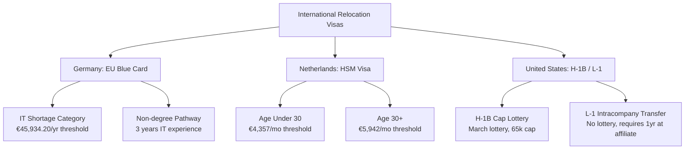
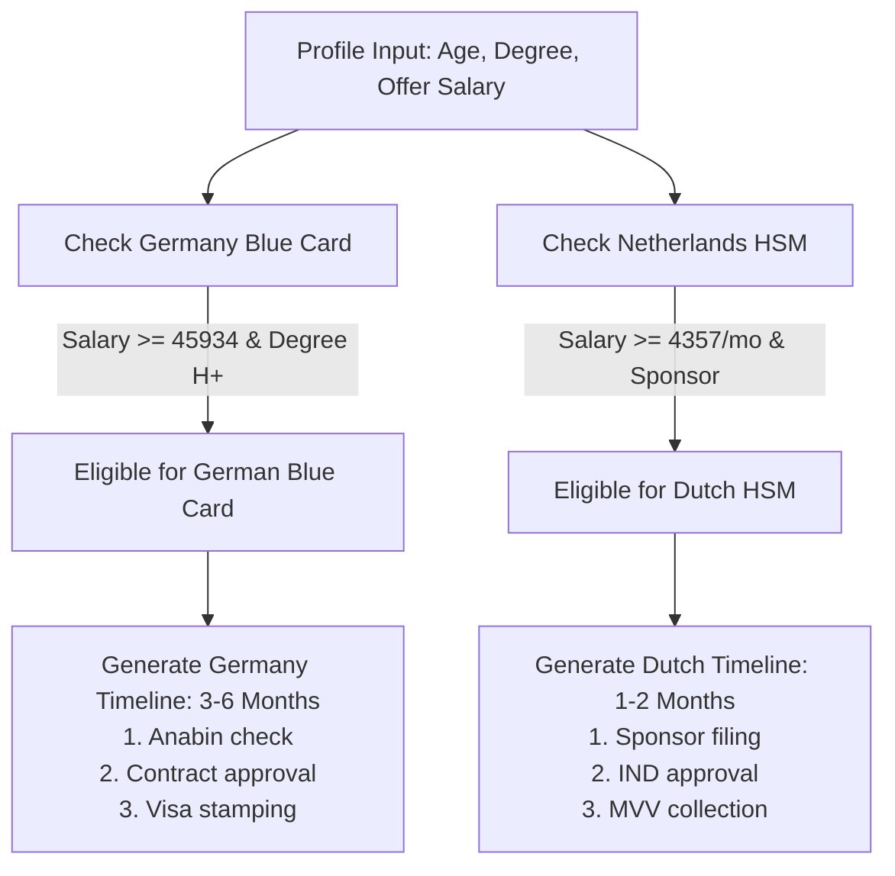

# Part 25: Immigration, Visas & Working Abroad

*[← Back to Master Index](/blog/it-career-guide)*

---

## 1. Deep-Dive Core Concepts: International Relocation Pipelines, Visa Classes, and Timelines

UPSKILLING is the engine that drives your career forward, but relocation is the multiplier that maximizes your lifetime earning potential and quality of life. For an engineer starting at ₹3.36 LPA at TCS in India, transitioning to a product-focused role locally can raise compensation to ₹18–30+ LPA. However, relocating to Europe, the United Kingdom, or the United States pushes compensation to €60,000–€100,000+ or \$120,000–\$250,000+ USD, respectively. This phase covers how to navigate immigration laws, select relocation routes, and manage visa pipelines.

---

### Key Relocation Visas: Europe and the United States

Immigration rules differ by region. Europe focuses on fast-track, salary-based pathways for skilled professionals, while the United States relies on employer-sponsored lotteries and corporate transfer routes.



---

### The German EU Blue Card Pipeline

Germany is one of the most accessible destinations in Europe for software developers due to its shortage of IT professionals.

#### 1. Salary Thresholds (2026)
*   **IT Shortage Occupations:** Software developers and system architects qualify for a reduced salary threshold of **€45,934.20/year** (compared to the standard threshold of €50,700/year).

#### 2. The Non-Degree Pathway
*   In Germany, if you do not hold a recognized university degree, you can still secure an EU Blue Card if:
    *   You have a concrete job offer in Germany in an IT role.
    *   You have at least **three years of professional IT experience** within the last seven years.
    *   Your salary meets the €45,934.20/year threshold.
    *   This makes Germany a strong choice for self-taught developers.

#### 3. Permanent Residency (PR) Fast-Track
*   An EU Blue Card holder can apply for Permanent Settlement (PR) in Germany quickly:
    *   **After 21 months** if you demonstrate German language proficiency at level **B1**.
    *   **After 27 months** if you demonstrate basic German language skills at level **A1**.

---

### The Dutch Highly Skilled Migrant (HSM) Pipeline

The Netherlands offers a streamlined immigration process for highly skilled workers, managed by the Immigration and Naturalisation Service (IND).

#### 1. Salary Thresholds (2026)
*   **30 Years and Older:** Minimum monthly gross salary of **€5,942** (excluding the mandatory 8% holiday allowance).
*   **Under 30 Years Old:** Minimum monthly gross salary of **€4,357** (excluding the 8% holiday allowance).

#### 2. The 30% Ruling Tax Benefit
*   A key incentive for moving to the Netherlands is the **30% ruling**—a tax advantage where eligible expat workers receive 30% of their salary tax-free for up to 60 months, significantly increasing net take-home pay.

#### 3. Fast-Track Sponsor System
*   Employers must be registered as "Recognized Sponsors" with the IND. Recognized sponsors can get visa applications approved in as little as **two weeks**, bypass standard labor checks, and relocate workers quickly.

---

### United States Visa Pathways: H-1B and L-1

The US remains a high-paying market for tech talent, but its immigration system requires careful planning.

#### 1. H-1B (Specialty Occupation Visa)
*   **The Cap Lottery:** The H-1B is subject to an annual cap of 65,000 visas (plus an additional 20,000 for US Master's degree holders). Registrations open in March, and visas are distributed via a random lottery.
*   **Prevailing Wage:** Employers must pay the H-1B worker at least the prevailing wage for the role and location, ensuring local wages are not undercut.

#### 2. L-1 (Intracompany Transfer Visa)
*   **The Alternative:** The L-1 visa bypasses the H-1B lottery entirely.
*   **The Requirement:** You must work for a multinational company outside the US (e.g., at the Indian office of Amazon, Google, or Microsoft) for **at least one continuous year** within the preceding three years.
*   **The Transfer:** The company can then transfer you to their US office under an **L-1A** (Manager/Executive) or **L-1B** (Specialized Knowledge) visa, allowing you to relocate without lottery delays.

---

## 2. Master Resource Directory: Visa & Relocation

Navigating international relocation requires studying government immigration portals, shortage lists, and sponsored job boards. Below are the 6 definitive learning resources.

---

### Resource 1: Make It In Germany (make-it-in-germany.com)
*   **Why It Was Selected:** The official portal of the German Federal Government for qualified professionals. It is selected because it is the definitive guide to German visa paths, explaining degree recognition (Anabin database checks), job search requirements, and Blue Card salary thresholds, ensuring you have accurate, official details.
*   **Target Syllabus Modules/Chapters:**
    *   *Visa Types:* The EU Blue Card for IT specialists and the Jobseeker Visa.
    *   *Recognition:* Direct link guides to the Anabin university database.
    *   *Working:* Labor contracts, health insurance, and registration (Anmeldung).
*   **Time Investment Required:** 12 hours of research and document verification.
    *   *Week 1:* Blue card requirements and university checks (6 hours)
    *   *Week 2:* Application flows and relocation checklists (6 hours)
*   **Value Assessment:** Critical, free. The official source for all German immigration rules.
*   **Actionable Study Strategy:** Visit the **Anabin** database guide. Look up your university and degree program, confirming they are rated `H+` (recognized) to ensure your academic credentials qualify.

---

### Resource 2: IND Portal (ind.nl/en)
*   **Why It Was Selected:** The official portal of the Netherlands Immigration and Naturalisation Service (IND). It is selected because it provides the latest HSM monthly salary thresholds, lists of recognized sponsors, and application processing timelines.
*   **Target Syllabus Modules/Chapters:**
    *   *Work Visas:* Highly Skilled Migrant visa requirements.
    *   *Sponsors:* Public database directory of registered, recognized sponsor employers.
*   **Time Investment Required:** 8 hours.
*   **Value Assessment:** Free. Essential reference for verifying if a Dutch employer is licensed to sponsor your visa.
*   **Actionable Study Strategy:** Search the **Recognized Sponsors** database. Download the CSV list of sponsored employers and cross-reference it with job listings on LinkedIn to target your applications.

---

### Resource 3: USCIS H-1B / L-1 Guides (uscis.gov)
*   **Why It Was Selected:** The official United States Citizenship and Immigration Services portal. It provides detailed guides explaining H-1B cap rules, L-1 intracompany requirements, and prevailing wage guidelines, helping you plan US career moves.
*   **Target Syllabus Modules/Chapters:**
    *   *H-1B:* Cap limits, registration processes, and filing timelines.
    *   *L-1:* Specialized knowledge criteria and transfer requirements.
*   **Time Investment Required:** 10 hours.
*   **Value Assessment:** Free. Essential for understanding US visa categories and corporate transfer regulations.
*   **Actionable Study Strategy:** Read the **L-1 Intracompany Transfer** page. Document the requirements for proving "Specialized Knowledge" (L-1B) to ensure your project experience aligns with these rules.

---

### Resource 4: EU Immigration Portal (immigration-portal.ec.europa.eu)
*   **Why It Was Selected:** The official portal of the European Commission. It provides a comparative overview of immigration pathways across all 27 EU member states, helping you compare Blue Card rules, residency timelines, and tax structures.
*   **Time Investment Required:** 6 hours.
*   **Value Assessment:** Free. Useful for comparing relocation options across Europe.
*   **Actionable Study Strategy:** Use their search tool to compare the German, Dutch, and Irish work visa pathways, noting the differences in salary thresholds and residency timelines.

---

### Resource 5: Next Level Jobs EU (nextleveljobs.cz / sponsored listings)
*   **Why It Was Selected:** A curated job board and directory that aggregates tech positions in Europe that offer explicit **Visa Sponsorship and Relocation Packages**.
*   **Time Investment Required:** Ongoing weekly review (2 hours/week).
*   **Value Assessment:** Free. Excellent for finding companies that actively hire international candidates.
*   **Actionable Study Strategy:** Filter listings for **Backend Engineer (Python)**. Focus on job ads that offer relocation packages and note the required skills (e.g., Kubernetes, system design).

---

### Resource 6: Germany Federal Employment Agency (arbeitsagentur.de)
*   **Why It Was Selected:** The official portal of the German Federal Employment Agency. It provides information on shortage occupations, labor market testing exemptions, and employment approvals for foreign workers.
*   **Time Investment Required:** 6 hours.
*   **Value Assessment:** Free. Useful for verifying shortage occupation list classifications.
*   **Actionable Study Strategy:** Check the shortage occupation list (Mangelberufe) to verify that software engineering roles are listed, and note the rules for fast-track approvals.

---

## 3. Hands-On Portfolio Lab Project: Visa Eligibility and Relocation Tracker

To demonstrate your preparation, you will build a **Visa Eligibility and Relocation Tracker** in Python. The application will evaluate a candidate's profile (age, experience, salary, education), calculate eligibility scores for the German Blue Card and Dutch HSM visas, and generate a step-by-step relocation timeline based on typical processing windows.

```
~/relocation_tracker/
├── app/
│   ├── __init__.py
│   ├── evaluator.py        # Visa eligibility and timeline calculation logic
│   └── main.py             # FastAPI interface for relocation tracking
├── tests/
│   ├── __init__.py
│   └── test_evaluator.py   # Unit and integration tests
├── requirements.txt        # Package dependencies
└── run.sh                  # Setup and execution script
```

### Relocation Pipeline and Timeline Flow

The diagram below details the milestones tracked by the relocation service:



---

### Step 1: Initialize Project Directory and Dependencies

Create the project directory and file structures:
```bash
mkdir -p ~/relocation_tracker/app ~/relocation_tracker/tests
cd ~/relocation_tracker
```

#### File: `~/relocation_tracker/requirements.txt`
Declares the required libraries for our relocation tracker.
```
fastapi>=0.110.0
uvicorn[standard]>=0.28.0
pydantic>=2.6.0
pytest>=8.0.0
```

---

### Step 2: Implement Eligibility and Timeline Calculators

#### File: `~/relocation_tracker/app/evaluator.py`
Evaluates candidate profiles and calculates processing timelines.
```python
from datetime import date, timedelta
from typing import Dict, Any, List

class RelocationEvaluator:
    # 2026 Salary Constants
    GERMANY_IT_SHORTAGE_LIMIT = 45934.20
    NETHERLANDS_HSM_UNDER_30 = 4357.00
    NETHERLANDS_HSM_OVER_30 = 5942.00

    def evaluate_profile(self, profile: Dict[str, Any]) -> Dict[str, Any]:
        """Calculates eligibility for German Blue Card and Dutch HSM visas."""
        age = profile.get("age", 25)
        has_recognized_degree = profile.get("has_recognized_degree", False)
        it_experience_years = profile.get("it_experience_years", 0)
        offer_salary_eur = profile.get("offer_salary_eur", 0.0)
        is_recognized_sponsor = profile.get("is_recognized_sponsor", False)

        # 1. Germany Blue Card Check
        # Requires recognized degree OR 3+ years experience, and salary above shortage limit
        germany_eligible = (
            (has_recognized_degree or it_experience_years >= 3)
            and offer_salary_eur >= self.GERMANY_IT_SHORTAGE_LIMIT
        )

        # 2. Netherlands HSM Check
        # Requires recognized sponsor, and salary above age-based threshold
        monthly_salary = offer_salary_eur / 12.0
        target_limit = (
            self.NETHERLANDS_HSM_UNDER_30 if age < 30 else self.NETHERLANDS_HSM_OVER_30
        )
        netherlands_eligible = is_recognized_sponsor and monthly_salary >= target_limit

        return {
            "germany_blue_card": {
                "eligible": germany_eligible,
                "reason": "Meets salary and education/experience criteria" if germany_eligible else "Salary below €45,934.20 or qualifications missing."
            },
            "netherlands_hsm": {
                "eligible": netherlands_eligible,
                "reason": "Sponsor approved and salary meets threshold" if netherlands_eligible else f"Requires recognized sponsor and monthly salary above €{target_limit}."
            }
        }

    def generate_timeline(self, visa_type: str, start_date: date) -> List[Dict[str, Any]]:
        """Generates step-by-step milestones for relocation."""
        milestones = []
        if visa_type == "germany_blue_card":
            milestones = [
                {"step": "1. Document Preparation & Anabin Check", "date": start_date + timedelta(days=7)},
                {"step": "2. Federal Employment Agency Approval", "date": start_date + timedelta(days=45)},
                {"step": "3. Embassy Visa Appointment & Stamping", "date": start_date + timedelta(days=90)},
                {"step": "4. Relocation & German Registration (Anmeldung)", "date": start_date + timedelta(days=120)}
            ]
        elif visa_type == "netherlands_hsm":
            milestones = [
                {"step": "1. Contract & Sponsor Ingestion", "date": start_date + timedelta(days=5)},
                {"step": "2. IND Fast-track Approval", "date": start_date + timedelta(days=21)},
                {"step": "3. MVV Entry Visa Collection", "date": start_date + timedelta(days=35)},
                {"step": "4. Relocation & BSN Number Allocation", "date": start_date + timedelta(days=50)}
            ]
        return milestones

evaluator = RelocationEvaluator()
```

---

### Step 3: Implement Web Interface

#### File: `~/relocation_tracker/app/main.py`
Exposes the evaluator via HTTP endpoints.
```python
from datetime import date
from fastapi import FastAPI, HTTPException, status
from pydantic import BaseModel, Field
from app.evaluator import evaluator

app = FastAPI(title="Visa Relocation Dashboard")

class ProfileData(BaseModel):
    age: int = Field(..., ge=18)
    has_recognized_degree: bool
    it_experience_years: int = Field(..., ge=0)
    offer_salary_eur: float = Field(..., ge=0)
    is_recognized_sponsor: bool

class TimelineRequest(BaseModel):
    visa_type: str
    target_start_date: str # YYYY-MM-DD

@app.post("/evaluate", status_code=status.HTTP_200_OK)
async def evaluate_visa_options(profile: ProfileData) -> dict:
    return evaluator.evaluate_profile(profile.model_dump())

@app.post("/timeline", status_code=status.HTTP_200_OK)
async def generate_relocation_timeline(req: TimelineRequest) -> list:
    if req.visa_type not in ["germany_blue_card", "netherlands_hsm"]:
        raise HTTPException(
            status_code=400,
            detail="Unsupported visa type. Choose 'germany_blue_card' or 'netherlands_hsm'."
        )
    try:
        start_date = date.fromisoformat(req.target_start_date)
        timeline = evaluator.generate_timeline(req.visa_type, start_date)
        return [
            {"step": m["step"], "date": m["date"].isoformat()}
            for m in timeline
        ]
    except ValueError:
        raise HTTPException(status_code=400, detail="Invalid date format. Use YYYY-MM-DD.")

@app.get("/health", status_code=200)
async def check_health() -> dict[str, str]:
    return {"status": "healthy"}
```

---

### Step 4: Write Unit Tests

#### File: `~/relocation_tracker/tests/test_evaluator.py`
Validates eligibility logic and processing timelines.
```python
from datetime import date
import pytest
from app.evaluator import evaluator

def test_germany_eligibility_with_degree():
    profile = {
        "age": 28,
        "has_recognized_degree": True,
        "it_experience_years": 1,
        "offer_salary_eur": 48000.0,
        "is_recognized_sponsor": False
    }
    res = evaluator.evaluate_profile(profile)
    assert res["germany_blue_card"]["eligible"] is True
    assert "Meets salary" in res["germany_blue_card"]["reason"]

def test_germany_eligibility_no_degree_shortage():
    profile = {
        "age": 28,
        "has_recognized_degree": False,
        "it_experience_years": 3,
        "offer_salary_eur": 46000.0,
        "is_recognized_sponsor": False
    }
    res = evaluator.evaluate_profile(profile)
    assert res["germany_blue_card"]["eligible"] is True

def test_netherlands_eligibility_under_30():
    profile = {
        "age": 25,
        "has_recognized_degree": True,
        "it_experience_years": 2,
        # 53,000 / 12 = 4,416 (exceeds 4,357)
        "offer_salary_eur": 53000.0,
        "is_recognized_sponsor": True
    }
    res = evaluator.evaluate_profile(profile)
    assert res["netherlands_hsm"]["eligible"] is True

def test_netherlands_eligibility_over_30_failure():
    profile = {
        "age": 32,
        "has_recognized_degree": True,
        "it_experience_years": 5,
        # 53,000 / 12 = 4,416 (below 5,942 threshold for 30+)
        "offer_salary_eur": 53000.0,
        "is_recognized_sponsor": True
    }
    res = evaluator.evaluate_profile(profile)
    assert res["netherlands_hsm"]["eligible"] is False

def test_timeline_generation():
    start_date = date(2026, 5, 26)
    timeline = evaluator.generate_timeline("netherlands_hsm", start_date)
    assert len(timeline) == 4
    assert timeline[0]["step"] == "1. Document Preparation & Sponsor Ingestion"
    # 5 days delta
    assert timeline[0]["date"] == date(2026, 5, 31)
```

---

### Step 5: Build and Run Setup Automation

#### File: `~/relocation_tracker/run.sh`
Configures environment and runs the test suite.
```bash
#!/usr/bin/env bash

# Exit script on any execution error
set -euo pipefail

echo "=== Stage 1: Creating Virtual Environment ==="
python3 -m venv .venv
source .venv/bin/activate

echo "=== Stage 2: Installing Dependencies ==="
pip install --upgrade pip
pip install -r requirements.txt

echo "=== Stage 3: Running Visa Evaluator Tests ==="
pytest tests/

echo "=== Stage 4: Starting API Dashboard Server ==="
echo "Starting Uvicorn relocation server locally..."
uvicorn app.main:app --reload --port 8000
```

Make the script executable:
```bash
chmod +x ~/relocation_tracker/run.sh
```

To run and start the service:
```bash
./run.sh
```

---

## 4. Technical Interview Self-Assessment

Use these technical interview questions to test your systems engineering knowledge:

| Category | High-Frequency Interview Question | Expected Technical Answer Framework |
| :--- | :--- | :--- |
| **European Blue Card** | How can a software developer qualify for the German EU Blue Card without a university degree? | Germany provides a non-degree pathway for IT shortage occupations. A software developer can qualify by providing a concrete job offer in Germany with an annual salary of at least **€45,934.20** and proving at least **three years of professional IT experience** acquired within the past seven years. |
| **Tax Relocations** | What is the Dutch '30% ruling' and how does it benefit highly skilled migrant workers? | The **30% ruling** is a tax incentive in the Netherlands. It allows employers to pay 30% of a highly skilled migrant's salary tax-free for up to 60 months, reducing their taxable income and increasing their net take-home pay. |
| **Visa Sponsorship** | Explain the role of a 'Recognized Sponsor' in the Netherlands HSM visa process. | A **Recognized Sponsor** is an employer licensed by the Dutch IND to fast-track visa applications. Sponsors can submit applications online, bypass standard labor market testing, and secure entry visa (MVV) approvals in as little as **two weeks**, simplifying the relocation process. |
| **USA Visas** | How does the L-1 intracompany transfer visa compare to the H-1B specialty occupation visa? | The **H-1B** visa is subject to an annual cap (65,000 slots) and requires participating in a random lottery held in March. The **L-1** visa bypasses the lottery entirely. It allows multinational companies to transfer employees who have worked at their international offices for at least one continuous year to their US offices under L-1A (Managers) or L-1B (Specialists) status. |
| **PR Timelines** | What is the fastest timeline to secure Permanent Residency (PR) in Germany under the EU Blue Card? | EU Blue Card holders can fast-track their permanent settlement application. The default timeline is **27 months** of employment while paying social security contributions. If you demonstrate German language proficiency at level **B1** or higher, this timeline is reduced to **21 months**. |
| **Prevailing Wage** | What is the purpose of the Prevailing Wage determination in the US H-1B visa process? | The **Prevailing Wage** is the average wage paid to similarly employed workers in the target occupation and geographic area. The US Department of Labor requires H-1B employers to pay at least the prevailing wage to ensure foreign workers are not underpaid and that local wages are not undercut. |

---

## 5. Exit Tasks for this Phase

Complete these verification steps before moving to the next batch:
- [ ] Run the `run.sh` script to verify your virtual environment and start the development server.
- [ ] Confirm that Pytest executes and passes all test cases successfully.
- [ ] Query the visa evaluator using `curl -X POST -H "Content-Type: application/json" -d '{"age": 28, "has_recognized_degree": true, "it_experience_years": 2, "offer_salary_eur": 52000, "is_recognized_sponsor": true}' http://localhost:8000/evaluate` to verify eligibility.
- [ ] Generate a timeline using `curl -X POST -H "Content-Type: application/json" -d '{"visa_type": "netherlands_hsm", "target_start_date": "2026-06-01"}' http://localhost:8000/timeline` to verify dates.
- [ ] Commit your relocation tracker codebase to GitHub to back up your progress.

---

*[Proceed to Series Summary Index](/blog/it-career-guide)*
