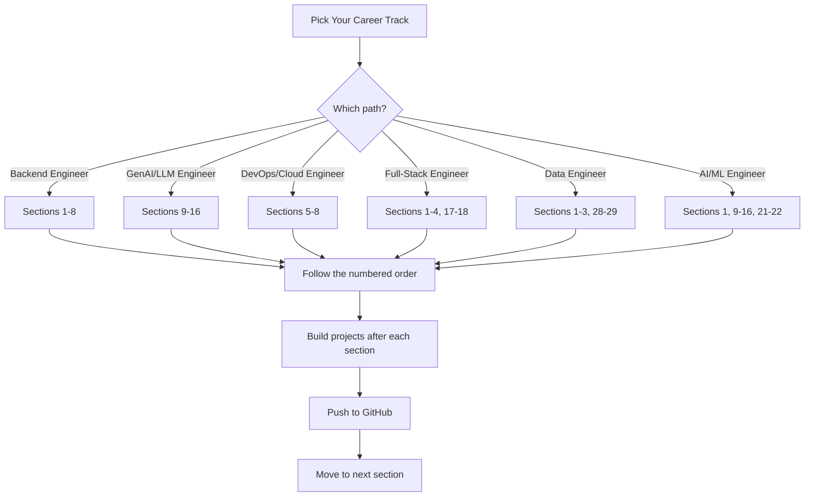
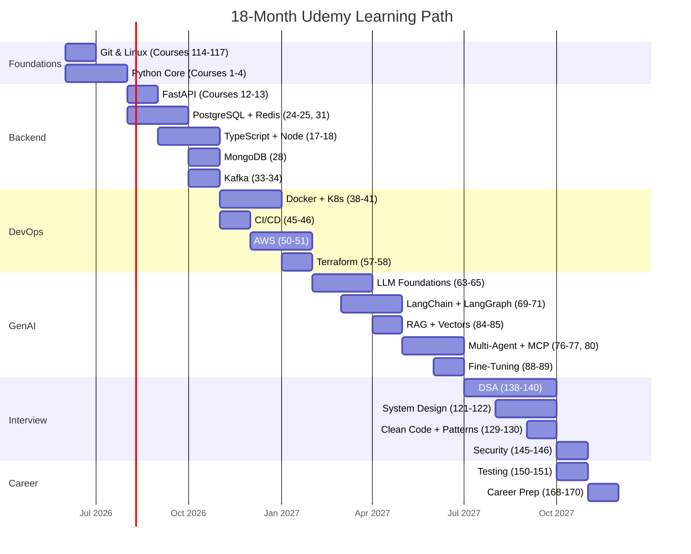

# Part 51: The Definitive 2026 Udemy Mega-Course Guide

## 200+ Courses Across Every Skill Domain You Need to Master

*[← Back to Master Index](/blog/it-career-guide)*

---

> [!IMPORTANT]
> **This is the expanded sequel to
> [Part 27: The Udemy Course Arsenal](/blog/it-career-guide/part-27-udemy-courses).**
> Part 27 gave you the essential 90 courses with a priority-ranked
> approach. This Part 51 goes **nuclear** — covering **200+ courses**
> across **30+ skill domains**, including emerging fields like
> MCP servers, agentic AI, computer vision, data engineering,
> Golang, and MLOps/LLMOps. Every course is verified against
> current 2026 Udemy listings, with instructor credibility notes,
> hour counts, and a recommended completion order.

---

## How to Use This Guide

**Priority Legend:**
- ⭐⭐⭐⭐⭐ = **Non-negotiable** — Take this course
- ⭐⭐⭐⭐ = **Highly recommended** — Strong ROI
- ⭐⭐⭐ = **Valuable** — Take if time permits
- ⭐⭐ = **Specialized** — For specific career paths
- ⭐ = **Niche** — Only if deeply interested

---

## Section 1: Python — The Foundation of Everything

> [!NOTE]
> Python is the single most important language for backend,
> AI/ML, data engineering, and automation roles in 2026.
> Start here regardless of your target career path.

### Core Python

| # | Priority | Course | Instructor | Hours | Why Take It |
|:-:|:---:|:---|:---|:---:|:---|
| 1 | ⭐⭐⭐⭐⭐ | **100 Days of Code: The Complete Python Pro Bootcamp** | Dr. Angela Yu | 60h | The #1 Python course on Udemy. 300K+ reviews, 4.7/5. One project per day builds unshakeable muscle memory. |
| 2 | ⭐⭐⭐⭐⭐ | **Python 3: Deep Dive (Part 1 — Functional)** | Fred Baptiste | 46h | University-level Python internals. Variables, memory model, scopes, closures, decorators. No other course matches this depth. |
| 3 | ⭐⭐⭐⭐⭐ | **Python 3: Deep Dive (Part 2 — Iterators/Generators)** | Fred Baptiste | 36h | Iterators, generators, context managers, coroutines. Essential foundation for async Python. |
| 4 | ⭐⭐⭐⭐ | **Python 3: Deep Dive (Part 4 — OOP)** | Fred Baptiste | 44h | Descriptors, properties, metaclasses, slots. Advanced OOP internals for senior-level code. |
| 5 | ⭐⭐⭐⭐ | **Complete Python Developer: Zero to Mastery** | Andrei Neagoie | 30h | Career-focused Python with professional tooling, testing, debugging, and deployment workflows. |
| 6 | ⭐⭐⭐⭐ | **Advanced Python with 10 OOP Projects** | Various | 25h | Master OOP through 10 complex real-world apps. Includes refactoring, Git, debugging, and deployment. |
| 7 | ⭐⭐⭐⭐ | **Advanced Python: Real-World Programming Deep Dive (2026)** | Various | 20h | Functional programming (lambda, map, filter), generators, dataclasses, NamedTuples, optimization strategies. |
| 8 | ⭐⭐⭐ | **Complete Python Bootcamp: Go from Zero to Hero** | Jose Portilla | 22h | Classic academic-style Python. Clear, methodical coverage of decorators, generators, OOP. |
| 9 | ⭐⭐⭐ | **Python Data Structures & Algorithms + LEETCODE Exercises** | Scott Barrett | 20h | Python-native DSA with integrated LeetCode exercises. Best for Python-focused interview prep. |

### Async Python & Concurrency

| # | Priority | Course | Instructor | Hours | Why Take It |
|:-:|:---:|:---|:---|:---:|:---|
| 10 | ⭐⭐⭐⭐ | **Python Concurrency with asyncio** | Various | 8h | Event loop mechanics, `asyncio`, `aiohttp`, concurrent I/O patterns. Essential for FastAPI. |
| 11 | ⭐⭐⭐ | **Advanced Python: Threading, Multiprocessing & asyncio** | Various | 10h | CPU-bound vs I/O-bound workloads. GIL, thread pools, process pools. |

---

## Section 2: FastAPI & Backend API Development

> [!TIP]
> FastAPI is the fastest-growing Python web framework in 2026.
> It's async-native, type-safe with Pydantic, and generates
> OpenAPI docs automatically. This is your primary backend skill.

| # | Priority | Course | Instructor | Hours | Why Take It |
|:-:|:---:|:---|:---|:---:|:---|
| 12 | ⭐⭐⭐⭐⭐ | **FastAPI — The Complete Course 2026 (Beginner + Advanced)** | Various | 22h | Most comprehensive FastAPI course. Async, SQLAlchemy, Pydantic v2, OAuth2, Docker deployment. |
| 13 | ⭐⭐⭐⭐ | **Ultimate Guide to FastAPI and Backend Development** | Various | 20h | Project-based: build a Delivery Management System. Async, dependency injection, SQLModel, PostgreSQL. |
| 14 | ⭐⭐⭐⭐ | **FastAPI with Python: Build REST API Using Clean Architecture** | Various | 18h | Clean Architecture focus. Scalable project structure, Docker containerization, professional deployment. |
| 15 | ⭐⭐⭐⭐ | **Mastering REST APIs with FastAPI** | Various | 15h | 100% test coverage with pytest, background tasks, logging, middleware, Render deployment. |
| 16 | ⭐⭐⭐ | **FastAPI Mastery: Build Modern APIs with Python** | Various | 15h | WebSockets, background tasks, Uvicorn/Gunicorn production deployment. |

---

## Section 3: TypeScript & Node.js

| # | Priority | Course | Instructor | Hours | Why Take It |
|:-:|:---:|:---|:---|:---:|:---|
| 17 | ⭐⭐⭐⭐⭐ | **Understanding TypeScript (2026 Edition)** | Maximilian Schwarzmüller | 22h | The most comprehensive TypeScript course. Generics, decorators, mixins, namespaces, advanced types. 4.7/5. |
| 18 | ⭐⭐⭐⭐⭐ | **Node.js, Express, MongoDB & More: The Complete Bootcamp** | Jonas Schmedtmann | 42h | The highest-quality Node.js course. Deep Express, MongoDB, auth, REST API design, deployment. |
| 19 | ⭐⭐⭐⭐⭐ | **The Complete Node.js Developer Bootcamp** | Andrew Mead | 35h | Project-based backend development. MongoDB, Socket.io, real-world production APIs. |
| 20 | ⭐⭐⭐⭐ | **TypeScript: The Complete Developer's Guide** | Stephen Grider | 24h | Architecture-focused TypeScript. Design patterns, decorators, project structure. |
| 21 | ⭐⭐⭐⭐ | **JavaScript and TypeScript: The Complete Guide (Vite & Node.js)** | Various | 28h | Unified JS+TS experience for both frontend (Vite) and backend (Node.js). |
| 22 | ⭐⭐⭐ | **JavaScript — The Complete Guide 2026** | Maximilian Schwarzmüller | 52h | The deepest JS foundation. Essential if weak on JS fundamentals before TypeScript. |
| 23 | ⭐⭐⭐ | **The Complete JavaScript Course: From Zero to Expert** | Jonas Schmedtmann | 69h | Rock-solid JS fundamentals for those who need deep language mastery. |

---

## Section 4: Databases — SQL, NoSQL & Caching

### PostgreSQL & SQL

| # | Priority | Course | Instructor | Hours | Why Take It |
|:-:|:---:|:---|:---|:---:|:---|
| 24 | ⭐⭐⭐⭐⭐ | **SQL and PostgreSQL: The Complete Developer's Guide** | Stephen Grider | 22h | Hardware-level storage understanding, query tuning, schema design. Best developer-focused SQL course. |
| 25 | ⭐⭐⭐⭐⭐ | **The Complete SQL Bootcamp: Go from Zero to Hero** | Jose Portilla | 9h | Most popular SQL course. pgAdmin, CRUD, joins, subqueries, window functions. |
| 26 | ⭐⭐⭐⭐ | **PostgreSQL Bootcamp: Go From Beginner To Advanced (60+ Hours)** | Various | 62h | Most exhaustive PostgreSQL course. CTEs, window functions, JSON, PL/pgSQL, triggers, performance tuning. |
| 27 | ⭐⭐⭐ | **The Ultimate MySQL Bootcamp** | Colt Steele | 20h | SQL via MySQL. Good if your company uses MySQL (common in TCS/Infosys projects). |

### MongoDB

| # | Priority | Course | Instructor | Hours | Why Take It |
|:-:|:---:|:---|:---|:---:|:---|
| 28 | ⭐⭐⭐⭐⭐ | **MongoDB — The Complete Developer's Guide** | Maximilian Schwarzmüller | 17h | Gold standard. CRUD, aggregation, indexes, performance, Atlas. 200K+ students, frequently updated. |
| 29 | ⭐⭐⭐⭐ | **The Complete Developers Guide to MongoDB (NodeJS)** | Stephen Grider | 13h | TDD-focused, Mongoose-heavy. Best for Node.js developers integrating MongoDB. |
| 30 | ⭐⭐⭐ | **Complete MongoDB Administration Guide** | Various | 15h | DBA-focused: deployment, security, scaling, backup strategies. |

### Redis

| # | Priority | Course | Instructor | Hours | Why Take It |
|:-:|:---:|:---|:---|:---:|:---|
| 31 | ⭐⭐⭐⭐⭐ | **Redis: The Complete Developer's Guide** | Stephen Grider | 17h | Gold standard Redis course. Advanced data structures, clustering, Lua scripting, Redis modules. Bestseller. |
| 32 | ⭐⭐⭐⭐ | **Master Redis — From Beginner to Advanced (20+ hours)** | Various | 22h | Deepest Redis course. RedisJSON, RediSearch, administration, replication, clustering. |

---

## Section 5: Apache Kafka & Event Streaming

| # | Priority | Course | Instructor | Hours | Why Take It |
|:-:|:---:|:---|:---|:---:|:---|
| 33 | ⭐⭐⭐⭐⭐ | **Apache Kafka Series — Learn Apache Kafka for Beginners v3** | Stéphane Maarek | 8h | The definitive Kafka starting point. Updated for Kafka 4.0 and KRaft mode. 50K+ reviews. |
| 34 | ⭐⭐⭐⭐⭐ | **Kafka Streams for Data Processing** | Stéphane Maarek | 8h | Stream processing APIs, state stores, KTables, windowing, exactly-once semantics. |
| 35 | ⭐⭐⭐⭐ | **Confluent Schema Registry & Kafka REST Proxy** | Stéphane Maarek | 3h | Schema management in production. Avro, backward/forward compatibility. |
| 36 | ⭐⭐⭐⭐ | **Kafka Connect Hands On Learning** | Stéphane Maarek | 4h | Integrate Kafka with databases, Elasticsearch, S3. Source/sink connectors. |
| 37 | ⭐⭐⭐ | **Kafka Cluster Setup & Administration** | Stéphane Maarek | 5h | Production operations: cluster deployment, monitoring, performance tuning, security. |

---

## Section 6: Docker, Kubernetes & Container Orchestration

| # | Priority | Course | Instructor | Hours | Why Take It |
|:-:|:---:|:---|:---|:---:|:---|
| 38 | ⭐⭐⭐⭐⭐ | **Docker and Kubernetes: The Complete Guide** | Stephen Grider | 22h | Best combined Docker+K8s course. Multi-container production app with CI/CD. |
| 39 | ⭐⭐⭐⭐⭐ | **Docker & Kubernetes: The Practical Guide** | Maximilian Schwarzmüller | 24h | Best all-in-one course. Seamless transition from Docker to advanced Kubernetes. |
| 40 | ⭐⭐⭐⭐⭐ | **Kubernetes for the Absolute Beginners — Hands-on** | Mumshad Mannambeth | 6h | Most beginner-friendly K8s. Browser-based KodeKloud labs. Zero local setup. |
| 41 | ⭐⭐⭐⭐⭐ | **Certified Kubernetes Administrator (CKA) with Practice Tests** | Mumshad Mannambeth | 18h | Gold standard CKA exam prep. Exhaustive practice labs. |
| 42 | ⭐⭐⭐⭐⭐ | **Docker Mastery: With Kubernetes + Swarm** | Bret Fisher | 20h | Production-grade focus. Bret Fisher is a Docker Captain with deep real-world expertise. |
| 43 | ⭐⭐⭐⭐ | **Docker for the Absolute Beginner — Hands-On — DevOps** | Mumshad Mannambeth | 4h | Cleanest standalone Docker beginner course with browser labs. |
| 44 | ⭐⭐⭐ | **Certified Kubernetes Application Developer (CKAD)** | Mumshad Mannambeth | 12h | Developer-focused K8s certification. Pod design, services, networking. |

---

## Section 7: CI/CD, GitHub Actions & DevOps Pipelines

| # | Priority | Course | Instructor | Hours | Why Take It |
|:-:|:---:|:---|:---|:---:|:---|
| 45 | ⭐⭐⭐⭐⭐ | **GitHub Actions — The Complete Guide** | Maximilian Schwarzmüller | 14h | Most comprehensive GitHub Actions course. Workflows, Docker builds, matrix testing, secrets, OIDC. 4.8/5. |
| 46 | ⭐⭐⭐⭐ | **GitHub Actions & CI/CD: The Complete DevOps Masterclass** | Various | 12h | Enterprise-grade automation: caching, reusable workflows, professional deployment pipelines. |
| 47 | ⭐⭐⭐⭐ | **Decoding DevOps — From Basics to Advanced Projects with AI** | Imran Teli | 40h | Full DevOps ecosystem: GitHub Actions, Jenkins, GitLab CI, Docker, Kubernetes. |
| 48 | ⭐⭐⭐⭐ | **Master GitHub Actions for DevOps: CI/CD with Real Projects** | Various | 8h | Portfolio-building: three real projects with Docker and S3 static hosting. |
| 49 | ⭐⭐⭐ | **DevOps Projects | Real Time DevOps & GitOps Projects** | Imran Teli | 20h | Intermediate-level DevOps challenges for portfolio building. |

---

## Section 8: AWS Cloud & Infrastructure

### AWS Certifications

| # | Priority | Course | Instructor | Hours | Why Take It |
|:-:|:---:|:---|:---|:---:|:---|
| 50 | ⭐⭐⭐⭐⭐ | **Ultimate AWS Certified Solutions Architect Associate (SAA-C03)** | Stéphane Maarek | 27h | Gold standard cloud foundations. EC2, Lambda, S3, RDS, VPC, API Gateway. 200K+ students. |
| 51 | ⭐⭐⭐⭐⭐ | **Ultimate AWS Certified Developer Associate (DVA-C02)** | Stéphane Maarek | 26h | Developer-focused: Lambda, DynamoDB, API Gateway, SAM, CodePipeline. |
| 52 | ⭐⭐⭐⭐ | **AWS Certified Developer Associate Exam Training** | Neal Davis | 20h | Coding-heavy alternative to Maarek. Excellent learning-by-building approach. |

### Serverless & Lambda

| # | Priority | Course | Instructor | Hours | Why Take It |
|:-:|:---:|:---|:---|:---:|:---|
| 53 | ⭐⭐⭐⭐ | **AWS Lambda & Serverless Architecture Bootcamp (V2)** | Various | 15h | Deep serverless: Lambda, API Gateway, DynamoDB, SQS, EventBridge, Step Functions. |
| 54 | ⭐⭐⭐⭐ | **Serverless Framework Bootcamp: Node.js, AWS & Microservices** | Various | 12h | Serverless Framework for efficient multi-function deployments. |
| 55 | ⭐⭐⭐⭐ | **Building Fullstack Serverless Apps On AWS [2026]** | Various | 15h | Full-stack: React + Lambda + DynamoDB + Cognito + CloudFront. Portfolio-worthy. |
| 56 | ⭐⭐⭐ | **Serverless using AWS Lambda for Python Developers** | Various | 10h | Python-specific Lambda development for Python-first engineers. |

### Terraform & Infrastructure as Code

| # | Priority | Course | Instructor | Hours | Why Take It |
|:-:|:---:|:---|:---|:---:|:---|
| 57 | ⭐⭐⭐⭐⭐ | **Learn DevOps: Infrastructure Automation With Terraform** | Edward Viaene | 16h | Terraform + AWS + Packer + Docker + Jenkins + K8s. Real DevOps workflow. |
| 58 | ⭐⭐⭐⭐ | **HashiCorp Certified: Terraform Associate 2026** | Zeal Vora | 14h | Certification-focused. State management, modules, backends. Bestseller. |
| 59 | ⭐⭐⭐⭐ | **Mastering Terraform: From Basics to Advanced 2026** | Various | 18h | Production-grade: remote state, module design, security, team environments. |
| 60 | ⭐⭐⭐⭐ | **Terraform for the Absolute Beginners with Labs** | Mumshad Mannambeth | 4h | Browser-based labs. Cleanest beginner IaC path. |

### Cloudflare

| # | Priority | Course | Instructor | Hours | Why Take It |
|:-:|:---:|:---|:---|:---:|:---|
| 61 | ⭐⭐⭐⭐ | **Ultimate Cloudflare Bootcamp — All Modules Covered** | Various | 12h | Full Cloudflare ecosystem: Workers, performance, security, CDN. |
| 62 | ⭐⭐⭐ | **Cloudflare | Website Security, Performance, CDN & Zero Trust** | Various | 8h | Broader Cloudflare: DNS, CDN, DDoS protection, Zero Trust. |

---

## Section 9: Generative AI — LLMs & Foundations

> [!IMPORTANT]
> GenAI engineering is the highest-demand skill category in
> 2026. This section and the next 7 sections cover the
> complete AI engineering stack from fundamentals to
> production multi-agent systems.

| # | Priority | Course | Instructor | Hours | Why Take It |
|:-:|:---:|:---|:---|:---:|:---|
| 63 | ⭐⭐⭐⭐⭐ | **Complete Generative AI Course With Langchain and Huggingface** | Krish Naik | 30h | Best production GenAI course. LangChain, RAG, Hugging Face, vector DBs, chatbot deployment. 35K+ reviews. |
| 64 | ⭐⭐⭐⭐⭐ | **AI & LLM Engineering Mastery: GenAI, RAG Complete Guide** | Various | 25h | Structured LLM engineer path: RAG, vector databases, fine-tuning with LoRA/QLoRA, LangSmith observability. |
| 65 | ⭐⭐⭐⭐⭐ | **LLM Engineering: Master AI, Large Language Models & Agents** | Ed Donner | 22h | Bestseller. Transformer architecture to real-world deployment. Highly practical. |
| 66 | ⭐⭐⭐⭐ | **The AI Engineer Course 2026: Complete AI Engineer Bootcamp** | Various | 30h | Full AI engineer roadmap: LLMs, LangChain, LlamaIndex, RAG, vector DBs, agent orchestration. |
| 67 | ⭐⭐⭐⭐ | **2026 Bootcamp: Generative AI, LLM Apps, AI Agents, Cursor AI** | Various | 28h | Multimodal apps, dynamic multi-agent systems, AI coding assistants. |
| 68 | ⭐⭐⭐⭐ | **AI Engineer Core Track: LLM Engineering, RAG, QLoRA, Agents** | Various | 24h | Top-tier LLM engineering roadmap. QLoRA fine-tuning, RAG pipelines, agent design. |

---

## Section 10: LangChain & LangGraph — Agentic AI

| # | Priority | Course | Instructor | Hours | Why Take It |
|:-:|:---:|:---|:---|:---:|:---|
| 69 | ⭐⭐⭐⭐⭐ | **Build AI Agents with LangChain and LangGraph** | Eden Marco | 16h | The bestselling LangGraph course. RAG, tool calling, MCP, production workflows. |
| 70 | ⭐⭐⭐⭐⭐ | **Production AI Agents with LangChain + LangGraph [2026]** | Various | 20h | Production patterns: multi-agent, FastAPI deployment, Docker, LangSmith observability. |
| 71 | ⭐⭐⭐⭐⭐ | **Advanced LangGraph: Workflows, Multi-Agents, Deep Agents** | Various | 18h | State management, HITL workflows, sub-graph compartmentalization, self-correcting agents. |
| 72 | ⭐⭐⭐⭐ | **LangChain — Develop LLM Powered Applications with LangChain** | Various | 14h | LangChain fundamentals: chains, prompt templates, memory, agents, RAG projects. |
| 73 | ⭐⭐⭐⭐ | **LangChain Mastery: Build GenAI Apps with LangChain & Pinecone** | Various | 12h | Deep RAG + vector database integration. Pinecone, embedding optimization, chunking. |
| 74 | ⭐⭐⭐⭐ | **LangChain — Agentic AI Engineering with LangChain & LangGraph** | Various | 16h | LangGraph 1.0, stateful agents, multi-agent workflows. |
| 75 | ⭐⭐⭐ | **Multi-Agents with LangChain & LangGraph: Build 4 Projects** | Various | 14h | Four multi-agent patterns: travel planner, job pipeline, research, more. |

---

## Section 11: Multi-Agent Frameworks — CrewAI, AutoGen & MCP

| # | Priority | Course | Instructor | Hours | Why Take It |
|:-:|:---:|:---|:---|:---:|:---|
| 76 | ⭐⭐⭐⭐⭐ | **The Complete Agentic AI Engineering Course (2026)** | Various | 30h | Covers CrewAI, AutoGen, LangGraph, OpenAI Agents SDK, and MCP. Production-grade multi-agent skills. |
| 77 | ⭐⭐⭐⭐⭐ | **Master LLM Engineering & AI Agents: Build 14 Projects** | Various | 28h | 14 hands-on projects across CrewAI, AutoGen, LangGraph, n8n. Massive portfolio builder. |
| 78 | ⭐⭐⭐⭐ | **Mastering AutoGen: Building Multi-Agent Systems** | Various | 12h | Deep dive into AutoGen, AutoGen Studio, low-code agent building, local LLM integration. |
| 79 | ⭐⭐⭐⭐ | **RAG, AI Agents, and Generative AI with Python and OpenAI 2026** | Various | 18h | Full-stack RAG + CrewAI, OpenAI Swarm, Flowise orchestration. |

---

## Section 12: MCP — Model Context Protocol

> [!NOTE]
> MCP (Model Context Protocol) is a critical 2026 standard
> for connecting AI agents to external tools and data sources.
> This is one of the most in-demand emerging skills.

| # | Priority | Course | Instructor | Hours | Why Take It |
|:-:|:---:|:---|:---|:---:|:---|
| 80 | ⭐⭐⭐⭐⭐ | **The Complete MCP Masterclass: Fundamentals to Production** | Various | 16h | Core architecture, JSON-RPC, transport layers (STDIO, SSE, Streamable HTTP), OAuth 2.1, Docker deployment. |
| 81 | ⭐⭐⭐⭐ | **MCP Server Development with Python & TypeScript** | Various | 12h | Build custom MCP servers. Database connectors, document management, CRM integrations. |
| 82 | ⭐⭐⭐⭐ | **MCP Crash Course for Experienced Developers** | Various | 4h | Weekend-friendly quick start. Server implementation, MCP Inspector debugging. |
| 83 | ⭐⭐⭐ | **Agentic AI with MCP: Build Tool-Augmented AI Systems** | Various | 14h | MCP integrated with LangGraph and CrewAI for production tool-calling agents. |

---

## Section 13: RAG & Vector Databases

| # | Priority | Course | Instructor | Hours | Why Take It |
|:-:|:---:|:---|:---|:---:|:---|
| 84 | ⭐⭐⭐⭐⭐ | **Vector Databases Fundamentals to Production [2026 Edition]** | Various | 16h | Chroma, Pinecone, pgvector. Advanced chunking, hybrid search, HNSW parameters, cost analysis. |
| 85 | ⭐⭐⭐⭐⭐ | **RAG Masterclass: Build Production RAG Pipelines** | Various | 18h | End-to-end RAG: chunking strategies, embedding optimization, RAGAS evaluation, LangSmith observability. |
| 86 | ⭐⭐⭐⭐ | **Gen AI — RAG Application Development using LlamaIndex** | Various | 14h | LlamaIndex framework. ReAct agents, dynamic tool orchestration, complex DAG pipelines. |
| 87 | ⭐⭐⭐⭐ | **Master Vector Database — ChromaDB** | Various | 8h | Deep ChromaDB: collection management, embeddings, filtering, LangChain + OpenAI integration. |

---

## Section 14: Fine-Tuning & Prompt Engineering

| # | Priority | Course | Instructor | Hours | Why Take It |
|:-:|:---:|:---|:---|:---:|:---|
| 88 | ⭐⭐⭐⭐⭐ | **The Complete Prompt Engineering for AI Bootcamp (2026)** | Various | 14h | Advanced prompting, building AI agents, Fine-Tuning with LoRA modules. Frequently updated. |
| 89 | ⭐⭐⭐⭐ | **Advanced NLP Techniques: LoRA for Fine-Tuning Llama3 LLMs** | Various | 10h | Efficient fine-tuning on consumer GPUs. Hugging Face PEFT + transformers ecosystem. |
| 90 | ⭐⭐⭐⭐ | **Fundamentals of SLM Fine-Tuning: LoRA, Quantization & Edge** | Various | 8h | LoRA, QLoRA, quantization for edge deployment. Private, efficient AI on consumer hardware. |
| 91 | ⭐⭐⭐ | **Generative AI & LLM — Build AI-Powered Applications** | Various | 12h | OpenAI API mastery, prompt chaining, few-shot learning, function calling patterns. |

---

## Section 15: Machine Learning & Deep Learning

> [!TIP]
> ML/DL knowledge provides the theoretical foundation that
> separates AI engineers from API wrappers. Even if you focus
> on LLM engineering, understanding the underlying math and
> models makes you dramatically more effective.

### Classical Machine Learning

| # | Priority | Course | Instructor | Hours | Why Take It |
|:-:|:---:|:---|:---|:---:|:---|
| 92 | ⭐⭐⭐⭐⭐ | **Machine Learning A-Z™: AI, Python & R + ChatGPT Prize** | Kirill Eremenko, Hadelin de Ponteves | 44h | Nearly 1 million students. Classical ML + deep learning. Best breadth-first course. |
| 93 | ⭐⭐⭐⭐⭐ | **Complete A.I. & Machine Learning, Data Science Bootcamp** | Andrei Neagoie | 43h | Balanced theory + hands-on ML projects. Strong career-focus framing. |
| 94 | ⭐⭐⭐⭐ | **Python for Data Science and Machine Learning Bootcamp** | Jose Portilla | 25h | Master the Python ML stack: Pandas, NumPy, Matplotlib, Scikit-learn, Seaborn. |

### Deep Learning & Neural Networks

| # | Priority | Course | Instructor | Hours | Why Take It |
|:-:|:---:|:---|:---|:---:|:---|
| 95 | ⭐⭐⭐⭐⭐ | **PyTorch for Deep Learning Bootcamp** | Various | 20h | Industry-standard research framework. CNNs, RNNs, GPU computing. Pythonic and intuitive. |
| 96 | ⭐⭐⭐⭐ | **TensorFlow for Deep Learning Bootcamp** | Various | 20h | Production-ready AI. TFX, TensorFlow Lite for mobile, enterprise deployment at scale. |
| 97 | ⭐⭐⭐ | **Deep Learning A-Z 2026: Neural Networks, AI & ChatGPT** | Kirill Eremenko | 22h | ANN, CNN, RNN with TensorFlow + PyTorch. Solid theoretical foundation. |

### Mathematics for ML

| # | Priority | Course | Instructor | Hours | Why Take It |
|:-:|:---:|:---|:---|:---:|:---|
| 98 | ⭐⭐⭐⭐⭐ | **Mathematical Foundations of Machine Learning** | Various | 18h | Linear algebra + calculus specifically for ML. Bridges theory and library implementation. |
| 99 | ⭐⭐⭐⭐ | **Complete Math, Statistics & Probability for Machine Learning** | Various | 32h | Set theory, combinatorics, linear algebra, probability, statistics. Most thorough. |
| 100 | ⭐⭐⭐ | **Statistics for Data Science and Business Analysis** | Various | 7h | Hypothesis testing, distributions, regression, p-values. Python-integrated. |

---

## Section 16: NLP, Transformers & Computer Vision

### NLP & Transformers

| # | Priority | Course | Instructor | Hours | Why Take It |
|:-:|:---:|:---|:---|:---:|:---|
| 101 | ⭐⭐⭐⭐⭐ | **Natural Language Processing: NLP With Transformers in Python** | Various | 16h | BERT fine-tuning, Hugging Face, spaCy, PyTorch. Sentiment analysis, Q&A projects. |
| 102 | ⭐⭐⭐⭐ | **Data Science: Transformers for Natural Language Processing** | Various | 14h | Three-part: using pretrained, fine-tuning, and "under the hood" attention mechanics. GPT, BERT, T5. |
| 103 | ⭐⭐⭐⭐ | **A Deep Understanding of AI Large Language Model Mechanisms** | Mike X Cohen | 12h | Rigorous mechanistic approach. PyTorch-based transformer and attention from scratch. |
| 104 | ⭐⭐⭐ | **Deep Learning: NLP with Transformers (TensorFlow)** | Various | 14h | TF 2.0 + Hugging Face. RNNs to DeBERTa and BlenderBot progression. |

### Computer Vision

| # | Priority | Course | Instructor | Hours | Why Take It |
|:-:|:---:|:---|:---|:---:|:---|
| 105 | ⭐⭐⭐⭐⭐ | **Modern Computer Vision: GPT, PyTorch, Keras, OpenCV4** | Various | 30h | Most comprehensive CV course. YOLOv8, GenAI, Transformers, both PyTorch + TensorFlow. |
| 106 | ⭐⭐⭐⭐ | **Python for Computer Vision with OpenCV and Deep Learning** | Various | 14h | Classic foundational CV. Image manipulation, CNNs, OpenCV. |
| 107 | ⭐⭐⭐⭐ | **Build 15+ Real-Time Deep Learning (CV) Projects** | Various | 18h | YOLOv5/v8, object detection, GANs, Deepfakes. Project-heavy portfolio builder. |
| 108 | ⭐⭐⭐ | **Mastering Computer Vision With GenAI: 12 Projects** | Various | 16h | Traditional CV + Stable Diffusion + generative models. |

---

## Section 17: React, Next.js & Modern Frontend

| # | Priority | Course | Instructor | Hours | Why Take It |
|:-:|:---:|:---|:---|:---:|:---|
| 109 | ⭐⭐⭐⭐⭐ | **React — The Complete Guide (incl. Next.js, Redux)** | Maximilian Schwarzmüller | 68h | Most comprehensive React course. Hooks, Context, Redux, Next.js 14+, React Query. |
| 110 | ⭐⭐⭐⭐⭐ | **Next.js & React — The Complete Guide** | Maximilian Schwarzmüller | 36h | Deep Next.js 15+: App Router, Server Components, Server Actions, RSC, SSR/SSG. |
| 111 | ⭐⭐⭐⭐ | **Modern React with Redux** | Stephen Grider | 52h | Architecture-first React+Redux. Best for understanding "why" patterns exist. |
| 112 | ⭐⭐⭐⭐ | **Next.js: The Complete Developer's Guide** | Stephen Grider | 24h | Alternative Next.js deep-dive with strong architectural focus. |
| 113 | ⭐⭐⭐⭐ | **The Complete Web Development Bootcamp** | Dr. Angela Yu | 65h | Full-stack web dev: HTML, CSS, JS, React, Node.js, SQL/NoSQL. If starting from zero. |

---

## Section 18: Git, Linux & Developer Toolkit

### Git & Version Control

| # | Priority | Course | Instructor | Hours | Why Take It |
|:-:|:---:|:---|:---|:---:|:---|
| 114 | ⭐⭐⭐⭐⭐ | **The Git & GitHub Bootcamp** | Colt Steele | 17h | Consensus best Git course on any platform. DAG model, rebase, reflog, branching strategies. 4.8/5. |
| 115 | ⭐⭐⭐ | **Git & GitHub For Beginners — Master Git and GitHub** | Various | 6h | Shorter alternative for complete beginners needing a faster on-ramp. |

### Linux & Shell

| # | Priority | Course | Instructor | Hours | Why Take It |
|:-:|:---:|:---|:---|:---:|:---|
| 116 | ⭐⭐⭐⭐⭐ | **The Linux Command Line Bootcamp: Beginner To Power User** | Colt Steele | 15h | Best developer-focused Linux terminal course. Exercise-heavy, WSL2 friendly. |
| 117 | ⭐⭐⭐⭐ | **Bash Scripting and Shell Programming** | Jason Cannon | 6h | Automation scripts, cron jobs, error handling. Exactly what DevOps needs. |
| 118 | ⭐⭐⭐⭐ | **Linux Shell Scripting: A Project-Based Approach** | Jason Cannon | 10h | sed, grep, awk alongside Bash. Project-based automation. |
| 119 | ⭐⭐⭐⭐ | **Linux Administration Bootcamp** | Jason Cannon | 12h | Full sysadmin: permissions, networking, package management, process control. |
| 120 | ⭐⭐⭐ | **Complete Linux Training Course** | Imran Afzal | 30h | Deepest Linux course. Enterprise: LVM, NFS, LDAP. For DevOps/SRE tracks. |

---

## Section 19: System Design & Architecture

| # | Priority | Course | Instructor | Hours | Why Take It |
|:-:|:---:|:---|:---|:---:|:---|
| 121 | ⭐⭐⭐⭐⭐ | **Software Architecture & Design of Modern Large Scale Systems** | Michael Pogrebinsky | 9h | Most rigorous system design course. Performance, scalability, load balancing, caching, message queues. 4.7/5. |
| 122 | ⭐⭐⭐⭐⭐ | **Mastering the System Design Interview** | Frank Kane (ex-Amazon) | 14h | Interview-specific: hiring manager perspective, FAANG patterns, structured frameworks. |
| 123 | ⭐⭐⭐⭐⭐ | **Design Microservices Architecture with Patterns & Principles** | Michael Pogrebinsky | 12h | Best microservices decomposition: event-driven, monolith evolution. |
| 124 | ⭐⭐⭐⭐⭐ | **The Complete Microservices & Event-Driven Architecture** | Michael Pogrebinsky | 16h | CQRS, event sourcing, SAGA, outbox pattern. Deep distributed architecture. |
| 125 | ⭐⭐⭐⭐ | **System Design Masterclass (2026) | From FAANG Insiders** | Various | 12h | Structured thinking model and templates for solving any system design problem. |
| 126 | ⭐⭐⭐⭐ | **Rocking System Design** | Rajdeep Saha (ex-AWS) | 12h | AWS-integrated system design. Lambda, API Gateway, K8s in real architectures. |
| 127 | ⭐⭐⭐⭐ | **Pragmatic System Design** | Alexey Soshin | 8h | Concise core concepts. Netflix/Yelp case studies. SQL vs NoSQL, sharding. |
| 128 | ⭐⭐⭐ | **Software Architecture & System Design Practical Case Studies** | Michael Pogrebinsky | 8h | Real-world case studies for interview preparation. |

---

## Section 20: Design Patterns, SOLID & Clean Code

| # | Priority | Course | Instructor | Hours | Why Take It |
|:-:|:---:|:---|:---|:---:|:---|
| 129 | ⭐⭐⭐⭐⭐ | **Low-Level System Design, Design Patterns & SOLID Principles** | Prateek Narang | 18h | Bestseller. All 23 GoF patterns, SOLID in real code. Essential for code review quality. |
| 130 | ⭐⭐⭐⭐⭐ | **Ultimate Clean Code Masterclass** | Various | 14h | 8 real-world refactoring case studies. Best Clean Code course on Udemy. |
| 131 | ⭐⭐⭐⭐ | **TypeScript Design Patterns And SOLID Principles** | Various | 14h | Design patterns specifically for modern TypeScript web developers. |
| 132 | ⭐⭐⭐⭐ | **Python: SOLID Principles and Top Design Patterns** | Various | 12h | OOP and design patterns for Python developers building complex systems. |
| 133 | ⭐⭐⭐ | **Microservices: Clean Architecture, DDD, SAGA, Outbox & Kafka** | Various | 20h | DDD tactical patterns, SAGA distributed transactions, Kafka event pipelines. |

---

## Section 21: API Design — REST, GraphQL & gRPC

| # | Priority | Course | Instructor | Hours | Why Take It |
|:-:|:---:|:---|:---|:---:|:---|
| 134 | ⭐⭐⭐⭐ | **Modern API Development: REST, GraphQL & gRPC** | Various | 10h | All three protocols. Capstone project integrating REST + GraphQL + gRPC. |
| 135 | ⭐⭐⭐⭐ | **REST API vs GraphQL vs gRPC — The Complete Guide** | Memi Lavi | 10h | Decision-making framework. Web API Flowchart for choosing the right protocol. |
| 136 | ⭐⭐⭐⭐ | **REST API Design, Development & Management** | Various | 8h | API versioning, security, Swagger/OpenAPI, rate limiting, best practices. |
| 137 | ⭐⭐⭐ | **Backend Master Class [Golang + Postgres + K8s + gRPC]** | Various | 30h | Production gRPC in Go. Banking app with Docker, K8s, authentication. |

---

## Section 22: Data Structures & Algorithms (Interview Prep)

| # | Priority | Course | Instructor | Hours | Why Take It |
|:-:|:---:|:---|:---|:---:|:---|
| 138 | ⭐⭐⭐⭐⭐ | **Master the Coding Interview: Data Structures + Algorithms** | Andrei Neagoie | 19h | Best interview-focused DSA. FAANG mindset, systematic problem-solving framework. 4.7/5. |
| 139 | ⭐⭐⭐⭐⭐ | **JavaScript Algorithms and Data Structures Masterclass** | Colt Steele | 22h | Clear animations, deep pattern explanations. Best for JS developers. |
| 140 | ⭐⭐⭐⭐ | **Python Data Structures & Algorithms + LEETCODE Exercises** | Scott Barrett | 20h | Python-native DSA with integrated LeetCode exercises. Visual animations. |
| 141 | ⭐⭐⭐⭐ | **The Complete Data Structures and Algorithms Course in Python** | Elshad Karimov | 30h | Thorough, long-form. Deep foundation before LeetCode grinding. |
| 142 | ⭐⭐⭐⭐ | **50 Days of LeetCode in Python: Algorithms Coding Interviews** | Various | 15h | Daily coding challenge structure. Hands-on, pattern-oriented. |
| 143 | ⭐⭐⭐⭐ | **Data Structures & Algorithms, Level-up for Coding Interviews** | Prateek Narang (Google) | 26h | Pattern recognition, optimization strategies. Big Tech interview prep. |
| 144 | ⭐⭐⭐ | **Mastering Data Structures & Algorithms using C and C++** | Abdul Bari | 59h | Legendary "from scratch" DSA. Deep mechanical understanding of every structure. |

---

## Section 23: Web Security & Authentication

| # | Priority | Course | Instructor | Hours | Why Take It |
|:-:|:---:|:---|:---|:---:|:---|
| 145 | ⭐⭐⭐⭐⭐ | **Web Security & Bug Bounty: Learn Penetration Testing** | Various | 12h | SQL injection, XSS, broken access, Burp Suite. Real penetration testing. |
| 146 | ⭐⭐⭐⭐ | **OWASP TOP 10:2025 — Comprehensive Training** | Various | 8h | All 10 OWASP categories, JWT verification, CI/CD security, 60+ real code examples. |
| 147 | ⭐⭐⭐⭐ | **Mastering Authentication in Node.js: JWT, SSO, Token based** | Various | 10h | 4.9 rating. JWT, SSO, token-based auth in NestJS. |
| 148 | ⭐⭐⭐⭐ | **Mastering API Security for Pentesting & Bug Bounties** | Various | 10h | OWASP API Security Top 10, OAuth 2.0, JWT exploitation and defense. |
| 149 | ⭐⭐⭐ | **The Nuts and Bolts of OAuth 2.0** | Various | 6h | OAuth 2.0, OpenID, PKCE, JWTs, API Gateways. Conceptual deep-dive. |

---

## Section 24: Testing & TDD

| # | Priority | Course | Instructor | Hours | Why Take It |
|:-:|:---:|:---|:---|:---:|:---|
| 150 | ⭐⭐⭐⭐⭐ | **Playwright PYTHON Automation Testing — From Zero to Expert** | Various | 18h | Zero-to-expert. Python+Pytest basics, UI/API automation, BDD, framework design. |
| 151 | ⭐⭐⭐⭐⭐ | **Playwright Automation with Python, Pytest, AI & Jenkins** | Various | 16h | Enterprise-level. AI in test automation (Playwright MCP), Jenkins CI/CD. |
| 152 | ⭐⭐⭐⭐ | **Playwright Python and Pytest for Web Automation Testing** | Various | 14h | Page Object Model, parallel execution, CI/CD, API + UI testing. |
| 153 | ⭐⭐⭐⭐ | **Unit Testing And Test Driven Development In Python** | Various | 8h | TDD Red-Green-Refactor. unittest, pytest, mocking, test isolation. |
| 154 | ⭐⭐⭐ | **Playwright Automation: The Ultimate Guide + Framework 2026** | Various | 14h | Scalable frameworks, POM patterns, Trace Viewer debugging. |

---

## Section 25: Observability & Monitoring

| # | Priority | Course | Instructor | Hours | Why Take It |
|:-:|:---:|:---|:---|:---:|:---|
| 155 | ⭐⭐⭐⭐⭐ | **Observability with Grafana, Prometheus, Loki, Alloy, and Tempo** | Various | 18h | Best-selling. Full modern LGTM stack. OpenTelemetry, distributed tracing, log aggregation. |
| 156 | ⭐⭐⭐⭐ | **Prometheus | The Complete Hands-On for Monitoring & Alerting** | Various | 14h | Deep Prometheus focus. Advanced PromQL, custom exporters, complex alerting patterns. |
| 157 | ⭐⭐⭐⭐ | **Mastering Prometheus and Grafana Stack** | Various | 12h | Browser-based KillerCoda labs. Hands-on without local setup headaches. |

---

## Section 26: MLOps & LLMOps — Production AI

| # | Priority | Course | Instructor | Hours | Why Take It |
|:-:|:---:|:---|:---|:---:|:---|
| 158 | ⭐⭐⭐⭐⭐ | **AI Engineer Production Track: Deploy LLMs & Agents at Scale** | Various | 22h | Deploy to AWS/GCP/Azure/Vercel. Terraform IaC, GitHub Actions CI/CD, LangSmith observability. |
| 159 | ⭐⭐⭐⭐ | **LLMOps and AIOps Bootcamp with 8 End-to-End Projects** | Various | 25h | Jenkins CI/CD, Docker, K8s, Prometheus monitoring, vector DB management for RAG. |
| 160 | ⭐⭐⭐⭐ | **AI Engineer Bootcamp 2026: LLMs, RAG, AI Agents & Vector DBs** | Various | 28h | Full AI engineer roadmap. Evaluation metrics (latency, accuracy, hallucinations), microservice deployment. |

---

## Section 27: Golang (Go) — High-Performance Backend

| # | Priority | Course | Instructor | Hours | Why Take It |
|:-:|:---:|:---|:---|:---:|:---|
| 161 | ⭐⭐⭐⭐⭐ | **Backend Master Class [Golang + Postgres + K8s + gRPC]** | Various | 30h | Premier backend course. Banking app from scratch. Postgres, Gin, JWT/PASETO, Docker, K8s, gRPC. |
| 162 | ⭐⭐⭐⭐ | **Go: The Complete Developer's Guide (Golang)** | Stephen Grider | 12h | Fundamentals + advanced features. Data types, structs, interfaces, REST APIs, testing. |
| 163 | ⭐⭐⭐⭐ | **Working with Microservices in Go (Golang)** | Trevor Sawler | 14h | Microservices architecture specialization. Highly available, scalable distributed apps. |

---

## Section 28: Data Engineering & ETL Pipelines

| # | Priority | Course | Instructor | Hours | Why Take It |
|:-:|:---:|:---|:---|:---:|:---|
| 164 | ⭐⭐⭐⭐⭐ | **Data Engineering Bootcamp: SQL, ETL, PySpark & AWS** | Various | 25h | Modern data stack: data lake on S3, dimensional modeling, PySpark ETL, Airflow orchestration. |
| 165 | ⭐⭐⭐⭐⭐ | **The Complete Hands-On Introduction to Apache Airflow 3** | Various | 16h | Gold standard orchestration. DAGs, operators, Docker deployment. |
| 166 | ⭐⭐⭐⭐ | **Data Engineering Project: SQL, Python, Airflow, Docker, CI/CD** | Various | 14h | Professional pipeline "plumbing": Airflow + Docker + GitHub Actions. Portfolio-worthy. |
| 167 | ⭐⭐⭐⭐ | **Databricks Data Engineering 2026: PySpark, SQL & Delta Lake** | Various | 18h | Large-scale PySpark processing. Real-world ETL with Delta Lake. |

---

## Section 29: Career, Freelancing & Remote Work

| # | Priority | Course | Instructor | Hours | Why Take It |
|:-:|:---:|:---|:---|:---:|:---|
| 168 | ⭐⭐⭐⭐ | **Salary Negotiation Pro Masterclass** | Various | 4h | Preparation, framing, handling objections. Worth 10x its price at first salary discussion. |
| 169 | ⭐⭐⭐⭐ | **Freelancing Mastery: Earn, Work Remotely & Scale** | Various | 8h | Build a freelance business. Upwork/Toptal platform strategies, project management. |
| 170 | ⭐⭐⭐ | **Remote Work & Freelancing: Find a Remote Job** | Various | 6h | Landing remote jobs, standout resumes, digital nomad setup. |

---

## Section 30: Full-Stack Web Development Bootcamps

| # | Priority | Course | Instructor | Hours | Why Take It |
|:-:|:---:|:---|:---|:---:|:---|
| 171 | ⭐⭐⭐⭐⭐ | **The Web Developer Bootcamp** | Colt Steele | 74h | Gold standard full-stack bootcamp. HTML, CSS, JS, Node.js, Express, MongoDB. |
| 172 | ⭐⭐⭐⭐⭐ | **The Complete Web Development Bootcamp** | Dr. Angela Yu | 65h | Similar breadth. React, Node.js, SQL/NoSQL. Engaging teaching style. |
| 173 | ⭐⭐⭐⭐ | **Computer Science 101: Master the Theory Behind Programming** | Various | 12h | How computers work — binary, memory, CPU, networking. Fills CS gaps for self-taught devs. |

---

## The Complete 18-Month Learning Path

> [!IMPORTANT]
> This is the recommended order to consume courses across
> all sections above. Follow this path to build skills
> systematically from foundations to advanced specialization.

### Month-by-Month Breakdown

| Month | Focus | Key Courses | Hours |
|:---:|:---|:---|:---:|
| **1** | Git + Linux + Python Basics | #114, #116, #117, #1 | ~98h |
| **2** | Python Deep Dive | #2, #3 | ~82h |
| **3** | FastAPI + PostgreSQL + Redis | #12, #24, #25, #31 | ~70h |
| **4** | TypeScript + Node.js | #17, #18 | ~64h |
| **5** | MongoDB + Kafka | #28, #33, #34 | ~33h |
| **6** | Docker + Kubernetes + CI/CD | #38, #40, #41, #45 | ~60h |
| **7** | AWS Cloud + Terraform | #50, #51, #57 | ~69h |
| **8** | GenAI Foundations | #63, #64, #65 | ~77h |
| **9** | LangChain + LangGraph | #69, #70, #71 | ~54h |
| **10** | RAG + Vectors + Multi-Agent | #84, #85, #76 | ~64h |
| **11** | MCP + Fine-Tuning | #80, #88, #89 | ~40h |
| **12** | DSA Interview Prep | #138, #139, #140 | ~61h |
| **13** | System Design + Architecture | #121, #122, #123 | ~35h |
| **14** | Clean Code + Patterns | #129, #130, #131 | ~46h |
| **15** | Security + Testing | #145, #146, #150 | ~38h |
| **16** | MLOps + Production AI | #158, #159 | ~47h |
| **17** | Frontend (if full-stack) | #109, #110 | ~104h |
| **18** | Career + Portfolio | #168, #169, #170 | ~18h |

**Total: ~1,060 hours across 18 months ≈ 59 hours/month ≈ 15 hours/week**

---

## Quick Cost Strategy

### 🆓 Free via TCS/Service Company Learning Platforms

Check these before buying anything:
- **TCS Udemy Business** — 15,000+ courses free
- **TCS Percipio (Skillsoft)** — O'Reilly equivalent
- **LinkedIn Learning** — TCS/Infosys provide access
- **Coursera Enterprise** — University courses free

### 💰 Udemy Personal Purchase Strategy

| Situation | Action |
|:---|:---|
| Full price showing (₹3,499) | **WAIT.** Never buy at full price. |
| Sale price (₹399–₹599) | Buy immediately if the course matches your current phase. |
| Multiple courses needed | Consider Udemy Personal Plan (~₹899/month). |
| Have a TCS account | Check TCS Udemy Business portal FIRST. |

### 🆓 Free Alternatives to Every Category

| Category | Free Alternative |
|:---|:---|
| Python | CS50P (Harvard), freeCodeCamp |
| Git | Pro Git Book (git-scm.com/book) |
| DSA | NeetCode.io, LeetCode free tier |
| System Design | ByteByteGo blog + newsletter |
| Kubernetes | KodeKloud free tier |
| AWS | AWS Skill Builder free tier |
| LangChain/AI | LangChain Academy (free) |
| Docker | Docker Labs (play-with-docker.com) |
| MCP | Anthropic official docs + Skilljar course |

---

## The 20 Courses That Will Change Your Career

If you can only take 20 courses from this entire 200+
list, take exactly these in this order:

| # | Course | Section | Impact |
|:---:|:---|:---:|:---|
| 1 | **100 Days of Code** (Angela Yu) | Python | Foundation of everything |
| 2 | **Git & GitHub Bootcamp** (Colt Steele) | Git | Daily essential tool |
| 3 | **Python 3: Deep Dive Part 1** (Fred Baptiste) | Python | Professional-grade Python |
| 4 | **Linux Command Line Bootcamp** (Colt Steele) | Linux | Terminal fluency |
| 5 | **SQL & PostgreSQL: Complete Guide** (Grider) | DB | Database fluency |
| 6 | **FastAPI Complete Course 2026** | Backend | Production API development |
| 7 | **Redis: Complete Developer's Guide** (Grider) | DB | Caching mastery |
| 8 | **Apache Kafka for Beginners v3** (Maarek) | Kafka | Event streaming |
| 9 | **Docker & Kubernetes: Complete Guide** (Grider) | DevOps | Container mastery |
| 10 | **GitHub Actions: Complete Guide** (Schwarzmüller) | CI/CD | Automation |
| 11 | **Ultimate AWS SAA-C03** (Maarek) | Cloud | Cloud readiness |
| 12 | **Terraform with AWS** (Viaene) | IaC | Infrastructure automation |
| 13 | **Complete GenAI with LangChain** (Krish Naik) | AI | AI differentiation |
| 14 | **Build AI Agents with LangGraph** (Eden Marco) | AI | Agentic AI systems |
| 15 | **Vector DBs: Fundamentals to Production** | AI | RAG mastery |
| 16 | **Complete Agentic AI Engineering** | AI | Multi-agent production |
| 17 | **Master the Coding Interview** (Neagoie) | DSA | Interview DSA |
| 18 | **Software Architecture & Large Scale Systems** (Pogrebinsky) | Design | System design |
| 19 | **Low-Level Design & SOLID** (Narang) | Patterns | Code quality |
| 20 | **Observability with Grafana Stack** | Monitoring | Production monitoring |

**Complete these 20. Build 20 GitHub projects from them.
You will outcompete 99% of applicants from service companies.**

---

*[← Back to Master Index](/blog/it-career-guide)*

*[Part 27: The Udemy Course Arsenal →](/blog/it-career-guide/part-27-udemy-courses)*

*[Part 26: The Complete Book Arsenal →](/blog/it-career-guide/part-26-books-to-read)*

---

*Last updated: June 2, 2026*
